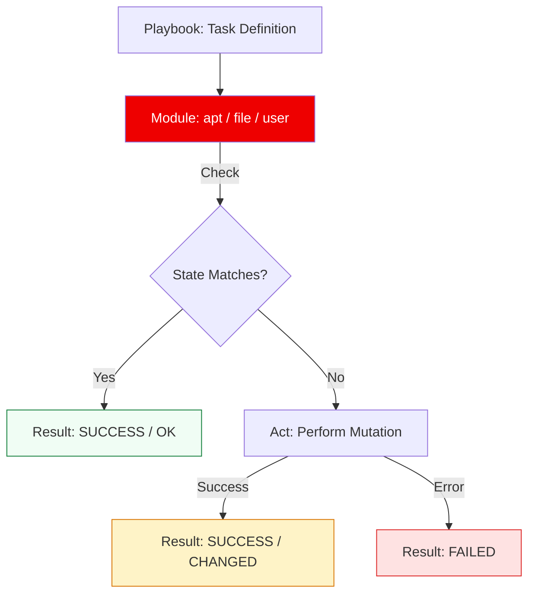

# 🛠️ Core Modules: The Building Blocks of Automation

> **"Ansible has thousands of modules, but an expert builds 90% of their infrastructure with just ten. Master the core, and everything else is just an API call away."**

Welcome to the **Core Modules** module. In the Ansible world, modules are specialized Python scripts that perform the "Heavy Lifting" on remote nodes. This module focuses on the **Idempotent Standard**: using the right tool for the job to ensure your infrastructure state is predictable, secure, and reproducible.

---

## 🏗️ The Module Execution Lifecycle

Every module call is an atomic "Check -> Act -> Verify" operation.



---

## 🎭 Real-World DevOps Scenarios

### 🧱 Scenario: The "Chmod 777" Security Hole
**The Incident:** A junior admin used a shell command `chmod -R 777 /var/www/html` to fix a "Permission Denied" error on a web server.
**The Failure:** This opened the entire webroot to anyone. A hacker uploaded a script and gained full control of the server within hours.
**The Fix:** Mandatory transition to the **`file` module**. By defining the exact `mode`, `owner`, and `group`, the state was locked down to professional security standards (`0755` for directories, `0644` for files).
**The Result:** A secure, functional web application with verifiable permissions.

---

## 💻 DevOps Logic Snippets: "The Safe Refactor"

Always prefer specialized modules over generic commands.

```yaml
# ❌ INCORRECT (The Scripting Mindset)
- name: Add User (Imperative)
  shell: useradd -m -s /bin/bash deploy
  ignore_errors: yes # Needs this because it fails if user exists

# ✅ CORRECT (The Engineering Mindset)
- name: Add User (Declarative/Idempotent)
  user:
    name: deploy
    shell: /bin/bash
    groups: sudo
    append: yes
    state: present
    create_home: yes

# 🚀 PRO TIP: Use the 'package' module for cross-distro support
- name: Install Nginx
  package:
    name: nginx
    state: latest
```

---

## 🎙️ Interview Preparation (Core Modules)

1.  **"What is the difference between `copy` and `template`?"**
    *   *Answer:* `copy` transfers files exactly as they are on the control node. `template` processes the file through the **Jinja2 engine** first, allowing you to inject dynamic variables (like the host's IP address or environment name) before the file is uploaded.
2.  **"Why should you avoid using the `command` or `shell` modules whenever possible?"**
    *   *Answer:* They are **not idempotent** by default. Running a shell command to create a directory will fail the second time unless you add complex logic. Native modules (like `file`) handle the "Check" phase automatically, only making changes if necessary.
3.  **"When is the `shell` module actually necessary?"**
    *   *Answer:* When you need to use shell-specific features like pipes (`|`), redirection (`>`), environment variables, or when no specialized module exists for the tool you are using.
4.  **"What does the `state: present` vs `state: latest` mean in the `apt` module?"**
    *   *Answer:* `present` ensures the package is installed (any version). `latest` will check for and apply updates if a newer version is available in the repositories.
5.  **"Explain the `lineinfile` module's use case."**
    *   *Answer:* It's used to ensure a specific line exists in a file (e.g., adding `AllowUsers admin` to `/etc/ssh/sshd_config`). It's more efficient than overwriting the entire file if you only need a minor tweak.

---

## 🧠 Knowledge Check

1.  **Which module is best for ensuring a service is running and starts at boot?**
    *   [ ] `command`
    *   [ ] `apt`
    *   [x] `service` (or `systemd`)
2.  **To create a symbolic link, which module do you use?**
    *   [ ] `copy`
    *   [x] `file`
    *   [ ] `link`
3.  **True or False: The `command` module supports shell pipes (`|`).**
    *   [ ] True
    *   [x] False
4.  **Which attribute ensures a file is only readable by its owner?**
    *   [ ] `mode: 0777`
    *   [x] `mode: 0600`
    *   [ ] `mode: 0444`
5.  **Which module replaces the functionality of both `wget` and `curl`?**
    *   [ ] `copy`
    *   [x] `get_url`
    *   [ ] `uri`

---

[⬅️ Back to Ansible Index](../readme.md) | [Next: Variables & Facts](../05-variables-and-facts/readme.md) ➡️

---
## 🧭 Additional Modules
- [01 File Management](01-file-management/readme.md)
- [02 Package Management](02-package-management/readme.md)
- [03 System Modules](03-system-modules/readme.md)
- [04 Utility Modules](04-utility-modules/readme.md)
