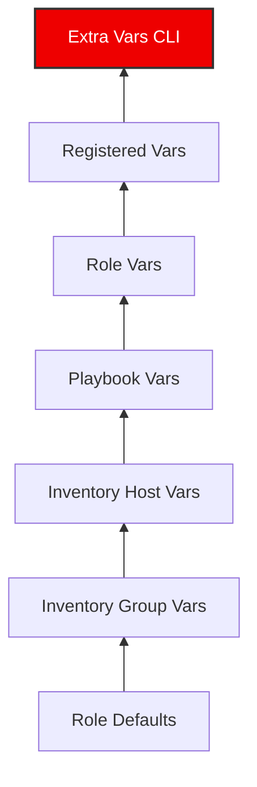

# 01. Variable Hierarchy and Precedence

Ansible allows you to define variables in many locations. Understanding the "Precedence" (which variable wins when names clash) is critical for troubleshooting complex playbooks.

## The Precedence Pyramid

Ansible has roughly 22 levels of precedence. If a variable of the same name exists in multiple places, the one with the highest precedence wins.

### Key Precedence Levels (Simplified)

1.  **Extra Vars** (`-e` at CLI): **Always wins.** Use for one-off overrides.
2.  **Task Vars**: Defined inside a specific task.
3.  **Block/Role Vars**: Defined at the role or block level.
4.  **Play Vars**: Defined in the `vars:` section of a play.
5.  **Host Vars**: Defined in `host_vars/` or inventory.
6.  **Group Vars**: Defined in `group_vars/` or inventory.
7.  **Role Defaults**: Lowest priority. Used to provide safe fallback values.

---

## Real-Life Scenarios

### Scenario 1: "The Debugging Nightmare"
**Problem**: An engineer set `http_port: 8080` in the playbook, but the web server kept configuring port `80`.
**Diagnosis**: Someone had passed `-e "http_port=80"` in the Jenkins CI job script months ago to fix a temporary issue.
**Solution**: Removed the extra var from CI. Understanding that "Extra Vars always win" allowed the team to find the culprit in the command line instead of wasting hours checking YAML files.

### Scenario 2: "The Safe Fallback"
**Problem**: You are writing a role to install a database. You want the default port to be `5432`, but you want users to be able to change it.
**Solution**: Put `db_port: 5432` in `roles/db/defaults/main.yml`.
*   Because `defaults` have the lowest precedence, any user who defines `db_port` in their inventory or playbook will successfully override your default.

### Scenario 3: "Environment-Specific Overrides"
**Problem**: You have 100 servers. All use `ntp_server: pool.ntp.org`, except for a special isolated lab that must use a local IP.
**Solution**:
*   Put `ntp_server: pool.ntp.org` in `group_vars/all.yml`.
*   Put `ntp_server: 10.0.0.5` in `group_vars/lab_servers.yml`.
*   Ansible's hierarchy ensures hosts in the `lab_servers` group use the more specific value.

---

## ❓ Interview Questions

1. **Which variable source has the absolute highest priority?**
    - Extra variables defined at the command line using `-e`.
2. **Where should you store sensitive variables?**
    - Encrypted in Ansible Vault files, usually within `group_vars` or `host_vars`.
3. **What is the difference between `role/defaults` and `role/vars`?**
    - `defaults` are meant to be overridden (lowest priority). `vars` have higher priority and are intended for constants the role needs that shouldn't be easily changed by users.

---

## 🧠 Quiz

1. **If a variable is in `all.yml` and a specific `web.yml` in `group_vars`, which one wins for a web server?**
    - [x] `web.yml`
    - [ ] `all.yml`
2. **Command to pass an extra variable:**
    - [x] `ansible-playbook -e "key=value"`
    - [ ] `ansible-playbook -v "key=value"`
3. **True or False: Host variables override group variables.**
    - [x] True
    - [ ] False