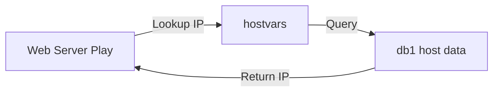

# 03. Magic Variables

"Magic Variables" are variables that Ansible creates for you to inspect the state of the automation itself, the inventory, or access data from *other* hosts.

## Core Magic Variables

| Variable | Description |
| :--- | :--- |
| `hostvars` | A dictionary of all hosts and their variables. |
| `groups` | A list of all groups and the hosts within them. |
| `group_names` | A list of groups the *current* host belongs to. |
| `inventory_hostname` | The name of the host as it appears in the inventory. |

---

## Accessing Other Hosts (`hostvars`)

This is the most powerful magic variable. It allows a "Web Server" to know the IP address of its "Database Server" even if it doesn't have it in its local variable file.



**Example YAML**:
```yaml
- name: Configure Web connection to DB
  template:
    src: db_config.j2
    dest: /etc/app/db.conf
  vars:
    db_ip: "{{ hostvars['db1'].ansible_default_ipv4.address }}"
```

---

## Real-Life Scenarios

### Scenario 1: "The Load Balancer Pool"
**Problem**: You have a cluster of 5 web servers. Your Load Balancer config must list every one of their IPs.
**Solution**: Used the `groups` magic variable to loop through the "web" group.
```jinja2
# Inside nginx.j2 template
upstream my_pool {
  
    server {{ hostvars[host].ansible_default_ipv4.address }};
  
}
```
*Result*: The Load Balancer config updates itself automatically as you add or remove hosts from the inventory.

### Scenario 2: "Host-Specific Logic"
**Problem**: You want to run a task on all servers *except* the one designated as the "Master".
**Solution**: Used `inventory_hostname`.
```yaml
- name: Do something on workers only
  shell: echo "I am a worker"
  when: inventory_hostname != "master-01"
```

---

## ❓ Interview Questions

1. **How do you access a variable belonging to `db_server` while running a task on `web_server`?**
    - Use `hostvars['db_server']['variable_name']`.
2. **What does `groups['all']` return?**
    - A list of every host name in the current inventory.
3. **Difference between `ansible_hostname` and `inventory_hostname`?**
    - `ansible_hostname` is a fact discovered from the OS (the real system name). `inventory_hostname` is the alias used in the Ansible inventory file.

---

## 🧠 Quiz

1. **Which magic variable lists the groups a host is in?**
    - [x] `group_names`
    - [ ] `my_groups`
2. **`hostvars` is a:**
    - [x] Dictionary (Key-Value)
    - [ ] Simple List
3. **If a host is not in any group except `all`, `group_names` is:**
    - [x] `['ungrouped']`
    - [ ] Empty