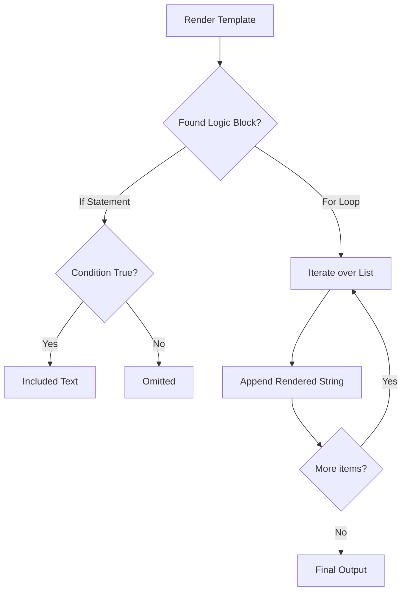

# 02. Jinja2 Advanced Logic

Beyond simple variable replacement, Jinja2 allows for complex control structures like loops and conditionals. This enables a single template to generate wildly different configuration files based on the target host.

## Control Structures

### 1. Conditionals: ``
Allows you to include or exclude blocks of text based on criteria.

```jinja2
# Listen port logic
listen 80;

listen 443 ssl;
ssl_certificate {{ ssl_cert_path }};

```

### 2. Loops: ``
Essential for generating repetitive configuration, such as a list of backend servers or host entries.

```jinja2
# /etc/hosts generation

{{ hostvars[host].ansible_default_ipv4.address }} {{ host }}

```

### 3. Whitespace Control: ``
Jinja2 blocks often leave behind newline characters, creating ugly gaps in your configuration files. Use the `-` marker to "strip" whitespace.
*   `` : Removes trailing whitespace (after the block).

```jinja2

  Item: {{ item }}

```

---

## The Logic Flow



---

## Real-Life Scenarios

### Scenario 1: "The Dynamic Hosts File"
**Problem**: A cluster of 100 nodes needed to know the IP address of every other node in the cluster for inter-node communication. Manual editing was impossible.
**Solution**: Used a Jinja2 loop over `groups['all']` and magic variable `hostvars` to pull the IP of every node and inject it into `/etc/hosts`.

### Scenario 2: "Global vs Local NTP"
**Problem**: Most servers use a global NTP pool, but servers in a private data center must use a specific local gateway.
**Solution**: Used an `if/else` block.
```jinja2
server  10.0.0.1  0.pool.ntp.org 
```

### Scenario 3: "Generating JSON Configs"
**Problem**: An application required a JSON configuration file representing a list of allowed IP addresses.
**Solution**: Combined a loop with a comma check.
```jinja2
{
  "allowed_ips": [
    
    "{{ hostvars[host].ansible_host }}",
    
  ]
}
```
*Note*: `loop.last` is a helper variable that prevents a trailing comma on the last item.

---

## ❓ Interview Questions

1. **How do you loop over a dictionary in Jinja2?**
    - Use ``.
2. **What is `loop.index`?**
    - A special variable available inside a loop that tracks the current iteration (starting at 1).
3. **How do you prevent a task from failing if a variable used in a template is missing?**
    - Use a default filter or an `if` statement to check `if var is defined`.

---

## 🧠 Quiz

1. **Symbol for stripping whitespace after a block:**
    - [x] `-%}`
    - [ ] `}-`
2. **To iterate over the 'all' group in inventory:**
    - [x] ``
    - [ ] ``
3. **The variable `loop.last` is true when:**
    - [x] The loop reaches the final item.
    - [ ] The loop is empty.