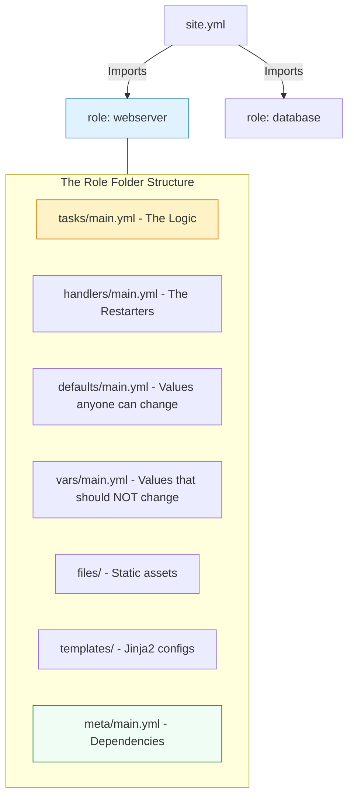

# 🏗️ Ansible Roles: Modular Infrastructure Engineering

> **"A junior engineer writes a 500-line playbook. A staff engineer writes five 100-line roles that can be reused across 500 different projects."**

Welcome to the **Ansible Roles** module. Roles are the standard way of decomposing monolithic playbooks into reusable, self-contained libraries. Mastering roles is the difference between writing "one-off scripts" and building a sustainable **Infrastructure-as-Code (IaC)** ecosystem.

---

## 🏗️ The Role Architecture

Role design follow a strict filesystem convention. This allows Ansible to automatically discover variables, handlers, and templates without explicit paths.



---

## 🎭 Real-World DevOps Scenarios

### 🛡️ Scenario: The "2,000 Line" Playbook Nightmare
**The Incident:** An enterprise platform used a single `provision.yml` file to handle OS hardening, Firewall setup, Nginx config, and App deployment. 
**The Failure:** The file grew to 2,000 lines. When the security team needed to update the "SSH Hardening" task, they had to scroll through 1,500 lines of unrelated Nginx logic. A mistake in line 1,200 broke the entire infrastructure provisioning for three days.
**The Fix:** Mandatory refactoring into **Atomic Roles**. The logic was split into `os-hardening`, `firewall`, `nginx`, and `app-deploy`.
**The Result:** The main playbook became 12 lines of code. Security updates now happen in a dedicated, 50-line role file, dramatically reducing risk and troubleshooting time.

---

## 💻 DevOps Logic Snippets: "The Role Invocation"

Always structure your top-level playbooks to be descriptive and modular.

```yaml
# site.yml
---
- name: Deploy Production Stack
  hosts: all
  become: yes
  
  # 🚀 Standard: Group common tasks into a base role
  roles:
    - role: common
      tags: ['setup', 'security']

- name: Deploy Frontend 
  hosts: webservers
  roles:
    - { role: nginx, nginx_port: 80, tags: ['web'] }

- name: Deploy Database
  hosts: dbservers
  roles:
    - { role: postgres, db_name: 'prod_db', tags: ['db'] }
```

---

## 🎙️ Interview Preparation (Roles & Modularity)

1.  **"What is the recommended directory structure for an Ansible Role?"**
    *   *Answer:* A role should have at minimum `tasks/main.yml`. Professional roles also include `handlers/`, `defaults/`, `vars/`, `templates/`, `files/`, and `meta/`.
2.  **"What is the difference between `defaults/main.yml` and `vars/main.yml`?"**
    *   *Answer:* `defaults` has the **lowest precedence** in Ansible—they are meant to be overridden. `vars` has very high precedence and is used for internal constants that the user should rarely change.
3.  **"How does `ansible-galaxy` help in a corporate environment?"**
    *   *Answer:* It functions as a package manager for roles. You can use it to pull community-vetted roles (like Geerlingguy's Nginx role) or to manage internal roles via private Git repositories using a `requirements.yml` file.
4.  **"Explain Role Dependencies in `meta/main.yml`."**
    *   *Answer:* It allows you to ensure a precursor role is run before the current one. For example, a `webserver` role might depend on a `firewall` role to ensure ports are open before Nginx is configured.
5.  **"What is the benefit of 'Atomic Roles'?"**
    *   *Answer:* They follow the "Single Responsibility Principle." An atomic role does one thing (e.g., installs Docker) and can be reused in dozens of different playbooks without modification.

---

## 🧠 Knowledge Check

1.  **Which directory in a role stores the main execution logic?**
    *   [ ] `files/`
    *   [ ] `vars/`
    *   [x] `tasks/`
2.  **Where should you put a Jinja2 configuration file within a role?**
    *   [ ] `files/`
    *   [x] `templates/`
    *   [ ] `handlers/`
3.  **True or False: Using roles makes your playbooks slower.**
    *   [ ] True
    *   [x] False (There is no performance penalty, only organizational gain).
4.  **Which magic command creates a new role skeleton automatically?**
    *   [ ] `ansible-role create`
    *   [x] `ansible-galaxy init`
    *   [ ] `mkdir ansible_role`
5.  **What is the lowest precedence variable location in a role?**
    *   [ ] `vars/main.yml`
    *   [x] `defaults/main.yml`
    *   [ ] `tasks/main.yml`

---

[⬅️ Back to Ansible Index](../readme.md) | [Next: Conditionals & Loops](../08-conditionals-and-loops/readme.md) ➡️

---
## 🧭 Additional Modules
- [01 Role Standard Structure](01-role-standard-structure/readme.md)
- [02 Advanced Role Usage](02-advanced-role-usage/readme.md)
- [03 Galaxy and Collections](03-galaxy-and-collections/readme.md)
- [04 Testing with Molecule](04-testing-with-molecule/readme.md)
