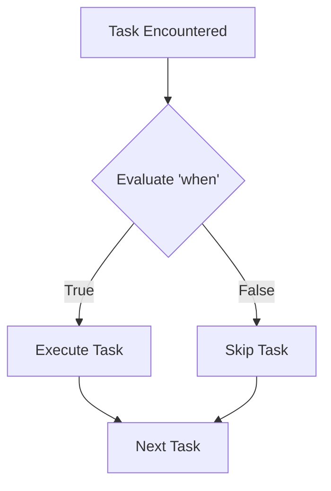

# 01. Conditional Execution

In automation, logic is essential. You often need to run a task based on certain conditions, like the Operating System, the amount of free memory, or the success of a previous step. In Ansible, this is handled by the `when` clause.

## The `when` Clause

The `when` clause is evaluated before a task is executed. If the condition is true, the task runs; otherwise, it is skipped.



### Logical Operators

You can combine multiple conditions using logical operators:

*   **AND**: Both must be true. In YAML, you can use a list or the `and` keyword.
*   **OR**: At least one must be true. Use the `or` keyword.
*   **NOT**: Invert the result. Use the `not` keyword.

```yaml
- name: Install package on specific conditions
  apt:
    name: nginx
    state: present
  when: 
    - ansible_os_family == "Debian"   # AND
    - ansible_memtotal_mb > 2048      # AND
    - not debug_mode                  # NOT
```

---

## Real-Life Scenarios

### Scenario 1: "The OS Conditional"
**Problem**: An organization has a mix of Ubuntu (apt) and CentOS (yum) servers. Running `apt` on CentOS would fail the whole playbook.
**Solution**: Used `when: ansible_os_family == "Debian"` for apt tasks and `when: ansible_os_family == "RedHat"` for yum tasks.
*   Result: A single playbook can now manage the entire mixed fleet without errors.

### Scenario 2: "Dependency Check"
**Problem**: A configuration task should only run if a specific binary is already installed on the system.
**Solution**: 
1. Used `command: which myapp` and `register: binary_check`.
2. Added `ignore_errors: yes` to the check.
3. Added `when: binary_check.rc == 0` to the configuration task.
*   Result: The configuration is safely skipped if the app is missing.

### Scenario 3: "Disk Space Safety"
**Problem**: A backup task would crash the server if the disk was more than 90% full.
**Solution**: Used facts to check available space.
```yaml
- name: Run Backup
  command: /opt/backup.sh
  when: ansible_mounts[0].size_available > 1000000000 # 1GB
```
*   Result: Automation prevents system crashes by verifying health before execution.

---

## ❓ Interview Questions

1. **How do you check if a variable is defined in a `when` statement?**
    - `when: my_var is defined`.
2. **What is the default logical relationship between items in a `when` list?**
    - AND (all must be true).
3. **Can you use Jinja2 delimiters `{{ }}` inside a `when` clause?**
    - No. The `when` clause is already evaluated as a Jinja2 expression. Adding `{{ }}` will cause a syntax error.

---

## 🧠 Quiz

1. **Which keyword is the 'if' statement of Ansible?**
    - [x] `when`
    - [ ] `if`
2. **To run a task if either Condition A or Condition B is true:**
    - [x] `when: cond_a or cond_b`
    - [ ] `when: [cond_a, cond_b]`
3. **If `gather_facts: no`, can you check `ansible_os_family`?**
    - [x] No, the fact won't be available.
    - [ ] Yes.