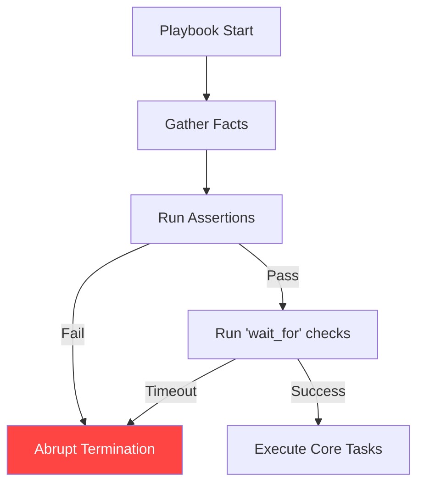

# 04. Validation and Abortion

Sometimes you need to stop a playbook before it even starts doing work. If the environment isn't right (e.g., wrong OS version, insufficient RAM, or a missing secret), failing early saves time and prevents partial, broken deployments.

## 1. The `assert` Module
The `assert` module acts like a unit test inside your playbook. It evaluates a condition and, if it is not met, fails the play with a custom message.

```yaml
- name: Verify system memory
  assert:
    that:
      - ansible_memtotal_mb >= 8192
    fail_msg: "This application requires at least 8GB of RAM. Found {{ ansible_memtotal_mb }}MB."
    success_msg: "Memory check passed."
```

## 2. The `fail` Module
Unlike `assert` which checks a condition, the `fail` module is unconditional. It is usually combined with a `when` clause to stop execution when something goes catastrophically wrong.

```yaml
- name: Stop if running on unauthorized cloud
  fail:
    msg: "Cloud provider {{ ansible_system_vendor }} is not approved for this workload."
  when: ansible_system_vendor not in ["AWS", "Google"]
```

## 3. Interactive Pausing (`pause`)
Used for manual gates or to give a human a chance to verify something before proceeding.

```yaml
- name: Wait for manual approvals
  pause:
    prompt: "Please verify the DB backup is finished. Press Enter to continue..."
```

---

## Pre-flight Verification Flow



---

## Real-Life Scenarios

### Scenario 1: "The Deployment Circuit Breaker"
**Problem**: An automation engine was accidentally triggered to deploy production code to the development environment, which would have overwritten test data.
**Solution**: Used `assert` to verify the `inventory_hostname` matched the intended environment prefix.
*   Result: The playbook aborted immediately because the hostname didn't match the expected "prod-*" pattern, saving the dev data.

### Scenario 2: "Dependency Readiness"
**Problem**: A playbook would fail halfway through because a remote API it needed to talk to was offline for maintenance.
**Solution**: Used the `wait_for` module at the start of the play to poll the API's port.
*   Result: Instead of a messy failure during deployment, the play waited cleanly for 5 minutes and then aborted with a "Service Unavailable" message.

### Scenario 3: "Version Lockdown"
**Problem**: A legacy application was known to crash on Ubuntu 22.04 but worked fine on 20.04.
**Solution**: Used a `fail` task combined with `when: ansible_distribution_version == "22.04"`.
*   Result: Prevented accidental installation on incompatible OS versions, reducing support tickets.

---

## ❓ Interview Questions

1. **Difference between `fail` and `assert`?**
    - `fail` is a simple "stop now" command (usually paired with `when`). `assert` accepts a list of conditions and only fails if they aren't met.
2. **What is the `wait_for` module used for?**
    - It polls a port, a file, or a processes' state until it matches a certain condition (e.g., waiting for port 80 to open after a restart).
3. **How do you make a playbook wait for exactly 30 seconds?**
    - Use `pause: seconds=30`.

---

## 🧠 Quiz

1. **Which module acts like a unit test?**
    - [x] `assert`
    - [ ] `check`
2. **To stop a play unconditionally if a condition is met:**
    - [x] Use `fail` with `when`.
    - [ ] Use `ignore_errors`.
3. **`wait_for` `timeout` default is:**
    - [x] 300 seconds (5 minutes).
    - [ ] 60 seconds.