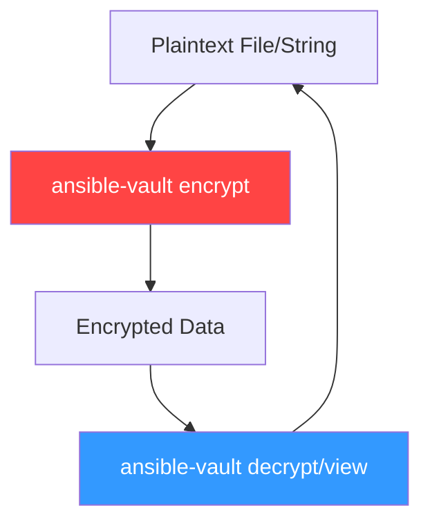

# 01. Vault CLI Operations

Ansible Vault is a command-line tool that allows you to encrypt and decrypt data used in your playbooks. It provides a way to protect sensitive information such as passwords, API keys, and private keys.

## Core Concepts

Vault uses **AES-256** encryption. By default, it encrypts the entire file, but it also supports encrypting individual strings within a YAML file.



## Common CLI Commands

| Command | Action |
| :--- | :--- |
| `ansible-vault create` | Creates a new encrypted file. |
| `ansible-vault edit` | Edits an existing encrypted file. |
| `ansible-vault view` | Displays the contents of an encrypted file without editing. |
| `ansible-vault encrypt` | Encrypts an existing plaintext file. |
| `ansible-vault decrypt` | Permanently decrypts an encrypted file. |
| `ansible-vault rekey` | Changes the password of an encrypted file. |
| `ansible-vault encrypt_string` | Encrypts a single string for use in a YAML file. |

### Encrypting a Single String
This is the preferred method for modern Ansible projects because it keeps the variable names visible while hiding only the values.

```bash
ansible-vault encrypt_string 'my_db_password' --name 'db_pass'
```
Output:
```yaml
db_pass: !vault |
          $ANSIBLE_VAULT;1.1;AES256
          36383633353434643032333630663733353831623136393561336465373634356461323337626131
          ...
```

---

## Real-Life Scenarios

### Scenario 1: "The Git Safe Password"
**Problem**: An engineer needed to store the root password for a database in a shared Git repository. Storing it in plaintext was a violation of security policy.
**Solution**: Used `ansible-vault encrypt_string` to encrypt the password.
*   Result: The password was safely committed to the repository in encrypted format. Only team members with the Vault password could deploy the application.

### Scenario 2: "The Emergency Rekey"
**Problem**: A contractor with access to the Vault password left the company. The company needed to rotate the password for all encrypted files.
**Solution**: Used `ansible-vault rekey`.
*   Result: All secret files were updated with a new password in minutes, ensuring the former contractor could no longer access the secrets.

### Scenario 3: "Structure Visibility"
**Problem**: A file encrypted using `ansible-vault encrypt` was difficult to maintain because the keys themselves were hidden. Developers didn't know which variables were defined.
**Solution**: Migrated to `encrypt_string` for specific values.
*   Result: Variable keys became visible in the YAML files, making the configurations easier to read while maintaining absolute security for the values.

---

## ❓ Interview Questions

1. **What encryption algorithm does Ansible Vault use?**
    - AES-256.
2. **How do you view an encrypted file without opening an editor?**
    - `ansible-vault view <filename>`.
3. **What happens if you run `vim` on a vault-encrypted file?**
    - You will see the encrypted header `$ANSIBLE_VAULT;1.1;AES256` followed by hexadecimal binary data.

---

## 🧠 Quiz

1. **Command to change a vault password:**
    - [x] `ansible-vault rekey`
    - [ ] `ansible-vault refresh`
2. **True or False: `ansible-vault encrypt_string` encrypts the key name.**
    - [x] False (only the value is encrypted).
    - [ ] True.
3. **Header of an Ansible Vault file starts with:**
    - [x] `$ANSIBLE_VAULT`
    - [ ] `BEGIN VAULT`