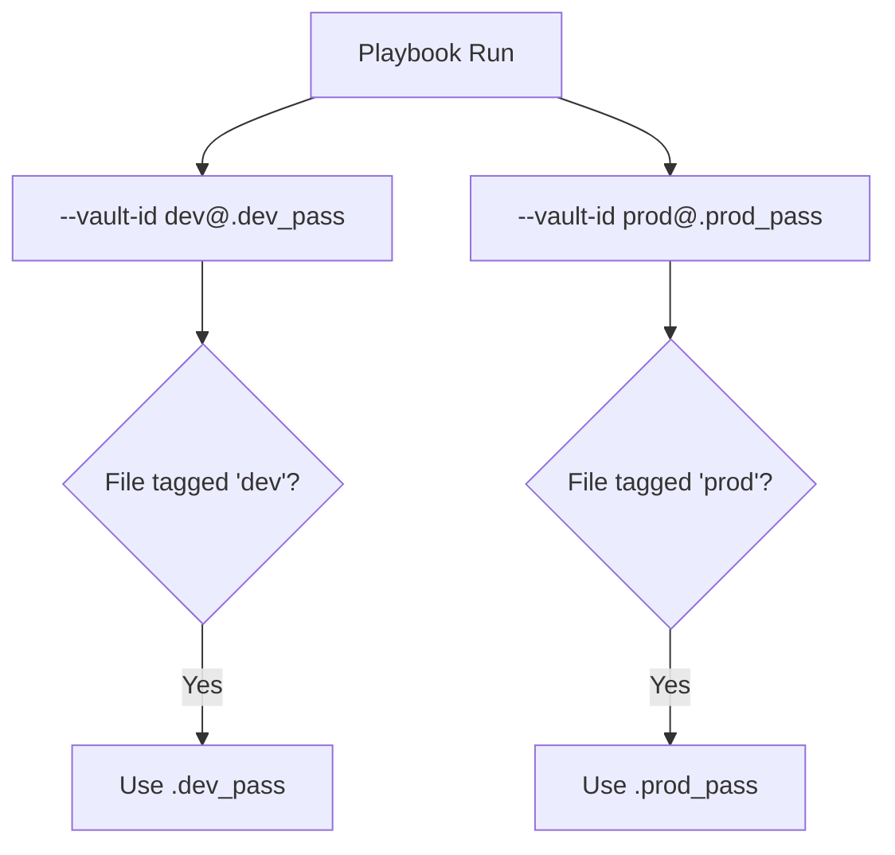

# 02. Automation Workflow

Manually typing a password every time you run a playbook is inefficient and impossible in automated environments. Ansible provides several ways to manage vault passwords for automated workflows.

## Providing the Vault Password

### 1. Manual Prompt
Ansible will ask for the password at runtime.
```bash
ansible-playbook site.yml --ask-vault-pass
```

### 2. Vault Password File
The most common method for automation. Store the password in a text file and point Ansible to it.
```bash
ansible-playbook site.yml --vault-password-file .vault_pass
```

### 3. Environment Variable
Set the path to the password file in your shell environment.
```bash
export ANSIBLE_VAULT_PASSWORD_FILE=~/.ansible/.vault_pass
```

---

## Multiple Vault Passwords (Vault IDs)

In complex environments, different teams or environments (Dev, Test, Prod) might use different vault passwords. **Vault IDs** allow you to label passwords and use multiple keys in a single run.



### Using Vault IDs
```bash
# Create with an ID
ansible-vault create --vault-id prod@prompt prod_secrets.yml

# Run with an ID
ansible-playbook site.yml --vault-id prod@.prod_pass
```

---

## Real-Life Scenarios

### Scenario 1: "The Hands-Free Deployment"
**Problem**: A sysadmin had to sit at their terminal for 30 minutes during a deployment just to type the vault password when prompted.
**Solution**: Created a `.vault_pass` file and configured `ansible.cfg` to point to it.
*   Result: One-click deployments became possible. The admin could now trigger a run and walk away.

### Scenario 2: "Shared Repo, Different Keys"
**Problem**: The "Security Team" and the "App Team" shared a repository. The App Team was allowed to see application secrets but not the enterprise SSH keys.
**Solution**: Used Vault IDs (`app` and `security`).
*   Result: Each team only had the password file for their specific Vault ID. They could both run the same playbook, and Ansible would only decrypt the variables each team had access to.

### Scenario 3: "Safe Password Storage"
**Problem**: A developer was worried about leaking the `.vault_pass` file because it was in the project directory.
**Solution**: Moved the file to `/home/user/.ansible/` (outside the repo) and used an environment variable to point to it.
*   Result: The risk of accidental `git add` for the password file was eliminated.

---

## ❓ Interview Questions

1. **How do you pass multiple vault passwords to a playbook?**
    - Use the `--vault-id` flag multiple times.
2. **What is the security risk of using a vault password file?**
    - If the file is accidentally committed to Git, the encryption is rendered useless. It should always be listed in `.gitignore`.
3. **Where can you set the default `vault_password_file`?**
    - In the `ansible.cfg` file under the `[defaults]` section.

---

## 🧠 Quiz

1. **Flag to ask for password interactively:**
    - [x] `--ask-vault-pass`
    - [ ] `--give-password`
2. **A Vault ID is formatted as:**
    - [x] `label@source`
    - [ ] `source:label`
3. **Best practice for `.vault_pass` in a Git repo:**
    - [x] Add to `.gitignore`.
    - [ ] Commit it with `encrypt_string`.