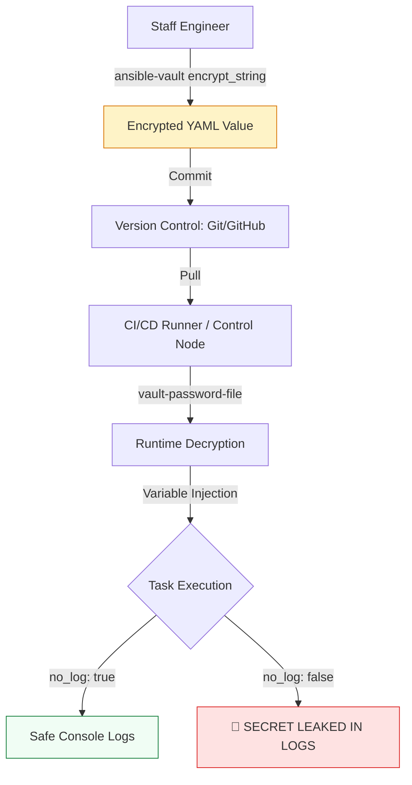

# 🔐 Ansible Vault: Enterprise Secret Management

> **"If your secrets are in plain text, your infrastructure is public. Ansible Vault ensures that your credentials are as secure as your production environment."**

Welcome to the **Ansible Vault** module. Automated infrastructure orchestration frequently requires API keys, database passwords, and SSH private keys. Storing these in Git in plain text is a "Priority 0" security violation. This module covers the **AES-256** encryption standards required to protect sensitive data at rest and during transit.

---

## 🏗️ The Secret Management Lifecycle

Ansible Vault follows an **Encrypt-at-Rest / Decrypt-at-Runtime** pattern. We move away from plain-text exposure to **Atomic Encryption**.



---

## 🎭 Real-World DevOps Scenarios

### 🧱 Scenario: The "Crypto-Mining" Breach
**The Incident:** A developer committed a new Ansible role to a public GitHub repository. The `vars/main.yml` file contained a functional Production AWS Secret Key that was accidentally hardcoded during debugging.
**The Failure:** Automated bot scanners detected the key within 45 seconds of the commit.
**The Catastrophe:** Attackers used the key to launch 200 `p3.16xlarge` GPU instances for Bitcoin mining. The company incurred a $15,000 AWS bill in less than 3 hours.
**The Fix:** Mandatory transition to **Ansible Vault**. The team implemented a Git "Pre-Commit Hook" that rejects any file containing a detected secret and enforced the use of `ansible-vault` for all sensitive variables.

---

## 💻 DevOps Logic Snippets: "The Secure Deployment"

Always protect your secrets from both the Git history AND the execution logs.

```yaml
# vars/secrets.yml (Encrypted via: ansible-vault encrypt)
db_password: "$ANSIBLE_VAULT;1.1;AES256;... (encrypted data) ..."

# playbook.yml
- name: Secure Database Configuration
  hosts: dbservers
  vars_files:
    - vars/secrets.yml
    
  tasks:
    - name: Update Database User Password
      mysql_user:
        name: root
        password: "{{ db_password }}"
        state: present
      # 🛡️ Guard Clause: Prevent secret exposure in CI/CD logs
      no_log: true

    - name: Run logic without secrets
      debug:
        msg: "Deployment proceeding for {{ inventory_hostname }}"
      # no_log is NOT needed here as no secrets are used
```

---

## 🎙️ Interview Preparation (Security)

1.  **"What encryption standard does Ansible Vault use?"**
    *   *Answer:* It uses **AES-256** (Advanced Encryption Standard).
2.  **"What is the difference between `encrypt` and `encrypt_string`?"**
    *   *Answer:* `encrypt` encrypts an entire file. `encrypt_string` allows you to encrypt a single value (like a password) while keeping the rest of the YAML file in plain text, making it much easier to read and manage in Git.
3.  **"How do you handle Vault passwords in a headless CI/CD environment (like Jenkins or GitHub Actions)?"**
    *   *Answer:* Use the `--vault-password-file` flag. The CI/CD runner can pull the password from its own internal secret manager and write it to a temporary file, or use an environment variable script.
4.  **"What is 'no_log: true' and why is it mandatory for security tasks?"**
    *   *Answer:* Even if a variable is encrypted on disk (Vault), Ansible will print the variable's value to the console during the task run. `no_log: true` suppresses all task output, preventing secrets from appearing in monitoring tools, logs, or CI/CD dashboards.
5.  **"Explain 'Vault IDs' and why they are useful in multi-environment setups."**
    *   *Answer:* Vault IDs allow you to use different passwords for different files in the same project. For example, you can have a "dev" password for development secrets and a "prod" password for production secrets, keeping them isolated.

---

## 🧠 Knowledge Check

1.  **Which command is used to edit an encrypted file WITHOUT permanently decrypting it?**
    *   [ ] `ansible-vault decrypt`
    *   [x] `ansible-vault edit`
    *   [ ] `ansible-vault view`
2.  **Where does the `no_log: true` parameter go?**
    *   [ ] In the `ansible.cfg` file.
    *   [x] Under a specific Task in a playbook.
    *   [ ] In the inventory file.
3.  **True or False: Ansible Vault encrypts data during network transit over SSH.**
    *   [ ] True (SSH handles transit encryption; Vault handles 'at-rest' encryption).
    *   [x] False (Vault encrypts files *before* they are used; SSH provides the transit security).
4.  **How do you view the contents of a vault-encrypted file in the terminal?**
    *   [ ] `cat secrets.yml`
    *   [x] `ansible-vault view secrets.yml`
    *   [ ] `less secrets.yml`
5.  **What is the default filename Ansible looks for to find a vault password?**
    *   [ ] `.vault_pass`
    *   [ ] There is no default; it must be specified in `ansible.cfg` or via CLI.
    *   [x] None of the above.

---

[⬅️ Back to Ansible Index](../readme.md) | [Next: Custom Modules](../11-custom-modules/readme.md) ➡️

---
## 🧭 Additional Modules
- [01 Vault CLI Operations](01-vault-cli-operations/readme.md)
- [02 Automation Workflow](02-automation-workflow/readme.md)
- [03 Vault in CI CD](03-vault-in-ci-cd/readme.md)
- [04 Security Best Practices](04-security-best-practices/readme.md)
