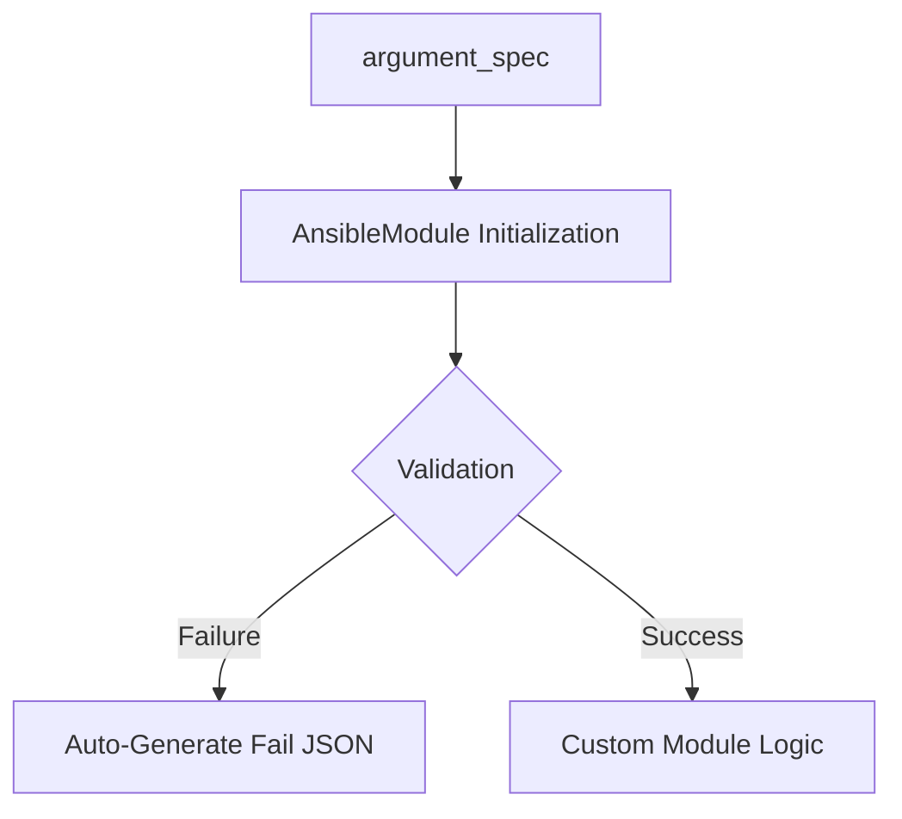

# 02. AnsibleModule Utility

Writing a module from scratch (parsing JSON manually) is tedious and error-prone. To solve this, Ansible provides a core utility class: `AnsibleModule`.

## The `AnsibleModule` Framework

This class handles argument parsing, security, validation, and standardized output for you.



### Key Components:

1.  **`argument_spec`**: A dictionary that defines what parameters your module accepts.
    ```python
    module_args = dict(
        name=dict(type='str', required=True),
        port=dict(type='int', default=80),
        active=dict(type='bool', default=True),
        password=dict(type='str', no_log=True) # Hides from logs!
    )
    ```
2.  **`module.params`**: A dictionary containing the validated values passed from the playbook.
3.  **`module.check_mode`**: A boolean flag that tells you if the user ran Ansible with `--check`.

---

## Argument Scoping and Types

| Type | Description |
| :--- | :--- |
| `str` | Default string type. |
| `int` | Automatically converts input to an integer. |
| `bool` | Handles `yes/no`, `true/false`, `1/0`. |
| `list` | Accepts a YAML list. |
| `dict` | Accepts a nested YAML dictionary. |
| `path` | Validates that the input is a valid file path. |

---

## Real-Life Scenarios

### Scenario 1: "The Safe Secret"
**Problem**: A custom module was used to configure a legacy app that required a database token. The token was appearing in the Ansible logs in plaintext.
**Solution**: Set `no_log=True` in the `argument_spec` for the token parameter.
*   Result: Even if the playbook failed, the token was replaced with `VALUE_SPECIFIED_IN_NO_LOG` in the output, satisfying security requirements.

### Scenario 2: "Automatic Type Safety"
**Problem**: An API required an integer for "retries". Users often passed it as a string `"5"` in YAML, causing the Python script to crash when it tried to do math.
**Solution**: Defined the parameter with `type='int'`.
*   Result: `AnsibleModule` automatically converted the string `"5"` to the integer `5` before the script even started running.

### Scenario 3: "Check Mode Support"
**Problem**: A sysadmin wanted to test a custom module that modifies system state, but there was no way to "Dry Run" it.
**Solution**: Added `supports_check_mode=True` to the initialization and checked `if module.check_mode:`.
*   Result: The admin could now run `ansible-playbook --check` and see if the module *would* make changes, without actually touching the system.

---

## ❓ Interview Questions

1. **How do you prevent sensitive variables from being logged in Ansible?**
    - Use `no_log=True` in the module's `argument_spec`.
2. **What utility class should every Python module use?**
    - `ansible.module_utils.basic.AnsibleModule`.
3. **Difference between `exit_json` and `fail_json`?**
    - `exit_json` ends the module successfully (Green/Yellow). `fail_json` ends it with an error (Red).

---

## 🧠 Quiz

1. **The `argument_spec` is defined as a:**
    - [x] Dictionary (dict)
    - [ ] List
2. **If a 'required' argument is missing, `AnsibleModule` will:**
    - [x] Automatically fail the task with an error.
    - [ ] Crash with a Python Traceback.
3. **Which parameter type handles `T/F` or `y/n`?**
    - [x] `bool`
    - [ ] `str`