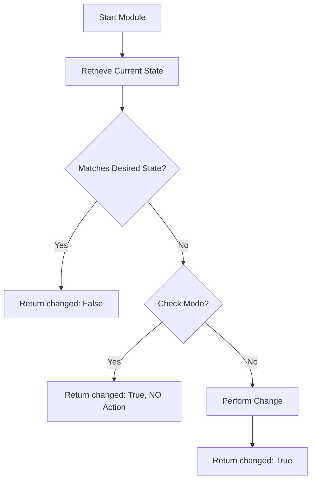

# 03. Returns and Idempotency

The core promise of Ansible is **Idempotency**: a task should only make a change if it's necessary, and running it a second time should result in "OK", not another "Changed". When writing a custom module, this logic is your responsibility.

## Communicating Results

Your module must return a JSON dictionary. Three keys are essential:

1.  **`changed`** (bool): Did the system state actually change?
2.  **`failed`** (bool): Did an error occur? (Handled automatically by `fail_json`).
3.  **`msg`** (str): A human-readable message about what happened.

### Implementation Logic

## Example: Creating a User
*   **Current State**: User "Alice" already exists.
*   **Desired State**: User "Alice" should exist.
*   **Logic**: If `exists`, return `changed=False`. If `not exists`, create user and return `changed=True`.

---

## Real-Life Scenarios

### Scenario 1: "The Safe Sync Module"
**Problem**: An engineer wrote a module to sync assets from an internal storage server. It worked, but it reported "Changed: True" every single time it ran, causing downstream tasks to trigger unnecessarily.
**Solution**: Implemented a hash check (MD5/SHA256).
*   Result: The module now compares the checksum of the local file with the remote. If they match, it skips the download and reports `changed: false`.

### Scenario 2: "The Fail-Safe Upgrade"
**Problem**: A custom module for upgrading firmware on network switches was failing halfway and leaving the switch in "maintenance mode".
**Solution**: Wrapped the logic in a `try/except` block and used `module.fail_json()`.
*   Result: The module now detects failure, attempts a cleanup to get the switch out of maintenance mode, and then reports a clear error message to Ansible.

### Scenario 3: "Data Integrity Check"
**Problem**: A module that inserts records into a database was creating duplicate entries every time the playbook ran.
**Solution**: Added a "Read before Write" step.
*   The module checks if the record (ID or email) already exists in the table.
*   Result: True idempotency achieved. The playbook is now safe to run multiple times per day.

---

## ❓ Interview Questions

1. **What happens if you return `changed: true` every time?**
    - You break the principle of idempotency. This causes unnecessary work, pollutes reports, and can trigger handlers (like service restarts) that shouldn't run.
2. **How does `exit_json` differ from `fail_json`?**
    - `exit_json` signifies a finished task (with success). `fail_json` informs Ansible the task failed and stops the execution for that host.
3. **Can a module return custom variables back to the playbook?**
    - Yes. Any key-value pair you pass to `exit_json` becomes available in the `register` variable in the playbook.

---

## 🧠 Quiz

1. **Primary variable to track if work was done:**
    - [x] `changed`
    - [ ] `updated`
2. **If `failed_json` is called, the task turns:**
    - [x] Red (Failed)
    - [ ] Yellow (Changed)
3. **To return a list of IDs created, you would pass them to:**
    - [x] `exit_json`
    - [ ] `print()`