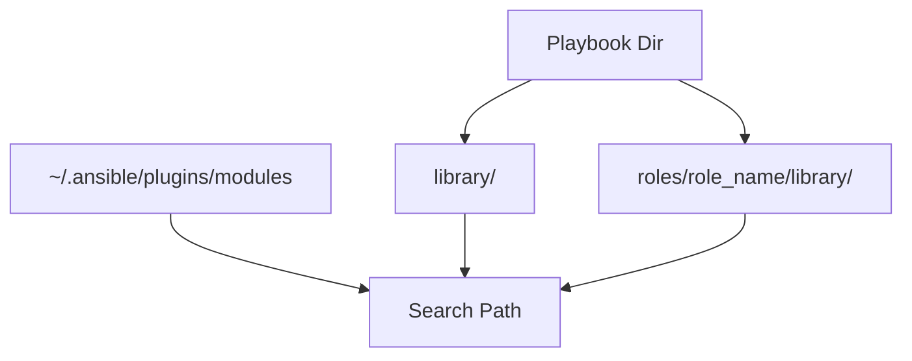

# 04. Testing and Distribution

Once your module code is written, you need to know how to install it in your project, how to document it so others can use it, and how to test it without running a full playbook.

## Module Distribution

Ansible looks for modules in a specific order:

1.  **`library/` directory**: Put your `.py` files here in the root of your playbook.
2.  **Ansible Roles**: Place them inside `my_role/library/`.
3.  **Ansible Collections**: The professional standard for distribution across teams.



## Self-Documentation

You can make your module compatible with the `ansible-doc` command by including specific YAML-formatted strings at the top of your Python file:

*   **`DOCUMENTATION`**: Describes arguments, requirement, and summary.
*   **`EXAMPLES`**: Shows how to call the module in a playbook.
*   **`RETURN`**: Explains the data returned by the module.

---

## Testing Your Module

Don't wait for a 10-minute playbook run to find a syntax error. Test locally!

### 1. Manual Testing
You can run your Python script directly. Create a JSON file with your arguments and pass it to the script.
```bash
python library/my_module.py <<EOF
{
  "ANSIBLE_MODULE_ARGS": {
    "name": "bob",
    "state": "present"
  }
}
EOF
```

### 2. Unit Testing
Use `pytest` to test the internal logic of your Python functions without actually calling Ansible.

---

## Real-Life Scenarios

### Scenario 1: "The library/ Shortcut"
**Problem**: A developer wrote a single-purpose module for a specific project. They didn't want the overhead of creating a full Role or Collection.
**Solution**: Created a folder named `library/` in the playbook directory and dropped the `.py` file inside.
*   Result: Ansible automatically detected and used the module without any configuration changes.

### Scenario 2: "Documenting for the Team"
**Problem**: A team lead wrote a custom module for deploying cloud resources. Other engineers couldn't remember what arguments it accepted.
**Solution**: Added the `DOCUMENTATION` and `EXAMPLES` strings to the code.
*   Result: Engineers could now run `ansible-doc -M library my_module` to see a beautiful manual page right in their terminal.

### Scenario 3: "Development in Isolation"
**Problem**: A module was failing on a remote production server, and debugging via the playbook was slow and painful due to logging latency.
**Solution**: Copied the module and the input JSON to a local virtual machine and ran it directly with `python`.
*   Result: The developer used standard Python `pdb` (debugger) to step through the code and found a variable scope issue in minutes.

---

## ❓ Interview Questions

1. **Where is the standard place to put local custom modules?**
    - In a directory named `library/` in the same folder as your playbook.
2. **How do you see the documentation for a local custom module?**
    - `ansible-doc -M <path_to_library> <module_name>`.
3. **Can you distribute a custom module via Ansible Galaxy?**
    - Yes, by packaging it inside an Ansible Collection.

---

## 🧠 Quiz

1. **Directory name for local modules:**
    - [x] `library`
    - [ ] `ext`
2. **String used for 'ansible-doc' support:**
    - [x] `DOCUMENTATION`
    - [ ] `HELP_INFO`
3. **True or False: A module can be tested without running Ansible.**
    - [x] True.
    - [ ] False.