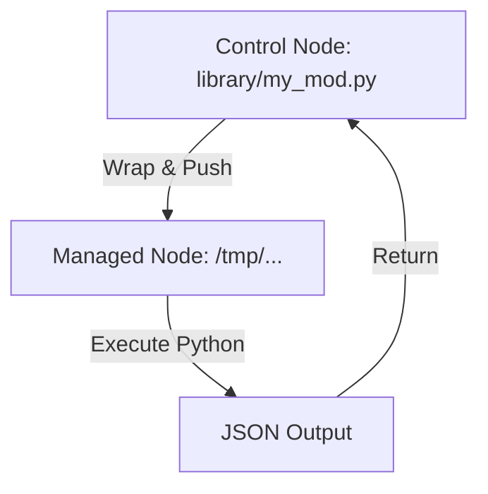

# Custom Modules: Extending Ansible

While Ansible has thousands of built-in modules, you will eventually hit a wall where no standard module exists for your specific internal tool or complex business logic. Custom modules allow you to write your own logic in **Python** and use it just like a native Ansible task.

## 📚 Module Structure
- **[Boilerplates](readme.md)**: `my_custom_module.py` (A scaffold for creating your own module).
- **[CHALLENGES](./challenges.md)**: Creating greetings, system info tools, and adding validation.

---

## 🔑 Key Concepts

| Keyword | Description |
| :--- | :--- |
| **`AnsibleModule`** | The core class from `ansible.module_utils.basic` that handles argument parsing and JSON output. |
| **`exit_json`** | How you tell Ansible the task succeeded. |
| **`fail_json`** | How you report a failure. |
| **`library/`** | The default folder where Ansible looks for custom modules in your project. |

---

## 🏗️ Architecture: How it works

When you run a custom module, Ansible does the following:
1.  **Wraps**: It combines your module code with internal utility libraries (`module_utils`).
2.  **Pushes**: It copies the combined file to the managed node via SSH.
3.  **Executes**: It runs the Python script on the node.
4.  **Parses**: It reads the JSON response from the script's stdout.

---

## 📖 Real-World Story: The "Proprietary API" Bridge

**Scenario**: A large enterprise used a custom internal CLI for managing their proprietary firewall. No Ansible module existed for this CLI.
**Problem**: The DevOps team was using `shell` tasks to call the CLI, but they couldn't easily parse the output or handle errors. The playbooks were full of complex `grep` and `awk` logic.
**Solution**: They wrote a **Custom Python Module**. This module encapsulated the CLI calls, parsed the responses into structured JSON, and handled "Idempotency" (checking if the firewall rule already existed before calling the CLI).
**Result**: Playbooks became 80% smaller and much more reliable.

---

## ❓ Interview Questions

1. **Which language should you use to write a custom Ansible module?**
   - *Answer*: Python is the standard (and best supported), but technically you can use *any* language that can output JSON to stdout (Bash, Ruby, Go).
2. **Where does Ansible look for custom modules by default?**
   - *Answer*: In a directory named `library/` located in the same folder as your playbook, or in a directory specified by `ANSIBLE_LIBRARY` environment variable.
3. **How do you signal that a task has "Changed" (Yellow) in your module response?**
   - *Answer*: By including `changed=True` in the dictionary passed to `module.exit_json()`.

---

[⬅️ Back to Ansible Index](../readme.md)

---
## 🧭 Additional Modules
- [01 Module Development Basics](01-module-development-basics/readme.md)
- [02 AnsibleModule Utility](02-ansiblemodule-utility/readme.md)
- [03 Returns and Idempotency](03-returns-and-idempotency/readme.md)
- [04 Testing and Distribution](04-testing-and-distribution/readme.md)
