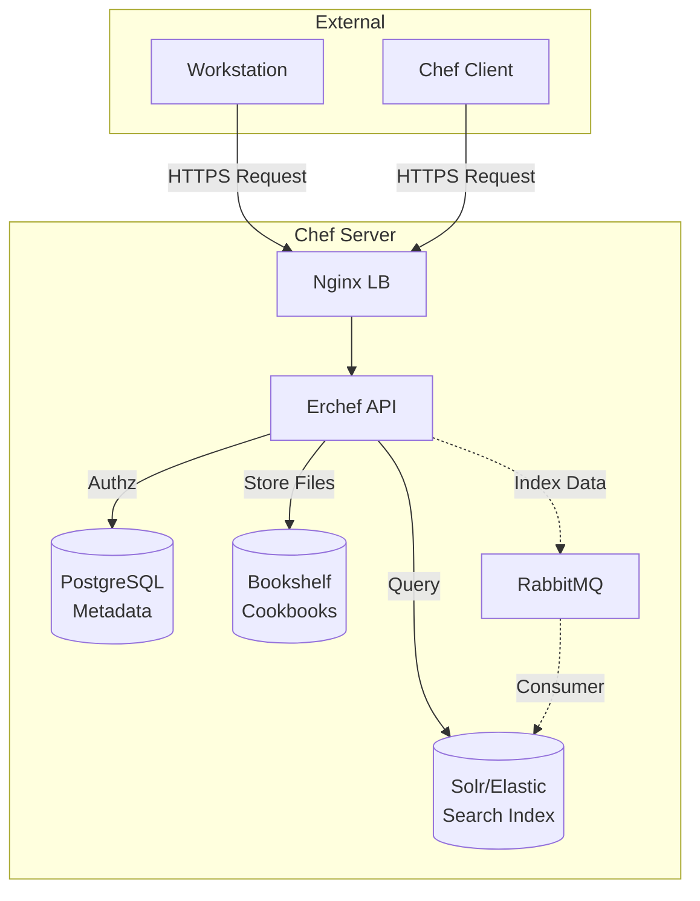

# The Chef Server: The Central Brain

The **Chef Server** is the hub of information. It acts as the central repository for all configuration data, including cookbooks, node policies, and metadata. It is the single source of truth that ensures all nodes are configured correctly.

## 1. Deep Dive: Architecture

The Chef Server is composed of several open-source services bundled together. Understanding these helps in troubleshooting.

### Core Components
1.  **Nginx**: The web front-end. It handles all HTTP/HTTPS requests to the API and routes them to the appropriate service.
2.  **Erchef (Erlang Chef)**: The core API server. It handles most of the logic, including authentication, search indexing, and data retrieval.
3.  **Bookshelf**: The S3-compatible object store that holds the actual cookbook files (recipes, templates, binaries).
4.  **Bifrost**: Handles authorization (permissions). It checks if Actor X is allowed to do Action Y on Object Z.
5.  **PostgreSQL**: The relational database. It stores metadata about nodes, environments, roles, and data bags.
6.  **Solr / Elasticsearch**: Used for the **Search** capability. When you run `knife search`, this service provides the results. It indexes data (via the `opscode-expander` or similar consumer) so it's searchable.
7.  **RabbitMQ**: A message queue used to pass data between components, primarily sending data to the search indexer.

### The Flow of Data
*   **Upload**: Workstation uploads a cookbook -> Nginx -> Erchef -> Bookshelf (files) + PostgreSQL (metadata).
*   **Search**: Workstation/Node asks for "webservers" -> Nginx -> Erchef -> Solr/Elasticsearch.
*   **Converge**: Node checks in -> Nginx -> Erchef -> Authenticates -> Retrieves Policy -> Erchef fetches from Bookshelf/DB.

## 2. Architecture Diagram

## 3. Real-Life Scenarios

### Scenario A: Search Indexer Lag
**Situation**: You just bootstrapped a node "web-05", but `knife search node 'name:web-05'` returns nothing for a few seconds.
**Cause**: The RabbitMQ queue might be backed up, or the Solr indexer is slow. It takes a moment for data to flow from Postgres (the System of Record) to Solr (the Search Index).
**Action**: Check `chef-server-ctl status`. If `opscode-expander` is down, search results won't update.

### Scenario B: Storage Full
**Situation**: Users cannot upload new cookbooks. Logs show disk space errors.
**Cause**: `/var/opt/opscode` is full. Bookshelf stores every version of every cookbook.
**Action**: Clean up old, unused cookbook versions using `knife cookbook bulk delete` or a maintenance script, then run `chef-server-ctl cleanup`.

## 4. Interview Questions

1.  **What is the role of `Ohai` in the context of the Chef Server?**
    *   *Answer*: Ohai runs on the *node*, gathers system stats (IP, RAM, OS), and sends this "Automatic Attribute" data to the Chef Server at the start of a run. This populates the Solr search index.

2.  **How does the Chef Server authenticate requests?**
    *   *Answer*: It uses **Public Key Infrastructure (PKI)**. The client hashes the request body and signs it with its Private Key. The Server uses the public key stored in PostgreSQL to verify the signature.

3.  **What is a "Run List"?**
    *   *Answer*: An ordered list of roles and/or recipes that defines exactly what Chef Client should apply to a specific node. It is stored on the Chef Server.

4.  **Explain "Policyfile" vs. "Berkshelf/Environment" workflow.**
    *   *Answer*: The traditional way uses Environments (Dev, Prod) and version pinning in Berkshelf. **Policyfiles** are a newer, immutable artifact way to bundle a complete set of cookbooks and attributes, solving the "version dependency hell" often found in the traditional workflow.

5.  **If the Chef Server goes down, what happens to the nodes?**
    *   *Answer*: Existing nodes continue running their configured services, but they cannot *converge* (update) or react to changes until the server is back. They fail their periodic chef-client runs.

## 5. Quiz: Test Your Knowledge

1.  **Which component stores the content of the cookbooks (files, templates)?**
    *   A) PostgreSQL
    *   B) Bookshelf
    *   C) Solr
    *   D) RabbitMQ

Click for Answer
B) Bookshelf

2.  **Which component is the web server that routes requests?**
    *   A) Apache
    *   B) IIS
    *   C) Nginx
    *   D) HAProxy

Click for Answer
C) Nginx

3.  **What listens on port 443 on the Chef Server?**
    *   A) Solr
    *   B) Nginx
    *   C) Erchef
    *   D) PostgreSQL

Click for Answer
B) Nginx

4.  **The "System of Record" for metadata (nodes, data bags) is:**
    *   A) Solr
    *   B) Redis
    *   C) PostgreSQL
    *   D) Flat files

Click for Answer
C) PostgreSQL

5.  **You want to find all nodes with more than 8GB of RAM. Which component services this query?**
    *   A) Bookshelf
    *   B) Solr / Elasticsearch
    *   C) Bifrost
    *   D) Nginx

Click for Answer
B) Solr / Elasticsearch

6.  **To restart all Chef Server services, you run:**
    *   A) `systemctl restart chef`
    *   B) `chef-server-ctl restart`
    *   C) `service chef restart`
    *   D) `knife server restart`

Click for Answer
B) chef-server-ctl restart

7.  **What does `chef-server-ctl reconfigure` do?**
    *   A) Reinstalls the RPM/DEB package.
    *   B) Applies the change in `/etc/opscode/chef-server.rb` to the internal services (effectively Chef running on itself).
    *   C) Deletes all data.
    *   D) Reboots the machine.

Click for Answer
B) Applies the change in /etc/opscode/chef-server.rb...

8.  **What represents a physical or virtual machine within the Chef Server?**
    *   A) A Client
    *   B) A Node Object
    *   C) A User
    *   D) A Databag

Click for Answer
B) A Node Object

9.  **True or False: The Chef Server pushes configurations to the nodes immediately when you upload a cookbook.**
    *   A) True
    *   B) False

Click for Answer
B) False (Chef is Pull-based)

10. **What is a "Data Bag"?**
    *   A) A backpack for the Chef.
    *   B) Global arbitrary JSON data accessible by any node (often used for users, secrets).
    *   C) A temporary cache.
    *   D) A log file.

Click for Answer
B) Global arbitrary JSON data...

11. **Which organization created Chef?**
    *   A) Puppet Labs
    *   B) Red Hat
    *   C) Opscode (now Chef/Progress)
    *   D) Google

Click for Answer
C) Opscode (now Chef/Progress)

12. **What is `Bifrost` responsible for?**
    *   A) Searching
    *   B) Authorization (ACLs)
    *   C) Routing
    *   D) Storage

Click for Answer
B) Authorization (ACLs)

13. **What acts as the message bus between Erchef and the Indexer?**
    *   A) Kafka
    *   B) ActiveMQ
    *   C) RabbitMQ
    *   D) ZeroMQ

Click for Answer
C) RabbitMQ

14. **Where can you view the Chef Server web UI?**
    *   A) Chef Dashboard
    *   B) Chef Manage / Automate
    *   C) Knife UI
    *   D) It has no UI.

Click for Answer
B) Chef Manage (Legacy) or Chef Automate

15. **What is a Chef "Organization"?**
    *   A) A company.
    *   B) A multi-tenant scope within the Chef Server containing its own nodes, cookbooks, and roles.
    *   C) A folder on disk.
    *   D) A group of users.

Click for Answer
B) A multi-tenant scope within the Chef Server...

16. **Which command creates a new organization on the server?**
    *   A) `knife org create`
    *   B) `chef-server-ctl org-create`
    *   C) `useradd org`
    *   D) `chef org new`

Click for Answer
B) chef-server-ctl org-create

17. **If `knife ssl check` fails, what is the likely issue?**
    *   A) The server is down.
    *   B) The workstation doesn't trust the Chef Server's self-signed certificate.
    *   C) You have the wrong password.
    *   D) The internet is down.

Click for Answer
B) The workstation doesn't trust the Chef Server's self-signed certificate.

18. **What is the command to create a user on the Chef Server via CLI?**
    *   A) `chef-server-ctl user-create`
    *   B) `knife user create`
    *   C) `adduser`
    *   D) `chef user new`

Click for Answer
A) `chef-server-ctl user-create` (Server-side) or `knife` (if admin)

19. **Can a node belong to multiple environments?**
    *   A) Yes
    *   B) No

Click for Answer
B) No (A node belongs to exactly one environment)

20. **Can a node have multiple roles?**
    *   A) Yes
    *   B) No

Click for Answer
A) Yes (Run-list can contain many roles)
