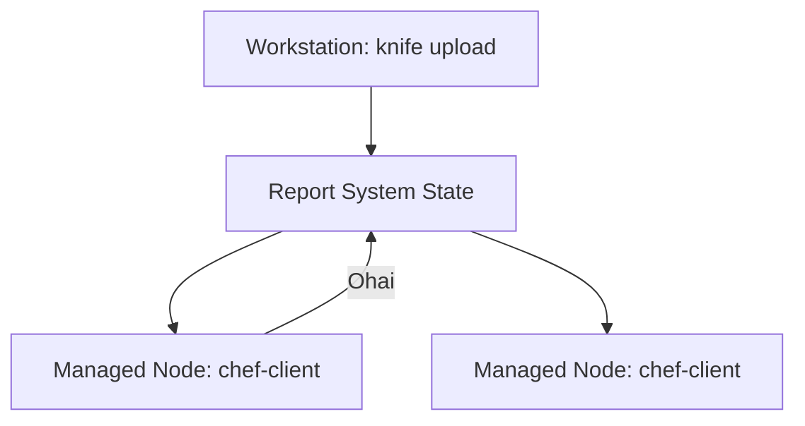

# Chef: Policy-Driven Automation

Chef is a powerful configuration management tool that transforms infrastructure into code. Using a Ruby-based Domain Specific Language (DSL), Chef allows you to define exactly how your servers should be configured.

## 📚 Module Structure
- **[Boilerplates](readme.md)**: `default.rb` (Nginx installation recipe).
- **[CHALLENGES](../../01-ansible/learning-modules/01-fundamentals/challenges.md)**: User management and attribute-driven logic.

---

## 🏗️ Architecture: The Chef Server Pattern

Chef works on a Client-Server model. You write code on your workstation, push it to the server, and nodes pull the code.

---

## 🔑 Key Concepts

| Concept | Description |
| :--- | :--- |
| **Recipe** | A single file containing resources (the "What"). |
| **Cookbook** | A package containing recipes, templates, and files. |
| **Resource** | A piece of the system (package, service, file). |
| **Ohai** | A tool that gathers system information (Attributes). |
| **Knife** | The command-line tool for interacting with the Chef Server. |

---

## 📖 Real-World Story: The "Compliance" Drift
**Scenario**: A financial company had 2,000 servers that needed a specific security patch.
**Problem**: Manually checking all 2,000 servers took weeks.
**Solution**: They wrote a **Chef Recipe** that defined the security setting.
**Result**: On the next `chef-client` run (every 30 mins), every server automatically applied the fix. They achieved 100% compliance in under an hour.

---

## ❓ Interview Questions

1. **What is 'Idempotency' in Chef?**
   - *Answer*: It means that regardless of how many times a recipe is run, the outcome is the same. Chef only makes changes if the current state of the node differs from the desired state defined in the recipe.
2. **What is a 'Data Bag'?**
   - *Answer*: A global JSON store for data that can be shared across multiple cookbooks/recipes (e.g., user lists, SSL certificates).
3. **What does 'Ohai' do?**
   - *Answer*: It runs at the start of every Chef run to collect system metadata (IP address, OS version, memory) and provides it to the recipe via the `node` object.

---

[Next: Helm](../../../../../readme.md)
