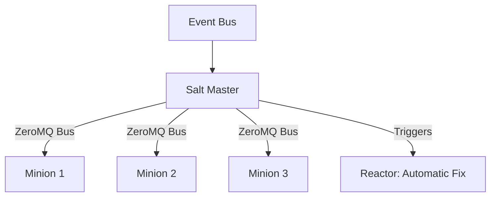

# SaltStack: High-Speed Event-Driven Automation

SaltStack (or Salt) is a Python-based, open-source infrastructure management platform. It excels at massive-scale remote execution and event-driven automation.

## 📚 Module Structure
- **[Boilerplates](readme.md)**: `init.sls` (Nginx state).
- **[CHALLENGES](../../01-ansible/learning-modules/01-fundamentals/challenges.md)**: Remote execution, Pillars, and Reactors.

---

## 🏗️ Architecture: The Master-Minion Bus

Salt uses a **ZeroMQ** message bus for extremely fast communication between the **Salt Master** and **Salt Minions**.

---

## 🔑 Key Concepts

| Keyword | Description |
| :--- | :--- |
| **Grains** | Static system info (OS, CPU) stored on the Minion. |
| **Pillars** | Secure, centralized data stored on the Master (Passwords, Keys). |
| **SLS (Salt State)** | YAML files defining the desired state of a system. |
| **Beacons** | Monitoring agents on Minions that send event signals to the Master. |
| **Reactors** | Logic on the Master that acts when a Beacon signal is received. |

---

## 🛡️ Robust Pattern: Targeted Execution
Never run commands on all servers if you don't have to. Use **Targeting**:
- By Grains: `salt -G 'os_family:RedHat' pkg.install vim`
- By List: `salt -L 'node1,node2' test.ping`
- By Regex: `salt -E 'web.*' service.restart nginx`

---

## 📖 Real-World Story: The "Self-Scaling" Database
**Scenario**: A high-traffic social app saw database performance drop as users grew.
**Outcome**: They used a **Salt Beacon** to monitor DB disk space. When space fell below 10%, the Beacon fired an event. The **Reactor** caught the event and triggered a script to expand the cloud volume and resize the filesystem.
**Result**: Zero downtime, zero manual intervention.

---

## ❓ Interview Questions

1. **What is ZeroMQ and why does Salt use it?**
   - *Answer*: ZeroMQ is a high-performance messaging library. Salt uses it because it is much faster than SSH (used by Ansible), allowing Salt to manage 10,000+ nodes effectively.
2. **Difference between Grains and Pillars?**
   - *Answer*: **Grains** are data ABOUT the minion (local, non-sensitive). **Pillars** are data FOR the minion (centralized, sensitive/config data).
3. **What is a 'State Run' (highstate)?**
   - *Answer*: Applying the `top.sls` configuration to a minion to ensure it matches its assigned desired state.

---

[Next: Packer](../../../../../readme.md)
