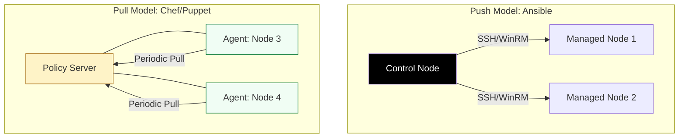

# ⚙️ Server Configuration: Layer 2 Orchestration

> **"If Provisioning builds the house, Configuration moves the furniture in and sets the alarm. A server is just a blank canvas; the configuration is the art of production-ready engineering."**


---

## 🧠 The Mental Model: The Master Remote

**The Junior Struggle**: "I need to install Nginx on 50 servers. I'll just open 50 terminal tabs and run `apt install` one by one. It'll take all day, but it's safe!" (Then they miss one server, or type the wrong version on 3 others).

**The Engineer Solution**: Use an **Agentless Push Tool** (Ansible).
Instead of manual commands, you write a **Playbook** (HCL/YAML). You describe the state ("Nginx must be Version 1.24 and running"). You hit one button, and Ansible "pushes" that reality to all 50 servers via SSH simultaneously.

### 🏗️ The Infrastructure Analogy

| Concept | Manufacturing Analogy | Ansible Equivalent |
|:--------|:----------------------|:-------------------|
| **Inventory** | The Shipping Address List | `hosts.ini` / Dynamic Inventory |
| **Playbook** | The Assembly Instruction | `site.yml` |
| **Module** | The Specialized Tool (Wrench) | `package`, `service`, `file` |
| **Facts** | The Machine's Self-Report | `ansible_facts` (RAM, OS, CPU) |
| **Handlers** | The "Wait until paint is dry" Trigger | `notify: restart_nginx` |

---

## 📚 Why This Module Matters for Juniors

**Before this module**, you might think:
- "Configuration management is just bash scripts"
- "I can manually patch 100 servers in an hour"
- "Agentless vs Agent-based doesn't matter"

**After this module**, you'll understand:
- **Idempotency** ensures that running a playbook twice won't break your site.
- **SSH-based Push (Ansible)** is the fastest way to gain control of a fleet.
- **Roles** allow you to share battle-tested configurations across teams.
- **Dynamic Inventories** automatically scale your automation as the cloud grows.

**The Difference**: You move from "Scaling by hours worked" to **"Scaling by code written."**

---

## 🎯 Learning Objectives

By the end of this module, you will:

- ✅ **Master Ansible Core**: Ad-hoc commands, Playbooks, and Tasks.
- ✅ **Implement Roles & Collections**: Building modular automation.
- ✅ **Manage Dynamic Inventories**: Auto-discovering cloud nodes.
- ✅ **Orchestrate Security**: Using Ansible Vault for secrets.
- ✅ **Enforce State**: Using Handlers and Conditionals for zero-outage updates.

---

## 🏗️ Configuration Architectures

Configuration Management (CM) relies on **Continuous State Enforcement**.



---

## 🚀 Professional Patterns for Engineers

### 1. Role-Based Organization
Never put 1,000 lines in one file. Use **Roles**.

```yaml
# 🚀 Standard: Composition of Roles
- name: Setup Production Web Layer
  hosts: web_servers
  become: yes
  roles:
    - { role: common, tags: ['base'] }      # Firewall, Users, Updates
    - { role: nginx, tags: ['web_app'] }    # SSL, Proxy Config
    - { role: monitoring, tags: ['ops'] }   # Datadog/Prometheus
```

### 2. The Idempotent File Check
```yaml
# ✅ Safe to run 1,000 times
- name: Ensure SSH is secure
  lineinfile:
    path: /etc/ssh/sshd_config
    regexp: '^PermitRootLogin'
    line: 'PermitRootLogin no'
  notify: restart_ssh # Only triggers if the file actually changed
```

---

## 🏆 Real-World DevOps Story: The CVE-2024 Emergency

**The Incident**: A critical Zero-Day vulnerability was found in `OpenSSL`. 5,000 servers had to be patched in 4 hours for compliance.
**The Failure**: Manual patching would take weeks. A standard bash script would fail on nodes with different OS versions (Ubuntu 20, 22, RHEL 8).
**The Fix**: A 10-line Ansible Playbook using the `package` module. It was run across the fleet in parallel.
**The Outcome**: 4,980 servers were patched in **45 minutes**. The remaining 20 were flagged for disk-space issues. The security audit was passed with a single JSON report generated by Ansible.

---

## ❓ Interview Preparation (Ansible)

### 🎯 Core Concepts

1. **Q: What is 'Idempotency' in Ansible?**
    *   *Answer: It is the property that an operation can be applied multiple times without changing the result beyond the initial application. This makes it safe to run playbooks repeatedly.*
2. **Q: How does Ansible's 'Agentless' architecture work?**
    *   *Answer: It uses existing protocols like SSH (for Linux) and WinRM (for Windows) to push small Python modules to the server, execute them, and then delete them. No software needs to be installed on the managed nodes beforehand.*
3. **Q: What is a 'Handler' and when does it run?**
    *   *Answer: A handler is a task that is only executed if another task 'notifies' it. This usually happens when a configuration file is changed and a service needs to be restarted.*
4. **Q: Ansible Playbooks vs. Roles?**
    *   *Answer: A Playbook is a mapping between a group of hosts and the tasks they should perform. A Role is a self-contained bundle of variables, files, templates, and tasks that can be shared across multiple playbooks.*

---

## 📝 Knowledge Check

1. **Which protocol does Ansible use for Linux by default?**
    * [ ] a) HTTP
    * [x] b) SSH
    * [ ] c) FTP
2. **Where are variables defined in a reusable directory structure?**
    * [x] a) `group_vars/` or `host_vars/`
    * [ ] b) `main.py`
    * [ ] c) `/tmp/vars`
3. **True or False: Ansible replaces standard Shell Scripts.**
    * [ ] a) True
    * [x] b) False (It enhances them by making them declarative and idempotent).
4. **Which command checks your syntax without running the tasks?**
    * [x] a) `ansible-playbook --syntax-check`
    * [ ] b) `ansible-verify`
    * [ ] c) `ansible-lint`

---

## 🔗 Next Steps

Servers are provisioned and configured. But what happens if we want to move even faster? Let's explore the world of "Baking" instead of "Cooking."

**Proceed to**: [Immutable Infrastructure & Packer →](readme.md)


---
## 🧭 Additional Modules
- [01 Ansible](01-ansible/readme.md)
- [02 Chef](02-chef/readme.md)
- [03 Puppet](03-puppet/readme.md)
- [04 SaltStack](04-saltstack/readme.md)
