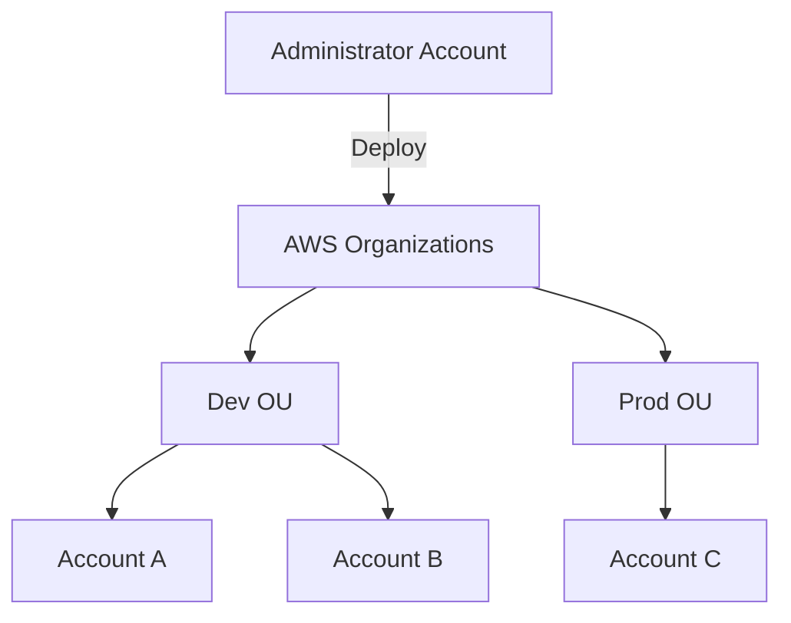

# 🏆 CloudFormation Advanced Level

## 📋 Learning Objectives
- ✅ Orchestrate multi-account deployments with **StackSets**
- ✅ Develop **CloudFormation Macros** for template transformation
- ✅ Integrate with **CI/CD Pipelines** (CodePipeline, GitHub Actions)
- ✅ Implement **Infrastructure Compliance** using Guard and cfn-nag
- ✅ Master **Resource Import** and **Private Extensions**

---

## 🏢 Enterprise Governance: StackSets

StackSets extend the functionality of stacks by letting you create, update, or delete stacks across multiple accounts and regions with a single operation.



### Key Use Cases
- **Centralized Security**: Deploy IAM roles and Config rules to every account.
- **Disaster Recovery**: Replicate infrastructure across multiple regions.
- **Standardized Environments**: Ensure VPCs/Subnets are identical across the org.

---

## 🛠️ Template Extensions

### 1. Macros
Macros enable you to perform custom processing on templates. When you create a macro, you specify a Lambda function that CloudFormation calls to process the template.

```yaml
Transform: MyCustomMacro
Resources:
  MyInstance:
    Type: AWS::EC2::Instance
    # Parameters that the macro will process
```

### 2. Private Extensions (Registry)
The CloudFormation Registry allows you to manage and use non-AWS resources (e.g., Datadog, GitHub, MongoDB) exactly like native AWS resources.

---

## 🛡️ Advanced Security & Compliance

### 1. Stack Policies
A JSON document that defines the update actions that can be performed on specified resources.
```json
{
  "Statement" : [
    {
      "Effect" : "Allow",
      "Action" : "Update:*",
      "Principal": "*",
      "Resource" : "*"
    },
    {
      "Effect" : "Deny",
      "Action" : "Update:Replace",
      "Principal": "*",
      "Resource" : "LogicalResourceId/ProductionDatabase"
    }
  ]
}
```

### 2. Deployment Pipelines
Integrating CloudFormation into your CI/CD process (e.g., AWS CodePipeline).
- **Stage 1**: Template Validation (cfn-lint).
- **Stage 2**: Security Scanning (cfn-nag, Checkov).
- **Stage 3**: Create/Review Change Set.
- **Stage 4**: Execute Change Set to Production.

---

## 🔄 Operations at Scale
- **Dynamic References**: Retrieve secrets from AWS Secrets Manager or parameters from SSM Parameter Store directly in the template.
- **Resource Import**: Bring existing resources (created via Console or CLI) under CloudFormation management without downtime.
- **WaitConditions**: Coordinate resource creation with external events or software installation completion.
