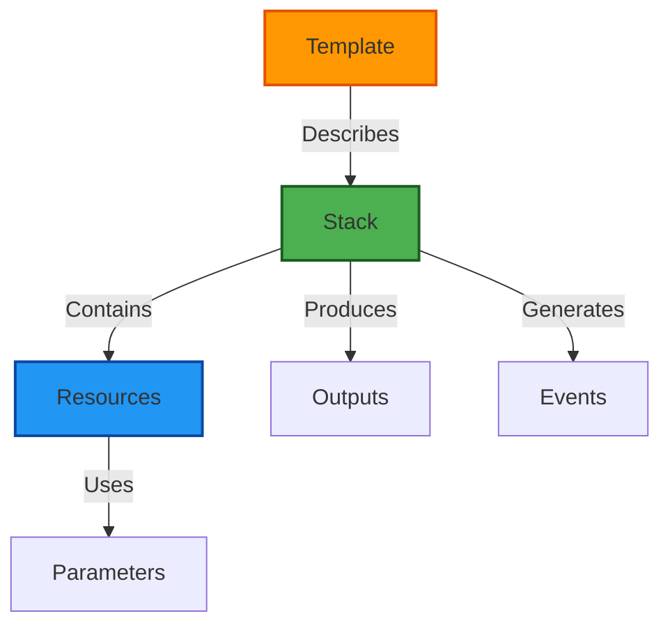
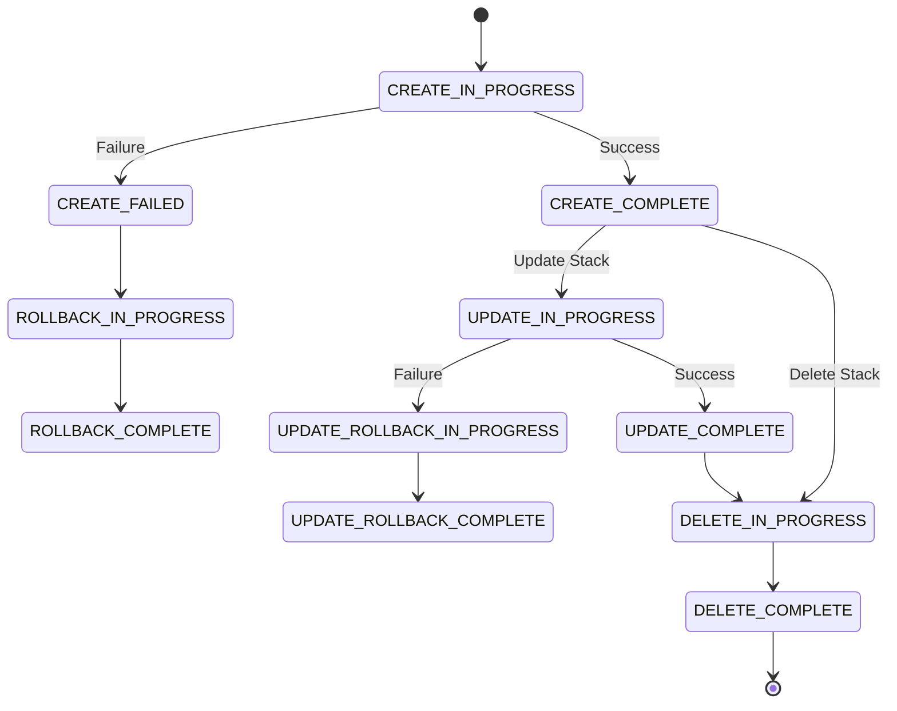

# 🔰 CloudFormation Beginner Level

## 📋 Learning Objectives

By the end of this level, you will be able to:
- ✅ Understand CloudFormation core concepts and terminology
- ✅ Write basic YAML and JSON templates
- ✅ Create simple AWS resources (S3, EC2, VPC)
- ✅ Use parameters, outputs, and basic intrinsic functions
- ✅ Deploy and manage stacks using AWS Console and CLI
- ✅ Troubleshoot common template errors

---
## 🎓 Prerequisites
- AWS Account with appropriate permissions
- Basic understanding of AWS services (EC2, S3, VPC)
- AWS CLI installed and configured
- Text editor or IDE (VS Code recommended with CloudFormation extension)

---
## 📚 Core Concepts

### What is CloudFormation?
CloudFormation is AWS's Infrastructure as Code service that lets you:
- **Model** your infrastructure using templates
- **Provision** resources automatically
- **Update** infrastructure safely
- **Delete** entire environments cleanly

### Key Terminology



- **Template**: JSON or YAML file defining infrastructure
- **Stack**: Running instance of a template with actual AWS resources
- **Resource**: AWS component (EC2, S3, RDS, etc.)
- **Parameter**: Input value that customizes the template
- **Output**: Value to display or export after stack creation
- **Change Set**: Preview of changes before updating a stack

---
## 📝 Template Structure

### Minimum Template
```yaml
AWSTemplateFormatVersion: '2010-09-09'
Description: 'My first CloudFormation template'

Resources:
  MyFirstBucket:
    Type: AWS::S3::Bucket
```
### Complete Template Sections
```yaml
AWSTemplateFormatVersion: '2010-09-09'  # Required version string
Description: String                      # Optional description

Metadata:                                # Optional metadata
  AWS::CloudFormation::Interface:
    ParameterGroups: []

Parameters:                              # Optional input parameters
  ParameterName:
    Type: String

Mappings:                                # Optional lookup tables
  RegionMap:
    us-east-1:
      AMI: ami-12345678

Conditions:                              # Optional conditional logic
  CreateProdResources: !Equals [!Ref Env, prod]

Resources:                               # REQUIRED - AWS resources
  LogicalResourceId:
    Type: AWS::Service::ResourceType
    Properties:
      PropertyName: Value

Outputs:                                 # Optional output values
  OutputName:
    Description: String
    Value: !Ref ResourceLogicalId
```

---
## 🛠️ Example 1: Simple S3 Bucket

### Basic S3 Bucket
```yaml
AWSTemplateFormatVersion: '2010-09-09'
Description: 'Create a simple S3 bucket'

Resources:
  MyS3Bucket:
    Type: AWS::S3::Bucket
    Properties:
      BucketName: my-cloudformation-bucket-12345
      Tags:
        - Key: Environment
          Value: Development
        - Key: ManagedBy
          Value: CloudFormation
````

### Deploy this template:
```bash
aws cloudformation create-stack \
  --stack-name my-s3-stack \
  --template-body file://s3-bucket.yaml \
  --region us-east-1
```

---

## 🛠️ Example 2: S3 Bucket with Parameters

```yaml
AWSTemplateFormatVersion: '2010-09-09'
Description: 'S3 bucket with parameterized name and environment'

Parameters:
  BucketPrefix:
    Type: String
    Description: Prefix for the S3 bucket name
    Default: myapp
  
  Environment:
    Type: String
    Description: Environment name
    AllowedValues:
      - dev
      - staging
      - prod
    Default: dev

Resources:
  MyS3Bucket:
    Type: AWS::S3::Bucket
    Properties:
      BucketName: !Sub '${BucketPrefix}-${Environment}-bucket'
      VersioningConfiguration:
        Status: Enabled
      Tags:
        - Key: Environment
          Value: !Ref Environment

Outputs:
  BucketName:
    Description: Name of the created S3 bucket
    Value: !Ref MyS3Bucket
  
  BucketArn:
    Description: ARN of the S3 bucket
    Value: !GetAtt MyS3Bucket.Arn
```

### Deploy with parameters:
```bash
aws cloudformation create-stack \
  --stack-name parameterized-s3-stack \
  --template-body file://s3-with-params.yaml \
  --parameters \
    ParameterKey=BucketPrefix,ParameterValue=mycompany \
    ParameterKey=Environment,ParameterValue=dev
```

---

## 🛠️ Example 3: EC2 Instance with Security Group

```yaml
AWSTemplateFormatVersion: '2010-09-09'
Description: 'EC2 instance with security group'

Parameters:
  KeyName:
    Type: AWS::EC2::KeyPair::KeyName
    Description: EC2 Key Pair for SSH access
  
  InstanceType:
    Type: String
    Default: t2.micro
    AllowedValues:
      - t2.micro
      - t2.small
      - t2.medium
    Description: EC2 instance type

Mappings:
  # See [Global-Image-Inventory.md](../../../../../../../../../../../08-resources/05-cloud-metadata/global-image-inventory.md) for latest IDs
  RegionMap:
    us-east-1:
      AMI: ami-0c55b159cbfafe1f0
    us-west-2:
      AMI: ami-0d1cd67c26f5fca19
    eu-west-1:
      AMI: ami-0bbc25e23a7640b9b

Resources:
  MySecurityGroup:
    Type: AWS::EC2::SecurityGroup
    Properties:
      GroupDescription: Allow SSH and HTTP
      SecurityGroupIngress:
        - IpProtocol: tcp
          FromPort: 22
          ToPort: 22
          CidrIp: 0.0.0.0/0
          Description: SSH access
        - IpProtocol: tcp
          FromPort: 80
          ToPort: 80
          CidrIp: 0.0.0.0/0
          Description: HTTP access
      Tags:
        - Key: Name
          Value: MyWebServerSG

  MyEC2Instance:
    Type: AWS::EC2::Instance
    Properties:
      InstanceType: !Ref InstanceType
      KeyName: !Ref KeyName
      ImageId: !FindInMap [RegionMap, !Ref 'AWS::Region', AMI]
      SecurityGroupIds:
        - !Ref MySecurityGroup
      Tags:
        - Key: Name
          Value: MyWebServer
      UserData:
        Fn::Base64: !Sub |
          #!/bin/bash
          yum update -y
          yum install -y httpd
          systemctl start httpd
          systemctl enable httpd
          echo "<h1>Hello from CloudFormation!</h1>" > /var/www/html/index.html

Outputs:
  InstanceId:
    Description: Instance ID
    Value: !Ref MyEC2Instance
  
  PublicDNS:
    Description: Public DNS name
    Value: !GetAtt MyEC2Instance.PublicDnsName
  
  PublicIP:
    Description: Public IP address
    Value: !GetAtt MyEC2Instance.PublicIp
  
  WebsiteURL:
    Description: Website URL
    Value: !Sub 'http://${MyEC2Instance.PublicDnsName}'
```

### Deploy:
```bash
aws cloudformation create-stack \
  --stack-name web-server-stack \
  --template-body file://ec2-webserver.yaml \
  --parameters ParameterKey=KeyName,ParameterValue=my-keypair
```

---

## 🔑 Essential Intrinsic Functions

### 1. Ref - Reference Resources and Parameters

```yaml
Parameters:
  BucketName:
    Type: String

Resources:
  MyBucket:
    Type: AWS::S3::Bucket
    Properties:
      BucketName: !Ref BucketName  # References parameter

  MyEC2:
    Type: AWS::EC2::Instance
    Properties:
      SecurityGroupIds:
        - !Ref MySecurityGroup  # References another resource
```

### 2. GetAtt - Get Resource Attributes

```yaml
Outputs:
  BucketDomainName:
    Value: !GetAtt MyBucket.DomainName
  
  InstancePrivateIp:
    Value: !GetAtt MyEC2Instance.PrivateIp
```

### 3. Sub - String Substitution

```yaml
Resources:
  MyBucket:
    Type: AWS::S3::Bucket
    Properties:
      BucketName: !Sub '${AWS::StackName}-bucket-${AWS::Region}'
      # Result: my-stack-bucket-us-east-1
```

### 4. Join - Concatenate Strings

```yaml
!Join 
  - '-'
  - - !Ref EnvironmentName
    - 'webapp'
    - 'bucket'
# Result: dev-webapp-bucket
```

### 5. FindInMap - Lookup in Mappings

```yaml
Mappings:
  EnvironmentMap:
    dev:
      InstanceType: t2.micro
    prod:
      InstanceType: t2.large

Resources:
  MyInstance:
    Type: AWS::EC2::Instance
    Properties:
      InstanceType: !FindInMap [EnvironmentMap, !Ref Environment, InstanceType]
```

---

## 🛠️ Common AWS CLI Commands

### Create Stack
```bash
aws cloudformation create-stack \
  --stack-name my-stack \
  --template-body file://template.yaml \
  --parameters file://parameters.json

# With capabilities for IAM resources
aws cloudformation create-stack \
  --stack-name my-stack \
  --template-body file://template.yaml \
  --capabilities CAPABILITY_IAM CAPABILITY_NAMED_IAM
```

### Describe Stack
```bash
# Get stack information
aws cloudformation describe-stacks --stack-name my-stack

# Get stack status
aws cloudformation describe-stacks \
  --stack-name my-stack \
  --query 'Stacks[0].StackStatus' \
  --output text
```

### List Stacks
```bash
# List all stacks
aws cloudformation list-stacks

# List active stacks only
aws cloudformation list-stacks \
  --stack-status-filter CREATE_COMPLETE UPDATE_COMPLETE
```

### Update Stack
```bash
aws cloudformation update-stack \
  --stack-name my-stack \
  --template-body file://template-updated.yaml
```

### Delete Stack
```bash
aws cloudformation delete-stack --stack-name my-stack

# Wait for deletion to complete
aws cloudformation wait stack-delete-complete --stack-name my-stack
```

### Get Stack Outputs
```bash
aws cloudformation describe-stacks \
  --stack-name my-stack \
  --query 'Stacks[0].Outputs'
```

### View Stack Events
```bash
aws cloudformation describe-stack-events \
  --stack-name my-stack \
  --max-items 10
```

---

## 🐛 Common Errors and Troubleshooting

### 1. Template Validation Errors

**Error**: `Template format error: YAML not well-formed`

**Solution**: Validate YAML syntax
```bash
aws cloudformation validate-template \
  --template-body file://template.yaml
```

### 2. Resource Already Exists

**Error**: `Bucket already exists`

**Solution**: Use unique names or add random suffix
```yaml
BucketName: !Sub 'my-bucket-${AWS::StackName}-${AWS::AccountId}'
```

### 3. Insufficient Permissions

**Error**: `User is not authorized to perform: cloudformation:CreateStack`

**Solution**: Ensure IAM permissions include:
- `cloudformation:*`
- Permissions for resources being created (e.g., `s3:*`, `ec2:*`)

### 4. Parameter Validation Failed

**Error**: `Parameter validation failed`

**Solution**: Check parameter constraints
```yaml
Parameters:
  InstanceType:
    Type: String
    AllowedValues:  # Restrict to specific values
      - t2.micro
      - t2.small
```

### 5. Rollback on Failure

**What happens**: Stack creation fails and rolls back

**To investigate**:
```bash
# View error events
aws cloudformation describe-stack-events \
  --stack-name my-stack \
  --query 'StackEvents[?ResourceStatus==`CREATE_FAILED`]'
```

---

## 📊 Stack Lifecycle



---

## ✅ Beginner Practice Challenges

### Challenge 1: Create a Versioned S3 Bucket
**Objective**: Create an S3 bucket with versioning enabled

**Requirements**:
- Enable versioning
- Add lifecycle policy to transition old versions to Glacier
- Add tags for Environment and Project

### Challenge 2: Launch a Simple Web Server
**Objective**: Deploy an EC2 instance running Apache

**Requirements**:
- Use a security group allowing port 80 and 22
- Install and start Apache using UserData
- Output the public DNS name

### Challenge 3: Multi-Resource Template
**Objective**: Create VPC with public subnet

**Requirements**:
- VPC with CIDR 10.0.0.0/16
- Public subnet with CIDR 10.0.1.0/24
- Internet Gateway attached to VPC
- Route table with route to IGW

---

## 📚 Additional Resources

### Official Documentation
- [CloudFormation Template Reference](https://docs.aws.amazon.com/AWSCloudFormation/latest/UserGuide/template-reference.html)
- [Resource Types](https://docs.aws.amazon.com/AWSCloudFormation/latest/UserGuide/aws-template-resource-type-ref.html)
- [Intrinsic Functions](https://docs.aws.amazon.com/AWSCloudFormation/latest/UserGuide/intrinsic-function-reference.html)

### Tools
- [CloudFormation Linter (cfn-lint)](https://github.com/aws-cloudformation/cfn-lint)
- [VS Code CloudFormation Extension](https://marketplace.visualstudio.com/items?itemName=aws-scripting-guy.cform)

### Sample Templates
- [AWS Sample Templates](https://github.com/awslabs/aws-cloudformation-templates)

---

## 🎯 Knowledge Check

Before moving to Intermediate level, ensure you can:

- [ ] Write a basic CloudFormation template from scratch
- [ ] Use parameters to make templates reusable
- [ ] Create common resources (S3, EC2, Security Groups)
- [ ] Use intrinsic functions (Ref, GetAtt, Sub)
- [ ] Deploy stacks using AWS CLI
- [ ] Troubleshoot basic template errors
- [ ] Understand stack states and lifecycle
- [ ] Export and reference outputs

---

**Next Level**: [Intermediate CloudFormation](../intermediate/readme.md)

**Return to**: [CloudFormation Main](../readme.md)

## 💡 Junior-Friendly Tip: AMI Management
AMI IDs change per region and are frequently updated with security patches. **Never hardcode them in production.** 

To find the latest Amazon Linux 2023 ID programmatically via the CLI, run:
```bash
aws ec2 describe-images \
    --owners amazon \
    --filters "Name=name,Values=al2023-ami-*-x86_64" \
    --query 'sort_by(Images, &CreationDate)[-1].ImageId' \
    --output text
```
Check the centralized [Global Image Inventory](../../../../../../../../../../../08-resources/05-cloud-metadata/global-image-inventory.md) for a curated list of IDs.
