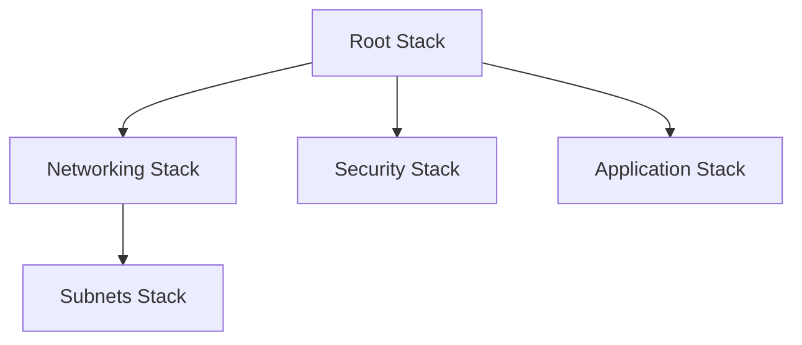
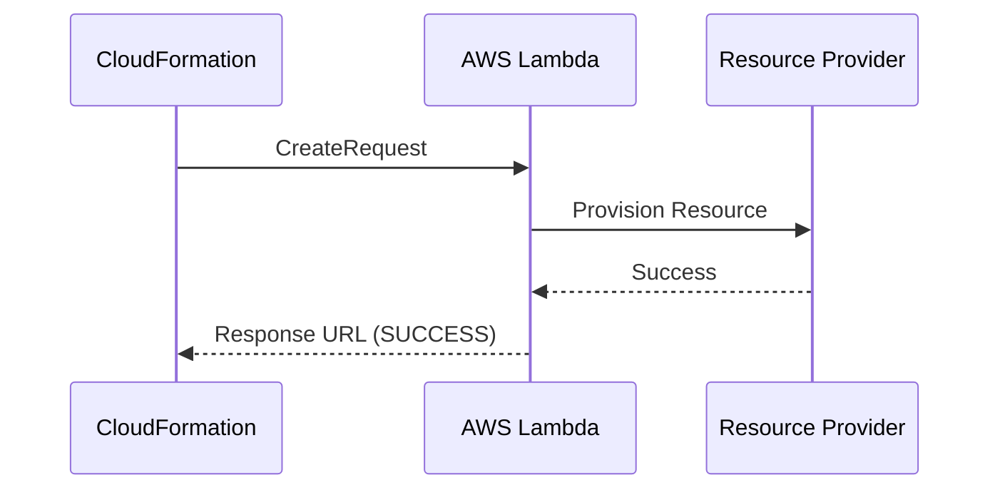
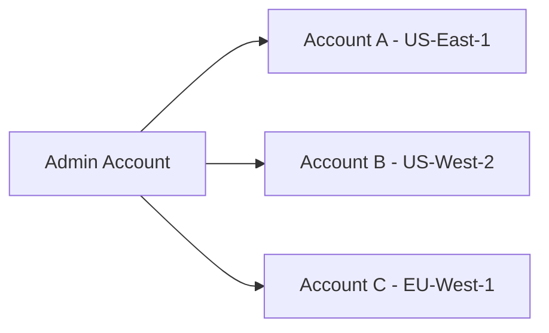

# 🚀 CloudFormation Intermediate Level

## 📋 Learning Objectives
- ✅ Design modular templates using **Nested Stacks** and **Exports**
- ✅ Implement **Change Sets** for safe deployments
- ✅ Master **Drift Detection** and remediation
- ✅ Utilize **Helper Scripts** (cfn-init, cfn-signal) for booting instances
- ✅ Create **Custom Resources** via Lambda

---

## 🏗️ Modular Architecture

### 1. Nested Stacks
Nested stacks are stacks created as part of other stacks. You create a nested stack within another stack by using the `AWS::CloudFormation::Stack` resource.



### 2. Cross-Stack References
Use `Export` in the Outputs of one stack and `Fn::ImportValue` in another.

```yaml
# Network Stack
Outputs:
  VpcId:
    Value: !Ref MyVPC
    Export:
      Name: !Sub "${AWS::StackName}-VPCID"

# App Stack
Resources:
  WebServer:
    Type: AWS::EC2::Instance
    Properties:
      VpcId: !ImportValue "Network-Stack-VPCID"
```

---

## 🛠️ Advanced Automation

### 1. CloudFormation Helper Scripts
Used to configure EC2 instances during stack creation.
- **cfn-init**: Reads template metadata to install packages, create files, and start services.
- **cfn-signal**: Signals CloudFormation when the configuration is complete.
- **cfn-hup**: Daemon that checks for metadata updates.

### 2. Custom Resources
Allow you to manage resources not natively supported by CloudFormation (e.g., retrieving a value from an external API).



---

## 🧪 Intermediate Practice
- Create a **Multi-tier VPC** using nested stacks.
- Deploy an **Auto Scaling Group** that uses `cfn-init` to install Nginx.
- Use **Change Sets** to update an instance type without interruption.

---

# 🏆 CloudFormation Advanced Level

## 📋 Learning Objectives
- ✅ Orchestrate multi-account deployments with **StackSets**
- ✅ Develop **CloudFormation Macros** for template transformation
- ✅ Integrate with **CI/CD Pipelines** (CodePipeline, GitHub Actions)
- ✅ Implement **Infrastructure Compliance** using Guard and cfn-nag

---

## 🏢 Enterprise Governance

### 1. StackSets
Extend the functionality of stacks by letting you create, update, or delete stacks across multiple accounts and regions with a single operation.



### 2. Macros and Transforms
Macros enable you to perform custom processing on templates. When you create a macro, you specify a Lambda function that CloudFormation calls to process the template.

---

## 🛡️ Security and Compliance
- **IAM Policies**: Use `AWS::CloudFormation::Stack` with specific Service Roles.
- **Stack Policies**: Prevent accidental updates to critical production resources (e.g., Databases).
- **cfn-nag**: Static analysis tool to search for insecure patterns.

---

## 🔄 Lifecycle and Optimization
- **Termination Protection**: Prevent accidental stack deletion.
- **Rollback Configuration**: Monitor CloudWatch Alarms during deployment; if they trigger, CloudFormation rolls back automatically.
- **Resource Import**: Bring existing AWS resources into CloudFormation management without re-creating them.
