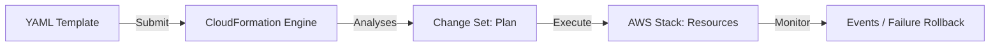

# AWS CloudFormation: Native IaC

CloudFormation is the native infrastructure-as-code service for AWS. It allows you to model your entire AWS infrastructure in single, text-based templates (YAML or JSON).

## 📚 Module Structure
- **[Boilerplates](readme.md)**: `template.yaml` (S3 and Parameters).
- **[CHALLENGES](../../03-server-configuration-and-ansible/01-ansible/learning-modules/01-fundamentals/challenges.md)**: Stack updates, intrinsic functions, and deletion policies.

---

## 🏗️ Architecture: The Stack Lifecycle

CloudFormation groups resources into a single unit called a **Stack**. You don't manage individual resources; you manage the Stack.

---

## 🔑 Key Concepts

| Keyword | Description |
| :--- | :--- |
| **Stack** | A collection of AWS resources you can manage as a single unit. |
| **Change Set** | A preview of how proposed changes to a stack might impact your running resources. |
| **Intrinsic Functions** | Built-in functions like `!Ref`, `!GetAtt`, or `!Sub` that assign values at runtime. |
| **Drift Detection** | Checking if your real AWS resources have been manually changed outside of the template. |

---

## 🛡️ Robust Pattern: Rollback on Failure
CloudFormation automatically rolls back the entire stack if a single resource fails to create. This ensures you never have a half-finished environment. You can customize this with `OnFailure=ROLLBACK`.

---

## 📖 Real-World Story: The "Nested" Complexities
**Scenario**: An enterprise had to deploy a web app with 50 resources across 10 regions.
**Problem**: Maintaining one giant template was a nightmare.
**Solution**: They used **Nested Stacks**.
**Result**: They broke the app into `network-stack.yaml`, `db-stack.yaml`, and `app-stack.yaml`. This allowed different teams to own different parts of the code.

---

## ❓ Interview Questions

1. **What is a 'Change Set'?**
   - *Answer*: It is an object that describes the changes CloudFormation will make (adds, modifies, deletes) before you actually execute the update.
2. **Explain the difference between `!Ref` and `!GetAtt`.**
   - *Answer*: `!Ref` returns the logical ID of a resource (like an Instance ID). `!GetAtt` returns a specific attribute of that resource (like its Private IP or Public DNS).
3. **What is 'Drift Detection'?**
   - *Answer*: A feature that compares the current state of your AWS resources with the template used to create them. It identifies "manually" made changes that could break your automation.

---

[⬅️ Back to Vendor Tools Index](../readme.md)

---
## 🧭 Additional Modules
- [Advanced](advanced/readme.md)
- [Beginner](beginner/readme.md)
- [Intermediate](intermediate/readme.md)
- [Interview Questions](interview-questions/readme.md)
