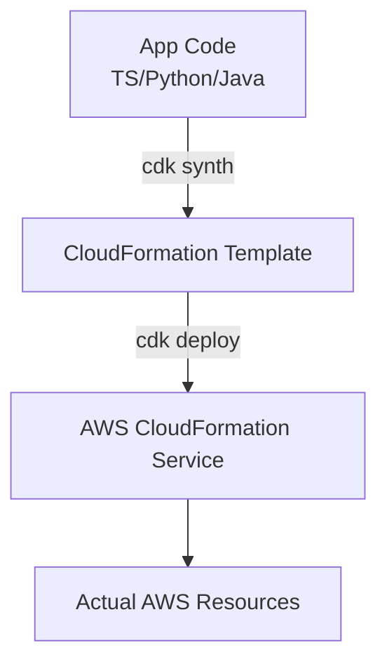

# 💻 AWS Cloud Development Kit (CDK)

## 📋 Overview
The **AWS Cloud Development Kit (CDK)** is an open-source software development framework to define cloud infrastructure in code and provision it through AWS CloudFormation. It allows you to use the power of modern programming languages to model your applications.

### Why use CDK?
- **Familiar Languages**: Write infrastructure in TypeScript, Python, Java, C#, or Go.
- **High-level Abstractions**: Use **Constructs** to define complex resources with sensible defaults.
- **Better Logic**: Use loops, conditionals, and classes.
- **Tooling**: Use IDE features like autocomplete, type checking, and unit testing.

---

## 🏗️ CDK Architecture

---

## 📂 Module Structure

### 🔰 [Beginner Level](./beginner/readme.md)
- Installation and Environment Setup
- CDK CLI commands (init, synth, deploy, diff)
- Understanding Stacks and Apps
- Basics of L1 and L2 Constructs

### 🚀 [Intermediate Level](./intermediate/readme.md)
- Custom Constructs (L3)
- Context and Environment variables
- Assets (Local files/images)
- Testing your CDK app (Fine-grained and Snapshot testing)

### 🏆 [Advanced Level](./advanced/readme.md)
- CDK Pipelines for self-mutating CI/CD
- Cross-account and cross-region deployments
- Aspects for governance and tagging
- Advanced construct patterns and sharing Libraries

---

## ❓ Interview Questions & Quiz
- [CDK Interview Questions & 20+ Quiz Questions](./interview-questions/readme.md)
