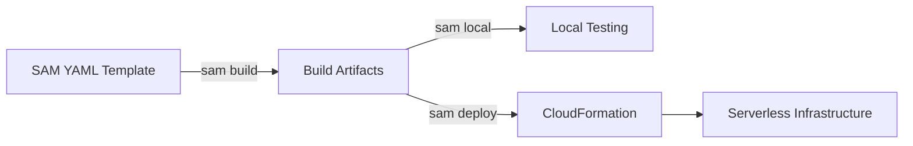

# ⚡ AWS Serverless Application Model (SAM)

## 📋 Overview
The **AWS Serverless Application Model (SAM)** is an open-source framework for building serverless applications. It provides shorthand syntax to express functions, APIs, databases, and event source mappings.

### Why use SAM?
- **Shorthand Syntax**: Define complex serverless architectures in a few lines of YAML.
- **Local Testing**: Run and debug Lambda functions locally using the SAM CLI.
- **Deep Integration**: Built specifically for AWS serverless services (Lambda, API Gateway, DynamoDB, S3).
- **Extension of CloudFormation**: SAM templates are transformed into CloudFormation templates during deployment.

---

## 🏗️ SAM Workflow

---

## 📂 Module Structure

### 🔰 [Beginner Level](./beginner/readme.md)
- Introduction to SAM and Serverless basics
- Template structure and simple Function/API definitions
- SAM CLI commands (init, build, deploy)

### 🚀 [Intermediate Level](./intermediate/readme.md)
- Local testing with `sam local invoke` and `sam local start-api`
- Managing environments with Parameter Store and Secrets Manager
- Event mapping (S3 triggers, DynamoDB Streams)

### 🏆 [Advanced Level](./advanced/readme.md)
- Canary and Linear deployments with CodeDeploy
- SAM Pipelines for CI/CD
- Nested applications and global configurations
- Integration with Step Functions

---

## ❓ Interview Questions & Quiz
- [SAM Interview Questions & 20+ Quiz Questions](./interview-questions/readme.md)
