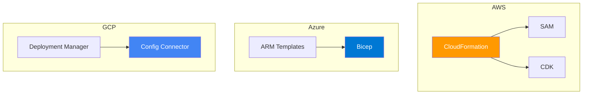

# 🏢 Vendor-Specific IaC: Deep Integration & Lock-In

> **"Vendor tools provide the deepest integration at the cost of portability. Choosing the right tool isn't about avoiding lock-in—it's about choosing the right lock for your castle."**

---

## 🧠 The Mental Model: The OEM vs. The Universal Tool

**The Junior Struggle**: "I'm terrified of 'Vendor Lock-In'! I'll only use multi-cloud tools so I can move to Azure tomorrow if I want to." (Then they spend 3 weeks trying to make a generic tool support a brand-new AWS feature that CloudFormation supports out of the box).

**The Engineer Solution**: Understand the **Law of Diminishing Portability**. 
90% of companies never switch clouds once they reach production. Using a **Vendor-Native Tool** (CDK, Bicep, Deployment Manager) allows you to use 100% of the cloud's features on Day 1, with zero "Translation Layers." 

### 🏗️ The Infrastructure Analogy

| Concept | Car Analogy | DevOps Tool |
|:--------|:------------|:------------|
| **Multi-Cloud IaC** | Generic Spare Parts (Fit many cars) | Terraform / Pulumi |
| **Vendor-Native IaC** | Original Equipment (OEM) Parts | AWS CDK / Azure Bicep |
| **Serverless IaC** | Electric Tuning Kit | AWS SAM |
| **K8s-Native IaC** | Smart Suspension System | GCP Config Connector |

---

## 📚 Why This Module Matters for Juniors

**Before this module**, you might think:
- "CloudFormation is just Terraform but worse"
- "Programming languages shouldn't be used for infrastructure"
- "Vendor lock-in is the ultimate evil"

**After this module**, you'll understand:
- **AWS CDK** allows you to use loops, classes, and logic to build complex cloud stacks.
- **Azure Bicep** is the modern, readable evolution of ARM templates.
- **GCP Config Connector** treats cloud resources like Kubernetes objects.
- **Day-0 Support**: Vendor tools support new features the second they are released.

**The Difference**: You move from "Fearing the cloud" to **"Mastering the platform."**

---

## 🎯 Learning Objectives

By the end of this module, you will:

- ✅ **Analyze Trade-offs**: Truly understanding Vendor Lock-in vs. Velocity.
- ✅ **Master AWS CDK**: Building infrastructure in TypeScript/Python.
- ✅ **Implement Azure Bicep**: Modernizing Azure deployments.
- ✅ **Adopt K8s-Native IaC**: Managing Google Cloud via `kubectl`.
- ✅ **Select the Strategy**: Learning when to go "Vendor Native."

---

## 🏗️ The Vendor Ecosystem

Each cloud provider has a "Stack" of tools depending on your skill level and needs.

---

## ⚖️ The "Lock-In" Choice Matrix

| Feature | Multi-Cloud (Terraform) | Vendor-Native (CDK/Bicep) |
|:--------|:-----------------------|:--------------------------|
| **Portability** | ✅ High | ❌ Low |
| **New Features** | ⚠️ Delayed | ✅ Day-0 Support |
| **Complexity** | ⚠️ Moderate | ✅ Handles complex logic well |
| **Integration** | ⚠️ Good | ✅ Perfect |
| **Cost** | 💰 Variable | 🆓 Usually Free |

---

## 🚀 Professional Patterns for Engineers

### 1. The "Wrapper" Pattern
Even if you use a vendor tool, wrap your logic in reusable "Constructs" (AWS) or "Modules" (Bicep) so the *intent* remains clear even if the *tool* is specific.

### 2. High-Level Constructs (CDK)
Avoid building every VPC Subnet manually. Use `Vpc.fromLookup()` or `new Vpc()` which automatically creates public/private subnets according to best practices.

---

## 🏆 Real-World DevOps Story: The Day-0 Launch

**The Incident**: AWS announced a revolutionary new security service at 10:00 AM during re:Invent. A financial firm needed to implement it immediately for a major audit at 2:00 PM.
**The Failure**: The team's multi-cloud tool didn't have a provider update yet. They were stuck waiting for third-party developers to write the code.
**The Fix**: The SRE team switched to **CloudFormation**. Since it's native, the service was available for automation the literal minute it was announced.
**The Outcome**: The audit was passed, and the team realized that for "Bleeding Edge" services, vendor-native tools are an essential part of the toolkit.

---

## ❓ Interview Preparation (Vendor IaC)

### 🎯 Core Concepts

1. **Q: Why use AWS CDK instead of CloudFormation?**
    *   *Answer: CDK allows you to use real programming languages (Python/TS). You get type checking, IDE auto-complete, and the ability to build 'Constructs' that encapsulate 100 lines of JSON into 1 line of code.*
2. **Q: Is Azure Bicep just a wrapper?**
    *   *Answer: Yes, it is a DSL that transpiles into ARM JSON. It provides much better readability and modularity while retaining 100% compatibility with Azure's back-end.*
3. **Q: What is the benefit of GCP Config Connector?**
    *   *Answer: It allows you to manage non-K8s resources (like Cloud SQL or GCS buckets) using Kubernetes manifests and `kubectl`. This centralizes your entire app+infra management into one GitOps workflow.*

---

## 📝 Knowledge Check

1. **Which AWS tool is best for Serverless/Lambda-heavy apps?**
    * [ ] a) Bicep
    * [x] b) SAM
    * [ ] c) Deployment Manager
2. **True or False: Using a programming language for IaC is called 'Imperative' but the result is often 'Declarative'.**
    * [x] a) True (CDK synthesizes into a declarative template).
    * [ ] b) False.
3. **Which GCP tool integrates cloud resources directly into Kubernetes?**
    * [x] a) Config Connector
    * [ ] b) Pulumi
    * [ ] c) CloudFormation

---

**Return to [Strategic IaC Overview](../readme.md)**

---
## 🧭 Additional Modules
- [01 AWS CloudFormation](01-aws-cloudformation/readme.md)
- [02 AWS CDK](02-aws-cdk/readme.md)
- [03 AWS SAM](03-aws-sam/readme.md)
- [04 Azure ARM](04-azure-arm/readme.md)
- [05 Azure Bicep](05-azure-bicep/readme.md)
- [06 GCP Deployment Manager](06-gcp-deployment-manager/readme.md)
- [07 GCP Config Connector](07-gcp-config-connector/readme.md)
- [08 Pulumi](08-pulumi/readme.md)
