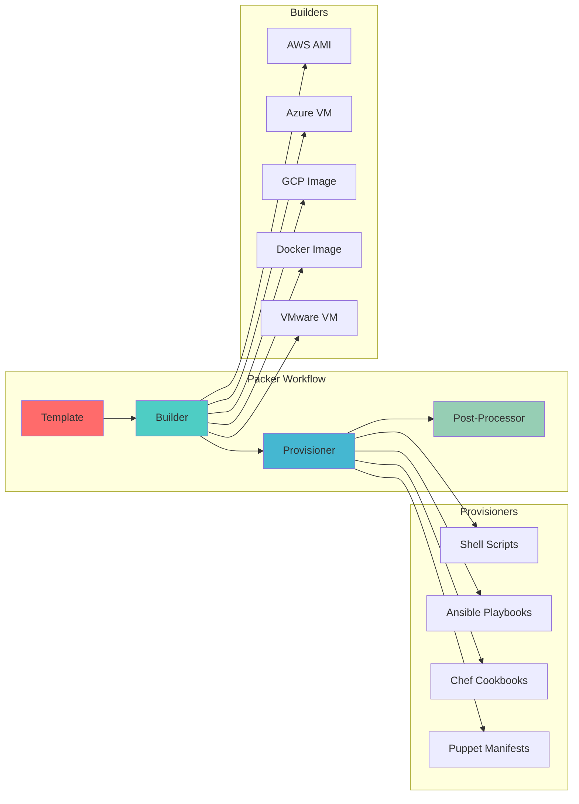

# 📦 Packer: Automated Image Building

Packer is HashiCorp's open-source tool for creating identical machine images for multiple platforms from a single source configuration, enabling consistent and reproducible infrastructure deployments.

---

## 🎯 **What is Packer?**

Packer automates the creation of machine images across multiple platforms including AWS AMIs, Azure VMs, Docker containers, VMware, VirtualBox, and more. It uses a single JSON or HCL configuration to build images consistently.

### **Key Features**
- **Multi-Platform**: Build images for AWS, Azure, GCP, VMware, Docker, etc.
- **Consistent Images**: Same configuration produces identical images
- **Infrastructure as Code**: Version-controlled image definitions
- **Parallel Builds**: Build multiple images simultaneously
- **Provisioner Support**: Shell, Ansible, Chef, Puppet integration
- **Post-Processing**: Compress, upload, or transform built images

---

## 🏗️ **Architecture Overview**



---

## 🛠️ **Learning Modules**

### **Module 1: Packer Fundamentals**
- **Installation & Setup**: Installing Packer and basic configuration
- **Template Structure**: Understanding JSON and HCL formats
- **Builders**: Platform-specific image creation
- **Basic Workflows**: First image build and validation

### **Module 2: Provisioning & Configuration**
- **Shell Provisioners**: Script-based configuration
- **Ansible Integration**: Playbook-driven provisioning
- **File Provisioners**: Copying files and configurations
- **Multi-Stage Builds**: Complex provisioning workflows

### **Module 3: Advanced Features**
- **Variables & Functions**: Dynamic template configuration
- **Parallel Builds**: Multi-platform image creation
- **Post-Processors**: Image optimization and distribution
- **Debugging & Troubleshooting**: Build process optimization

### **Module 4: Enterprise Patterns**
- **CI/CD Integration**: Automated image pipelines
- **Golden Images**: Standardized base images
- **Security Hardening**: Compliance and security automation
- **Image Management**: Versioning and lifecycle management

---

## 📚 **Template Examples**

### **Basic AWS AMI Template (HCL)**
```hcl
# aws-ubuntu.pkr.hcl
packer {
  required_plugins {
    amazon = {
      version = ">= 1.0.0"
      source  = "github.com/hashicorp/amazon"
    }
  }
}

variable "region" {
  type    = string
  default = "us-east-1"
}

variable "instance_type" {
  type    = string
  default = "t3.micro"
}

source "amazon-ebs" "ubuntu" {
  ami_name      = "custom-ubuntu-{{timestamp}}"
  instance_type = var.instance_type
  region        = var.region
  
  source_ami_filter {
    filters = {
      name                = "ubuntu/images/*ubuntu-jammy-22.04-amd64-server-*"
      root-device-type    = "ebs"
      virtualization-type = "hvm"
    }
    most_recent = true
    owners      = ["099720109477"]
  }
  
  ssh_username = "ubuntu"
  
  tags = {
    Name        = "CustomUbuntu"
    Environment = "Production"
    OS_Version  = "Ubuntu 22.04"
    Built_By    = "Packer"
  }
}

build {
  name = "ubuntu-build"
  sources = [
    "source.amazon-ebs.ubuntu"
  ]
  
  # Update system packages
  provisioner "shell" {
    inline = [
      "sudo apt-get update",
      "sudo apt-get upgrade -y",
      "sudo apt-get install -y curl wget git vim htop"
    ]
  }
  
  # Install Docker
  provisioner "shell" {
    script = "scripts/install-docker.sh"
  }
  
  # Configure system
  provisioner "file" {
    source      = "configs/"
    destination = "/tmp/"
  }
  
  provisioner "shell" {
    inline = [
      "sudo mv /tmp/configs/* /etc/",
      "sudo systemctl enable docker",
      "sudo usermod -aG docker ubuntu"
    ]
  }
  
  # Clean up
  provisioner "shell" {
    inline = [
      "sudo apt-get autoremove -y",
      "sudo apt-get autoclean",
      "sudo rm -rf /tmp/*",
      "history -c"
    ]
  }
}
```

### **Multi-Platform Template**
```hcl
# multi-platform.pkr.hcl
source "amazon-ebs" "aws" {
  ami_name      = "web-server-aws-{{timestamp}}"
  instance_type = "t3.micro"
  region        = "us-east-1"
  
  source_ami_filter {
    filters = {
      name = "ubuntu/images/*ubuntu-jammy-22.04-amd64-server-*"
    }
    most_recent = true
    owners      = ["099720109477"]
  }
  
  ssh_username = "ubuntu"
}

source "azure-arm" "azure" {
  client_id       = var.azure_client_id
  client_secret   = var.azure_client_secret
  tenant_id       = var.azure_tenant_id
  subscription_id = var.azure_subscription_id
  
  managed_image_resource_group_name = "packer-images"
  managed_image_name               = "web-server-azure-{{timestamp}}"
  
  os_type         = "Linux"
  image_publisher = "Canonical"
  image_offer     = "0001-com-ubuntu-server-jammy"
  image_sku       = "22_04-lts-gen2"
  
  vm_size = "Standard_B1s"
}

source "docker" "docker" {
  image  = "ubuntu:22.04"
  commit = true
  
  changes = [
    "EXPOSE 80",
    "ENTRYPOINT [\"/usr/sbin/nginx\", \"-g\", \"daemon off;\"]"
  ]
}

build {
  sources = [
    "source.amazon-ebs.aws",
    "source.azure-arm.azure",
    "source.docker.docker"
  ]
  
  # Common provisioning for all platforms
  provisioner "shell" {
    inline = [
      "apt-get update",
      "apt-get install -y nginx",
      "systemctl enable nginx"
    ]
  }
  
  # Platform-specific provisioning
  provisioner "shell" {
    only = ["amazon-ebs.aws"]
    inline = [
      "apt-get install -y awscli",
      "echo 'AWS-specific configuration' > /etc/motd"
    ]
  }
  
  provisioner "shell" {
    only = ["azure-arm.azure"]
    inline = [
      "apt-get install -y azure-cli",
      "echo 'Azure-specific configuration' > /etc/motd"
    ]
  }
  
  # Post-processing
  post-processor "docker-tag" {
    only       = ["docker.docker"]
    repository = "mycompany/web-server"
    tags       = ["latest", "{{timestamp}}"]
  }
}
```

---

## 🔧 **Advanced Provisioning**

### **Ansible Integration**
```hcl
# ansible-provisioning.pkr.hcl
build {
  sources = ["source.amazon-ebs.ubuntu"]
  
  # Install Ansible dependencies
  provisioner "shell" {
    inline = [
      "sudo apt-get update",
      "sudo apt-get install -y python3-pip",
      "pip3 install ansible"
    ]
  }
  
  # Run Ansible playbook
  provisioner "ansible" {
    playbook_file = "playbooks/web-server.yml"
    extra_arguments = [
      "--extra-vars",
      "target=default ansible_host=${build.Host} ansible_user=${build.User} ansible_ssh_private_key_file=${build.SSHPrivateKey}"
    ]
  }
}
```

### **Multi-Stage Build**
```hcl
# multi-stage.pkr.hcl
build {
  sources = ["source.amazon-ebs.base"]
  
  # Stage 1: Base system setup
  provisioner "shell" {
    inline = [
      "sudo apt-get update",
      "sudo apt-get upgrade -y"
    ]
  }
  
  # Stage 2: Security hardening
  provisioner "file" {
    source      = "security/hardening.sh"
    destination = "/tmp/hardening.sh"
  }
  
  provisioner "shell" {
    inline = [
      "chmod +x /tmp/hardening.sh",
      "sudo /tmp/hardening.sh"
    ]
  }
  
  # Stage 3: Application installation
  provisioner "ansible" {
    playbook_file = "playbooks/application.yml"
  }
  
  # Stage 4: Cleanup and optimization
  provisioner "shell" {
    script = "scripts/cleanup.sh"
  }
}
```

---

## 🔄 **CI/CD Integration**

### **Jenkins Pipeline**
```groovy
pipeline {
    agent any
    
    parameters {
        choice(
            name: 'PLATFORM',
            choices: ['aws', 'azure', 'docker', 'all'],
            description: 'Target platform for image build'
        )
        string(
            name: 'VERSION',
            defaultValue: 'latest',
            description: 'Image version tag'
        )
    }
    
    stages {
        stage('Checkout') {
            steps {
                git 'https://github.com/company/packer-images.git'
            }
        }
        
        stage('Validate Template') {
            steps {
                sh 'packer validate web-server.pkr.hcl'
            }
        }
        
        stage('Build Image') {
            steps {
                script {
                    if (params.PLATFORM == 'all') {
                        sh 'packer build web-server.pkr.hcl'
                    } else {
                        sh "packer build -only=${params.PLATFORM} web-server.pkr.hcl"
                    }
                }
            }
        }
        
        stage('Test Image') {
            steps {
                sh 'scripts/test-image.sh'
            }
        }
        
        stage('Publish') {
            steps {
                sh 'scripts/publish-image.sh ${params.VERSION}'
            }
        }
    }
    
    post {
        always {
            cleanWs()
        }
    }
}
```

### **GitHub Actions**
```yaml
# .github/workflows/build-images.yml
name: Build Images

on:
  push:
    branches: [main]
  pull_request:
    branches: [main]

jobs:
  build:
    runs-on: ubuntu-latest
    
    strategy:
      matrix:
        platform: [aws, azure, docker]
    
    steps:
    - uses: actions/checkout@v3
    
    - name: Setup Packer
      uses: hashicorp/setup-packer@main
      with:
        version: latest
    
    - name: Validate Template
      run: packer validate templates/${{ matrix.platform }}.pkr.hcl
    
    - name: Build Image
      run: packer build templates/${{ matrix.platform }}.pkr.hcl
      env:
        AWS_ACCESS_KEY_ID: ${{ secrets.AWS_ACCESS_KEY_ID }}
        AWS_SECRET_ACCESS_KEY: ${{ secrets.AWS_SECRET_ACCESS_KEY }}
        AZURE_CLIENT_ID: ${{ secrets.AZURE_CLIENT_ID }}
        AZURE_CLIENT_SECRET: ${{ secrets.AZURE_CLIENT_SECRET }}
```

---

## 🎯 **Best Practices**

### **1. Template Organization**
- Use version control for all templates
- Implement modular template structure
- Separate variables from logic
- Use consistent naming conventions

### **2. Security Hardening**
- Remove unnecessary packages and services
- Apply security patches during build
- Configure proper file permissions
- Implement compliance requirements

### **3. Performance Optimization**
- Use parallel builds when possible
- Optimize provisioning scripts
- Implement proper caching strategies
- Monitor build times and costs

### **4. Image Management**
- Implement proper versioning
- Tag images with metadata
- Set up automated cleanup policies
- Document image contents and usage

---

## 🔍 **Troubleshooting Guide**

### **Common Issues**
1. **Build Failures**: Provisioning script errors or timeouts
2. **Authentication Problems**: Cloud provider credential issues
3. **Network Connectivity**: Firewall or security group problems
4. **Resource Limits**: Insufficient permissions or quotas

### **Debugging Commands**
```bash
# Validate template syntax
packer validate template.pkr.hcl

# Debug build process
packer build -debug template.pkr.hcl

# Inspect variables
packer inspect template.pkr.hcl

# Format template
packer fmt template.pkr.hcl

# Build specific source only
packer build -only=amazon-ebs.ubuntu template.pkr.hcl
```

---

## 📊 **Comparison Matrix**

| Feature | Packer | Docker | Vagrant | Custom Scripts |
|---------|--------|--------|---------|----------------|
| **Multi-Platform** | Excellent | Limited | Good | Manual |
| **Reproducibility** | Excellent | Excellent | Good | Poor |
| **Learning Curve** | Medium | Low | Low | High |
| **CI/CD Integration** | Excellent | Excellent | Limited | Manual |
| **Cloud Native** | Excellent | Good | Limited | Manual |
| **Maintenance** | Low | Low | Medium | High |

---

## 🏆 **Interview Questions**

### **Technical Questions**
1. **Explain the difference between Packer builders, provisioners, and post-processors.**
2. **How does Packer ensure image reproducibility across different platforms?**
3. **What are the advantages of using Packer over manual image creation?**
4. **Describe how you would implement a golden image pipeline with Packer.**

### **Practical Scenarios**
1. **Building compliant images for regulated industries**
2. **Implementing disaster recovery with pre-built images**
3. **Managing image lifecycle and versioning strategies**
4. **Integrating Packer with existing CI/CD workflows**

---

## 🚀 **Advanced Topics**

### **Custom Plugins**
```go
// Custom builder plugin example
package main

import (
    "github.com/hashicorp/packer-plugin-sdk/plugin"
    "github.com/hashicorp/packer-plugin-sdk/version"
)

func main() {
    pps := plugin.NewSet()
    pps.RegisterBuilder("custom", new(Builder))
    pps.SetVersion(version.InitializePluginVersion("1.0.0", ""))
    err := pps.Run()
    if err != nil {
        panic(err)
    }
}
```

### **Dynamic Variables**
```hcl
# Dynamic variable generation
locals {
  timestamp = regex_replace(timestamp(), "[- TZ:]", "")
  
  common_tags = {
    Environment = var.environment
    Project     = var.project_name
    Built_By    = "Packer"
    Build_Time  = local.timestamp
  }
}

variable "environment" {
  type        = string
  description = "Environment name"
  validation {
    condition     = contains(["dev", "staging", "prod"], var.environment)
    error_message = "Environment must be dev, staging, or prod."
  }
}
```

---

## 📖 **Resources & References**

### **Official Documentation**
- [Packer Documentation](https://www.packer.io/docs)
- [Packer Plugins](https://www.packer.io/plugins)

### **Community Resources**
- [Packer GitHub Repository](https://github.com/hashicorp/packer)
- [Community Templates](https://github.com/hashicorp/packer/tree/main/examples)

### **Integration Examples**
- [AWS AMI Builder](https://www.packer.io/plugins/builders/amazon)
- [Azure ARM Builder](https://www.packer.io/plugins/builders/azure)
- [Docker Builder](https://www.packer.io/plugins/builders/docker)

---

**Next Steps**: Master Packer fundamentals, implement automated image pipelines, and integrate with infrastructure automation workflows for consistent, secure deployments.

*"Build once, deploy everywhere with consistent, reproducible machine images."*

---
## 🧭 Additional Modules
- [01 Fundamentals](01-fundamentals/readme.md)
