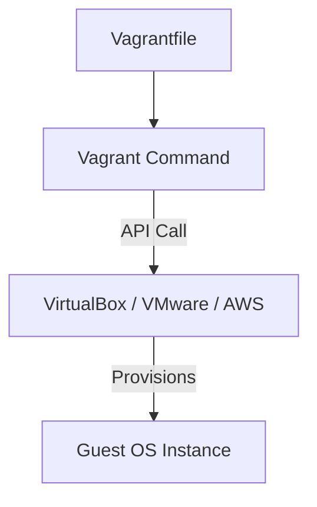

# Vagrant: Development Environment Consistency

Vagrant is a tool for building and managing virtual machine environments in a single workflow. It ensures that every member of a team is developing on an identical system, reducing the "It works on my machine" problem.

## 📚 Module Structure
- **[Boilerplates](readme.md)**: `Vagrantfile` (Multi-machine setup).
- **[CHALLENGES](../../../03-server-configuration-and-ansible/01-ansible/learning-modules/01-fundamentals/challenges.md)**: Networking, Synced Folders, and Resource Tuning.

---

## 🏗️ Architecture: The Provider abstraction

Vagrant is a "wrapper" around virtualization providers like VirtualBox, VMware, or AWS.

---

## 🔑 Key Concepts

| Keyword | Description |
| :--- | :--- |
| **Box** | Reusable base images for VMs (stored on Vagrant Cloud). |
| **Provider** | The virtualization backend (Hypervisor). |
| **Provisioner** | Tools used to setup the VM (Shell script, Ansible, Chef). |
| **Synced Folder** | A folder on your host that is mirrored inside the guest. |

---

## 🛡️ Robust Pattern: Clean Destruction
Don't let unused VMs bloat your disk space.
- `vagrant halt`: Shutdown the VM.
- `vagrant suspend`: Pause the VM.
- `vagrant destroy`: Wipe the VM and its disk completely (The "DevOps" way).

---

## 📖 Real-World Story: The "Python Version" Conflict
**Scenario**: A team had 5 developers. 3 used Macs with Python 3.9, 2 used Windows with Python 3.7. The production server was Ubuntu with Python 3.8.
**Crisis**: Code would pass tests on some laptops but crash in Production due to library mismatch.
**Solution**: They created a **Vagrantfile** using the same Ubuntu box as Production.
**Result**: Deployment errors dropped to zero overnight.

---

## ❓ Interview Questions

1. **What is the 'Vagrant Cloud'?**
   - *Answer*: A public repository of pre-built VM images (Boxes) hosted by Hashicorp.
2. **How does `vagrant up` find the VM settings?**
   - *Answer*: It reads the `Vagrantfile` in the current directory, which contains all definitions for the box, networking, and provisioning.
3. **What is a 'provisioner' in Vagrant?**
   - *Answer*: A script or configuration tool (like Ansible) that runs automatically after the VM boots to install software and configure the environment.

---

[Next: Pulumi](../../../../../readme.md)
