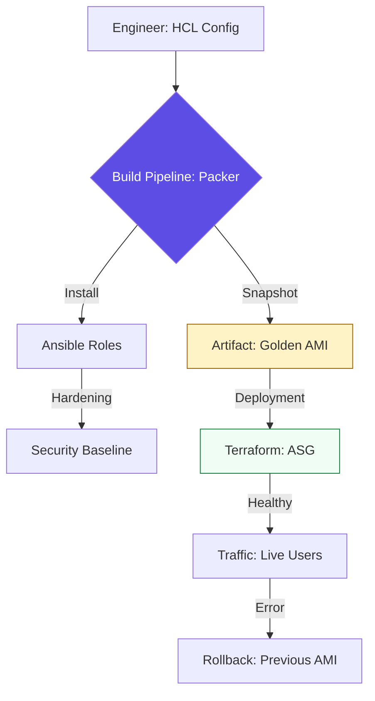

# 🧊 Immutable Infrastructure: The Build Factory

> **"A server is a software artifact, not a physical object. If you have to SSH into a production server to fix a bug, your process has failed. Build. Bake. Replace."**


---

## 🧠 The Mental Model: The Prefab Home

**The Junior Struggle**: "My servers are all slightly different because I patched them at different times. I'm terrified to restart them because they might not come back the same way!" (The "Snowflake" effect).

**The Engineer Solution**: Stop "Cooking" servers in the field. **"Bake"** them in the factory. 
You build a **Golden Image** (AMI/VMDK) that contains everything: the OS, the app, the security patches, and the logs. When you need a new server, you don't install software; you just "boot" the image. It is identical every single time. 

### 🏗️ The Infrastructure Analogy

Think of Immutability like **Modular Housing**:

| Concept | Traditional Building | Immutable Building |
|:--------|:---------------------|:-------------------|
| **OS Setup** | Laying bricks in the rain | Factory-poured foundation |
| **Software** | Plumbers & Electricians | Modular kitchen plug-ins |
| **Updates** | Renovating a lived-in house | Swapping the whole house |
| **Tool** | Toolbelt (Manual) | Packer (Assembly Line) |
| **Philosophy** | **"Frying"** (Config on boot) | **"Baking"** (Config in image) |

---

## 📚 Why This Module Matters for Juniors

**Before this module**, you might think:
- "SSH is a valid way to maintain servers"
- "Auto-scaling is slow because it takes 15 minutes to configure"
- "I can't test my OS changes until they reach production"

**After this module**, you'll understand:
- **Packer** allows you to build identical images for AWS, Azure, and VMWare from one file.
- **Auto-Scaling** becomes instantaneous when you use pre-baked images.
- **Rollbacks** are just pointing your Load Balancer to the previous image version.
- **Cloud-Init** handles the "Last Mile" (setting local hostnames/IPs) at boot.

**The Difference**: You move from "Hand-crafting individual servers" to **"Manufacturing entire fleets."**

---

## 🎯 Learning Objectives

By the end of this module, you will:

- ✅ **Master Packer**: Building multi-cloud artifacts (AMIs, OVAs).
- ✅ **Implement Build Pipelines**: Automating the creation of "Golden Images."
- ✅ **Infrastructure Hardening**: Applying CIS benchmarks *during* the build phase.
- ✅ **Understand Cloud-Init**: Orchestrating the "First Boot" logic.
- ✅ **Version Infrastructure**: Treating OS images like binary releases (v1.0.0).

---

## 🏗️ The Immutable Lifecycle

In an immutable world, we move from **Patching** to **Provisioning Artifacts**.



---

## 🚀 Professional Patterns for Engineers

### 1. Multi-Cloud Image Templates
Build once, deploy anywhere.

```hcl
# 🚀 Packer HCL: Standard Multi-Cloud Template
source "amazon-ebs" "ubuntu" {
  ami_name      = "hardened-ubuntu-{{timestamp}}"
  instance_type = "t3.medium"
  region        = "us-east-1"
  ssh_username  = "ubuntu"
}

build {
  sources = ["source.amazon-ebs.ubuntu"]

  # 🛡️ Step 1: Security Updates
  provisioner "shell" {
    inline = ["sudo apt-get update && sudo apt-get upgrade -y"]
  }

  # 🛡️ Step 2: Policy Enforcement
  provisioner "ansible" {
    playbook_file = "./playbooks/harden.yml"
  }
}
```

### 2. The Cloud-Init "Last Mile"
Use User-Data to apply unique settings *only* at first boot (hostname, SSH keys).

---

## 🏆 Real-World DevOps Story: The Black Friday Surge

**The Incident**: A news site had an auto-scaling group that "Fried" servers (ran a 10-minute Ansible playbook on every new boot).
**The Failure**: During a traffic spike, 50 new servers were requested. It took 10 minutes for them to be "Ready." By then, the existing servers had crashed under the load. 
**The Fix**: Transition to **Golden Images** using Packer.
**The Outcome**: Next spike, new servers were "Ready" in **45 seconds**. The site survived with zero downtime.

---

## ❓ Interview Preparation (Immutability)

### 🎯 Core Concepts

1. **Q: 'Bake' vs 'Fry'?**
    *   *Answer: 'Bake' means pre-installing everything into the image (Packer). 'Fry' means configuring a blank OS at boot (Cloud-Init/Ansible). Baking is faster and more reliable.*
2. **Q: What is a 'Phoenix Server'?**
    *   *Answer: A server designed to be destroyed and recreated from a Golden Image regularly to ensure no configuration drift or malware remains persistent.*
3. **Q: Why use Packer instead of just 'creating an AMI from a running instance'?**
    *   *Answer: Packer ensures the build is **Repeatable** and **Documented**. Manual AMIs are 'snowflakes' because you don't know exactly what commands were run to build them.*
4. **Q: What is Cloud-Init?**
    *   *Answer: A standard tool that executes at the first boot of a cloud server to handle unique metadata-driven tasks like setting hostnames, IPs, or injecting SSH keys.*

---

## 📝 Knowledge Check

1. **Which tool is the industry standard for building 'Golden Images'?**
    * [ ] a) Terraform
    * [x] b) Packer
    * [ ] c) Docker
2. **True or False: Immutable servers are patched while they are running.**
    * [ ] a) True
    * [x] b) False (We build a new image and replace the server).
3. **What is the 'Golden Image' philosophy?**
    * [x] a) All servers of a certain type are launched from an identical, pre-tested, hardened template.
    * [ ] b) An image that costs significantly more to run.
    * [ ] c) A backup of a crashed server.

---

## 🔗 Next Steps

You've built the foundation and the OS images. Now let's manage the most complex environment of all: Kubernetes.

**Proceed to**: [Kubernetes Config & Helm →](readme.md)


---
## 🧭 Additional Modules
- [01 Cloud Init](01-cloud-init/readme.md)
- [02 Packer](02-packer/readme.md)
- [03 Vagrant](03-vagrant/readme.md)
