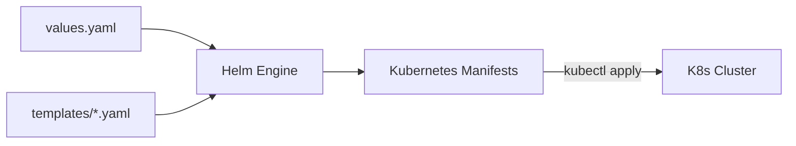

# Helm: The Kubernetes Package Manager

Helm helps you manage Kubernetes applications. Helm Charts help you define, install, and upgrade even the most complex Kubernetes application.

## 📚 Module Structure
- **[Boilerplates](readme.md)**: `deployment.yaml` (Chart Template).
- **[CHALLENGES](../../../03-server-configuration-and-ansible/01-ansible/learning-modules/01-fundamentals/challenges.md)**: Overriding values, debugging, and rollbacks.

---

## 🏗️ Architecture: The Templating Engine

Helm takes a **Chart** (Skeleton YAML + Values) and renders it into valid **Kubernetes Manifests**.



---

## 🔑 Key Concepts

| Concept | Description |
| :--- | :--- |
| **Chart** | A bundle of information necessary to create an instance of a Kubernetes application. |
| **Release** | A running instance of a chart with a specific config. |
| **Values** | The parameters passed to the chart templates. |
| **Library Charts** | A type of chart that provides utilities/templates but doesn't deploy anything itself. |

---

## 🛡️ Robust Pattern: Helper Templates
Use `_helpers.tpl` for re-usable logic across multiple templates to keep your code clean and consistent.

```yaml
{{/* Define a naming helper */}}
{{- define "mychart.name" -}}
{{- default .Chart.Name .Values.nameOverride | trunc 63 | trimSuffix "-" }}
{{- end }}
```

---

## 📖 Real-World Story: The "Misconfigured Image"
**Scenario**: A developer accidentally updated the production image tag to `latest` instead of a specific version.
**Crisis**: All pods pulled a broken experimental version of the app.
**Solution**: The SRE team ran `helm rollback <release-name> <last-working-version>`.
**Result**: The site was back online in 15 seconds.

---

## ❓ Interview Questions

1. **What is the difference between `helm install` and `helm upgrade --install`?**
   - *Answer*: `install` fails if the release already exists. `upgrade --install` will install it if missing, or update it if it exists (making it idempotent).
2. **What is a 'Sub-Chart'?**
   - *Answer*: A chart that is nested inside another chart (Parent Chart). It allows you to build complex stacks where one chart manages the DB, another manages the UI, etc.
3. **What does the `Chart.lock` file do?**
   - *Answer*: It records the exact versions of all dependencies (sub-charts) to ensure that every environment builds from the exact same components.

---

[Next: Cloud-Init](../../../../../readme.md)
