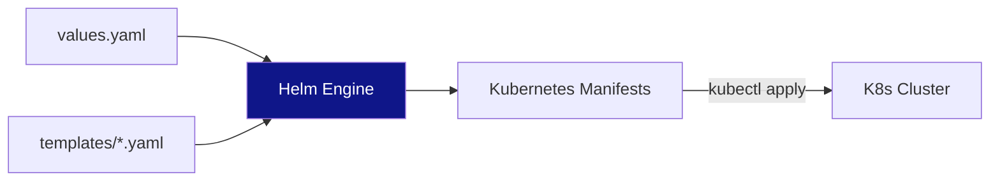

# Helm: The Kubernetes Package Manager

Helm treats Kubernetes infrastructure as "Apps." Instead of managing hundreds of individual YAML files, you manage a single **Chart**.

## 🏗️ Module Roadmap

| Stage | Topic | Focus |
| :--- | :--- | :--- |
| **01** | **[Fundamentals](./01-helm-fundamentals/readme.md)** | V3 Architecture, Repos, and Releases. |
| **02** | **[Chart Templating](./02-chart-templating/readme.md)** | Dynamic YAML, Go Templates, and Values. |
| **03** | **[Intermediate Patterns](./03-intermediate-helm/readme.md)** | Subcharts and Dependencies. |
| **04** | **[Advanced Ops](./04-advanced-helm/readme.md)** | Security, Plugins, and CI/CD Integration. |

---

## 🏗️ Architecture: The Rendering Pipeline

---

## 📖 Real-Life Scenarios

### Scenario 1: The "Manual Patch" Disaster
**Problem**: An engineer manually updated a deployment's replicas to 10.
**Crisis**: When the CI/CD pipeline ran again, it reset the replicas to 2 (the value in Git), causing a performance drop.
**Solution**: Switched to managing all changes via **Helm Values**.
**Result**: Configuration consistency is now guaranteed.

### Scenario 2: The "Broken Production" Rollback
**Problem**: A new release caused the database connection to fail.
**Action**: The SRE team ran `helm rollback my-app 14`.
**Result**: The application was reverted to the previous working version in seconds.

---

## ❓ Interview Prep & Resources
- **[Interview Questions & Quizzes](./05-interview-questions-and-quizzes/readme.md)**
- **[Real-Life War Stories](./06-real-life-scenarios/readme.md)**

---

[⬅️ Back to Configuration Tools Index](../readme.md)