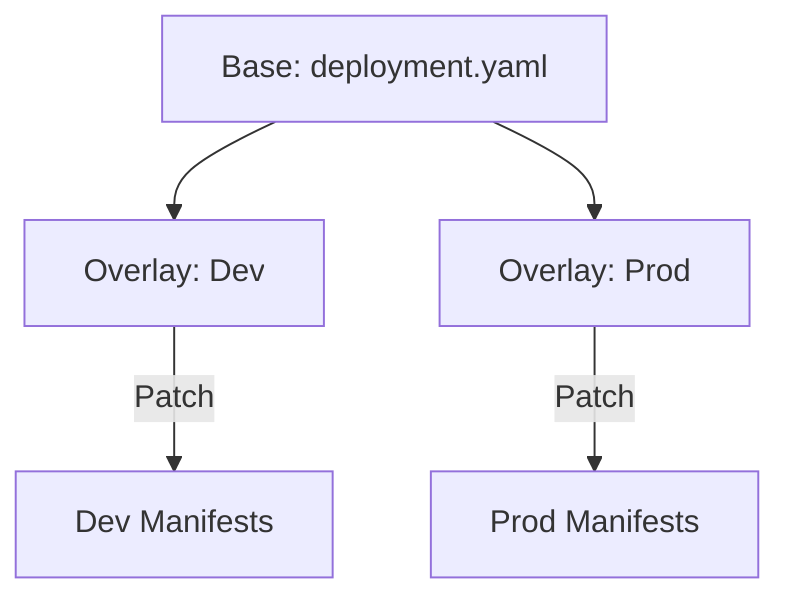

# Kustomize: K8s Native Configuration

Kustomize introduces a template-free way to customize Kubernetes objects. Instead of using a templating engine (like Helm), it uses a "Base and Overlay" model to patch YAML files.

## 📚 Module Structure
- **[Boilerplates](readme.md)**: `kustomization.yaml` (Base configuration).
- **[CHALLENGES](../../../03-server-configuration-and-ansible/01-ansible/learning-modules/01-fundamentals/challenges.md)**: Overlays and ConfigMap generators.

---

## 🏗️ Architecture: Base and Overlays

You define the standard application in a **Base** folder, and then define environment-specific changes (Port, Size, Labels) in **Overlay** folders.



---

## 🔑 Key Concepts

| Keyword | Description |
| :--- | :--- |
| **`resources`** | The YAML files you want to manage. |
| **`bases`** | (Legacy) Standard configurations you are building on. |
| **`patches`** | Specific instructions to change a part of a YAML file. |
| **`configMapGenerator`** | Automatically creates ConfigMaps from files or literals. |

---

## 🛡️ Robust Pattern: Image Tagging
Instead of hardcoding image tags in every deployment file, manage them globally in the `kustomization.yaml`. This allows you to update your app version company-wide by changing a single line.

```yaml
images:
  - name: my-api
    newTag: v2.5.0
```

---

## 📖 Real-World Story: The "Helm-Less" Cluster
**Scenario**: A startup found Helm too complex for their small team. They just wanted to deploy simple apps to Dev and Prod.
**Solution**: They adopted **Kustomize**.
**Result**: Since Kustomize is built into `kubectl` (`kubectl apply -k`), they didn't need to install any extra tools. Their deployment pipeline became a single shell command.

---

## ❓ Interview Questions

1. **How is Kustomize different from Helm?**
   - *Answer*: Helm is a package manager that uses a templating engine (text replacement). Kustomize is a configuration manager that use overlays and patches (merging YAML objects).
2. **How do you apply a kustomization directory to a cluster?**
   - *Answer*: `kubectl apply -k <directory_path>`.
3. **What is a 'Strategic Merge Patch'?**
   - *Answer*: It is a way to update specific fields in a Kubernetes resource (like `replicas` or `image`) by providing a partial YAML that matches the resource's Group, Version, and Kind.

---

[Next: Puppet](../../../../../readme.md)
