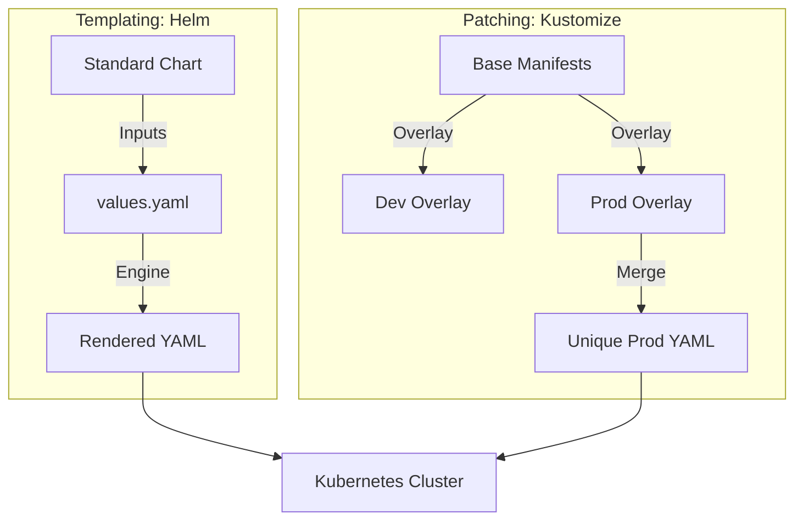

# ☸️ Kubernetes Config: Helm & Kustomize

> **\"Kubernetes is the new Operating System. Helm and Kustomize are the new package managers. If you are managing raw YAML files, you aren't an engineer—you're a copy-paste technician.\"**


---

## 🧠 The Mental Model: The Template vs. The Patch

**The Junior Struggle**: \"I need to deploy my app to Dev, Staging, and Prod. I'll just copy my 10 YAML files into three different folders and manually change the replicas and database URLs in each one. It's safe!\" (Then they update the 'Dev' version but forget to sync the 'Prod' version, leading to a production crash).

**The Engineer Solution**: Never copy-paste YAML. Use a **Blueprint (Helm)** or an **Overlay (Kustomize)**.
- **Helm (The Template)**: You create one "Chart" with placeholders `{{ .Values.replicas }}`. You fill in the blanks with environment-specific files.
- **Kustomize (The Patch)**: You have a "Base" (Common settings) and "Overlays" (RedHat patches for Prod, extra logs for Dev). It merges them at runtime.

### 🏗️ The Infrastructure Analogy

| Concept | Manufacturing Analogy | K8s Equivalent |
|:--------|:----------------------|:---------------|
| **Plain YAML** | Hand-drawing every part | Static Manifests |
| **Helm** | A 3D Printer (Input -> Product) | Template Engine |
| **Kustomize** | Post-processing a standard part | Patching/Overlays |
| **Chart** | The shared blueprint library | Helm Repository |
| **Release** | The final installed product | `helm install` |

---

## 📚 Why This Module Matters for Juniors

**Before this module**, you might think:
- \"YAML is easy to manage by hand\"
- \"Helm is just for installing open-source apps like Nginx\"
- \"I don't need a package manager for my own code\"

**After this module**, you'll understand:
- **Reproducibility**: You can deploy an identical stack to 50 regions in 5 seconds.
- **Rollbacks**: Helm tracks history; `helm rollback` is your "Panic Button."
- **Isolation**: Keeping secrets and config separate from your logic.
- **GitOps Readiness**: Moving towards automated delivery (ArgoCD/Flux).

**The Difference**: You move from "Copy-pasting files" to **"Orchestrating releases."**

---

## 🎯 Learning Objectives

By the end of this module, you will:

- ✅ **Master Helm**: Creating, Versioning, and Packaging charts.
- ✅ **Implement Kustomize**: Building "Base" and "Overlay" structures.
- ✅ **Manage Complexity**: Using Subcharts and Dependencies.
- ✅ **Secure Configs**: Using `ConfigMaps` and `Secrets` patterns.
- ✅ **Validate YAML**: Using `helm lint` and dry-runs to prevent deployment errors.

---

## 🏗️ Orchestration Configuration Models



---

## 🚀 Professional Patterns for Engineers

### 1. The Safety Blanket (Resource Limits)
Never deploy to K8s without resource guardrails.

```yaml
# 🛡️ Guard Clause: prevents a memory leak from killing the node
resources:
  limits:
    cpu: 500m
    memory: "1Gi"
  requests:
    cpu: 100m
    memory: "256Mi"
```

### 2. Semantic Versioning Charts
Treat your infra like your app code.
- **v1.2.0**: Major feature.
- **v1.2.1**: Bug fix in the YAML.

---

## 🏆 Real-World DevOps Story: The Multi-Region Outage

**The Incident**: A fintech company deployed their "Transfer API" to 15 clusters across 3 continents.
**The Failure**: They used 15 separate sets of manual YAML. A security patch was applied to the "Base" version in GitHub but the production clusters in Singapore were forgotten. A hacker exploited the drift.
**The Fix**: Combined everything into a single **Helm Chart**.
**The Outcome**: One push to the "Core Chart" now automatically cascades to all 15 regions. Drift is detected in 60 seconds by GitOps agents. High security is now the default, not an option.

---

## ❓ Interview Preparation (K8s Config)

### 🎯 Core Concepts

1. **Q: Helm vs Kustomize?**
    *   *Answer: Helm is a Template engine (variables). Kustomize is a Patching engine (merging files). Helm is better for packaged apps; Kustomize is better for tweaking identical environments locally.*
2. **Q: What is a 'Helm Release'?**
    *   *Answer: It is an instance of a chart running in a Kubernetes cluster. You can have many releases of the same chart (e.g., 'myapp-prod' and 'myapp-staging').*
3. **Q: Why avoid 'Latest' tags in your YAML?**
    *   *Answer: 'Latest' is not a version; it's a moving target. It makes rollbacks impossible and leads to "Ghost Bugs" where two servers run different code despite having the same tag.*
4. **Q: How do you handle secrets in Helm?**
    *   *Answer: Never put plain text secrets in `values.yaml`. Use `helm-secrets` (sops/encryption) or pull secrets from a CSI driver like AWS Secrets Manager at runtime.*

---

## 📝 Knowledge Check

1. **Which command renders a Helm chart to local console for debugging?**
    * [ ] a) `helm apply`
    * [x] b) `helm template`
    * [ ] c) `helm debug`
2. **Which file defines the chart metadata (version, name, appVersion)?**
    * [x] a) `Chart.yaml`
    * [ ] b) `values.yaml`
    * [ ] c) `config.json`
3. **True or False: Kustomize is built into `kubectl` via the `-k` flag.**
    * [x] a) True
    * [ ] b) False

---

## 🔗 Next Steps

You've mastered Provisioning, Configuration, Imaging, and Orchestration. You are now an **Infrastructure Architect**.

**Proceed to**: [Assessments & Certification →](readme.md)


---
## 🧭 Additional Modules
- [01 Helm](01-helm/readme.md)
