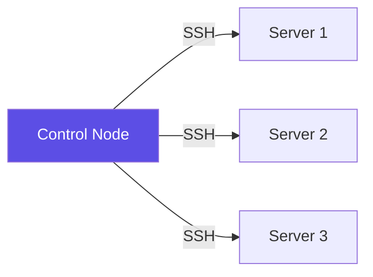
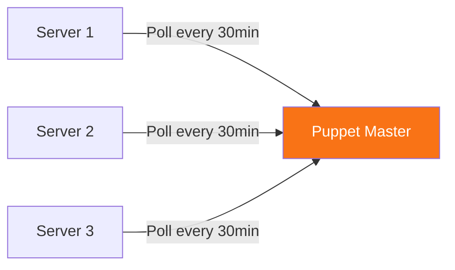
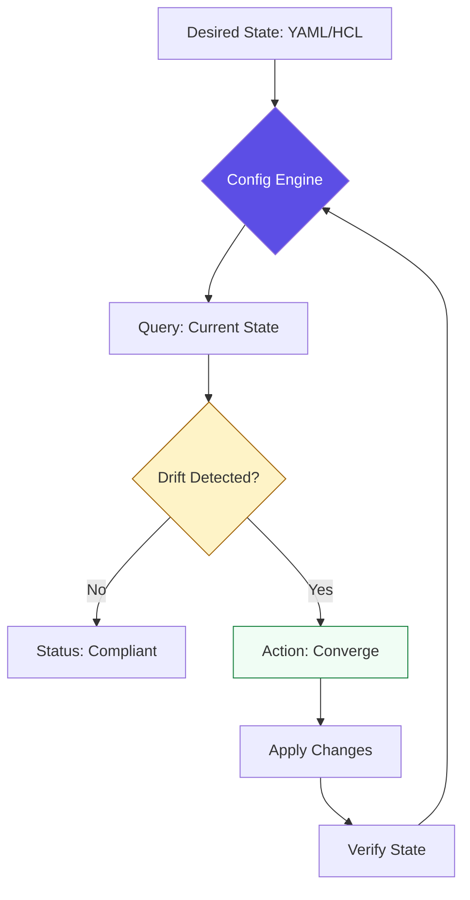
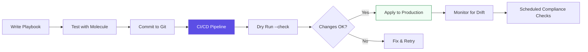

# 🏗️ The Philosophy of Configuration Management

> **"Infrastructure is not about servers anymore. It's about code that describes reality, and engines that enforce it."**


---

## 🧠 The Paradigm Shift: Imperative vs. Declarative

### The Junior's Bash Script Approach (Imperative)

```bash
#!/bin/bash
# Install nginx - but what if it's already installed?
apt-get update
apt-get install -y nginx
systemctl start nginx
systemctl enable nginx
# If I run this twice, will it break?
```

**Problems:**

- ❌ No idempotency - running twice causes errors
- ❌ No state tracking - can't detect drift
- ❌ Procedural logic - tells "how" not "what"
- ❌ No rollback capability

### The Engineer's Declarative Approach (Ansible)

```yaml
---
- name: Ensure nginx is present and running
  hosts: webservers
  tasks:
    - name: Nginx package
      apt:
        name: nginx
        state: present

    - name: Nginx service
      service:
        name: nginx
        state: started
        enabled: yes
```

**Advantages:**

- ✅ Idempotent - safe to run 100 times
- ✅ Declarative - defines desired state
- ✅ Self-healing - detects and corrects drift
- ✅ Auditable - clear intent in code

---

## 🎯 Core Pillars of Configuration Management

### 1. Idempotency: The Safety Net

**Definition:** An operation that produces the same result whether executed once or multiple times.

**Why It Matters:**

```yaml
# BAD: Imperative (not idempotent)
- shell: echo "server 10.0.1.5" >> /etc/ntp.conf
  # Running twice adds duplicate lines!

# GOOD: Declarative (idempotent)
- lineinfile:
    path: /etc/ntp.conf
    line: 'server 10.0.1.5'
    state: present
  # Running 100 times = same result
```

**Real-World Impact:** In production, automation runs on schedules. Without idempotency, your 3 AM cron job could create 30 duplicate database entries.

### 2. Push vs. Pull Models

| Model                  | Tool         | Architecture                | Use Case                             |
| :--------------------- | :----------- | :-------------------------- | :----------------------------------- |
| **Push (Agentless)**   | Ansible      | Control node SSH to targets | Quick patches, ad-hoc tasks          |
| **Pull (Agent-based)** | Chef, Puppet | Agents poll master server   | Continuous enforcement, large fleets |

**Ansible (Push Model):**



**Puppet (Pull Model):**



**Decision Matrix:**

- **Choose Push (Ansible):** Small-medium fleets, immediate execution, no agent overhead
- **Choose Pull (Puppet/Chef):** Large fleets (1000+ nodes), continuous compliance, network segmentation

### 3. Dynamic Inventory: Beyond Static Lists

**The Old Way (Static):**

```ini
# /etc/ansible/hosts
[webservers]
10.0.1.10
10.0.1.11
10.0.1.12
# Manual updates when servers change!
```

**The Modern Way (Dynamic):**

```yaml
# aws_ec2.yml - Queries AWS API in real-time
plugin: aws_ec2
regions:
  - us-east-1
filters:
  tag:Environment: production
  tag:Role: webserver
  instance-state-name: running
keyed_groups:
  - key: tags.Role
    prefix: role
```

**Benefits:**

- ✅ Auto-discovery of new instances
- ✅ Automatic removal of terminated instances
- ✅ Tag-based grouping
- ✅ Multi-cloud support (AWS, Azure, GCP)

**Usage:**

```bash
# List all discovered hosts
ansible-inventory -i aws_ec2.yml --graph

# Run playbook against dynamic inventory
ansible-playbook -i aws_ec2.yml site.yml
```

---

## 📚 The Junior's Essential Concepts

### Configuration as Software Engineering

**Before:** "I'll SSH into each server and run commands"
**After:** "I'll write code that describes the desired state and let the engine enforce it"

| Concept            | Bash Script Mindset    | Config Management Mindset                |
| :----------------- | :--------------------- | :--------------------------------------- |
| **Logic**          | "Install this package" | "Ensure package is present at version X" |
| **Secrets**        | Hardcoded in script    | Ansible Vault / AWS Secrets Manager      |
| **Organization**   | One 500-line script    | Modular roles with clear separation      |
| **Infrastructure** | Manual IP lists        | Dynamic inventory from cloud tags        |
| **Testing**        | "Hope it works"        | Molecule tests in Docker containers      |
| **Rollback**       | Manual SSH fixes       | Version-controlled playbooks             |

### The Convergence Engine



**Key Insight:** You don't write "steps" - you define "reality." The tool continuously enforces that reality.

---

## 🧪 Lab Scenario: Configuring a Web Server Fleet

**Mission:** Deploy a production-ready Nginx fleet with security hardening.

**Requirements:**

1. Install Nginx on all webservers
2. Configure firewall (allow 80, 443, deny all else)
3. Deploy custom index.html with server-specific variables
4. Enable SSL with Let's Encrypt
5. Configure log rotation
6. Verify service health

**Starter Playbook:**

```yaml
---
- name: Configure Web Server Fleet
  hosts: webservers
  become: yes

  vars:
    nginx_port: 80
    ssl_enabled: true

  roles:
    - nginx
    - firewall
    - ssl-certs

  tasks:
    - name: Deploy custom index
      template:
        src: templates/index.html.j2
        dest: /var/www/html/index.html
      notify: reload nginx

    - name: Health check
      uri:
        url: 'http://{{ ansible_default_ipv4.address }}'
        status_code: 200

  handlers:
    - name: reload nginx
      service:
        name: nginx
        state: reloaded
```

**Jinja2 Template (templates/index.html.j2):**

```html
<!DOCTYPE html>
<html>
	<head>
		<title>{{ inventory_hostname }}</title>
	</head>
	<body>
		<h1>Server: {{ inventory_hostname }}</h1>
		<p>Environment: {{ environment }}</p>
		<p>IP: {{ ansible_default_ipv4.address }}</p>
		<p>Deployed: {{ ansible_date_time.iso8601 }}</p>
	</body>
</html>
```

---

## 🔐 Security: Variables and Secrets Management

### The Wrong Way (Hardcoded Secrets)

```yaml
# NEVER DO THIS!
- name: Configure database
  mysql_db:
    login_user: admin
    login_password: SuperSecret123 # Exposed in Git!
    name: production_db
```

### The Right Way (Ansible Vault)

**Step 1: Create encrypted vault**

```bash
ansible-vault create group_vars/production/vault.yml
```

**Step 2: Store secrets**

```yaml
# group_vars/production/vault.yml (encrypted)
vault_db_password: SuperSecret123
vault_api_key: abc123xyz789
```

**Step 3: Reference in playbooks**

```yaml
- name: Configure database
  mysql_db:
    login_password: '{{ vault_db_password }}'
    name: production_db
```

**Step 4: Run with vault password**

```bash
ansible-playbook site.yml --ask-vault-pass
# Or use password file
ansible-playbook site.yml --vault-password-file ~/.vault_pass
```

### Integration with Cloud Secrets

```yaml
# Fetch from AWS Secrets Manager
- name: Get DB credentials
  set_fact:
    db_password: "{{ lookup('aws_secret', 'prod/db/password') }}"

- name: Configure database
  mysql_db:
    login_password: '{{ db_password }}'
    name: production_db
```

---

## 🏗️ Roles and Reusability

### The Problem: Monolithic Playbooks

```yaml
# site.yml - 500 lines of chaos
- hosts: all
  tasks:
    - name: Install nginx
      apt: name=nginx
    - name: Configure nginx
      template: src=nginx.conf dest=/etc/nginx/
    - name: Install mysql
      apt: name=mysql-server
    # ... 50 more tasks
```

### The Solution: Ansible Roles

**Standard Role Structure:**

```
roles/
├── nginx/
│   ├── tasks/
│   │   └── main.yml          # Task definitions
│   ├── handlers/
│   │   └── main.yml          # Service restarts
│   ├── templates/
│   │   └── nginx.conf.j2     # Jinja2 templates
│   ├── files/
│   │   └── ssl-cert.pem      # Static files
│   ├── vars/
│   │   └── main.yml          # Role variables
│   ├── defaults/
│   │   └── main.yml          # Default values
│   └── meta/
│       └── main.yml          # Dependencies
```

**Using Roles:**

```yaml
# site.yml - Clean and modular
- hosts: webservers
  roles:
    - common
    - nginx
    - ssl-certs

- hosts: databases
  roles:
    - common
    - mysql
    - backup
```

**Benefits:**

- ✅ Reusable across projects
- ✅ Testable in isolation
- ✅ Shareable via Ansible Galaxy
- ✅ Clear separation of concerns

---

## 🧪 Testing with Molecule

**Why Test?** Don't discover bugs in production at 3 AM.

**Molecule Workflow:**

```bash
# Initialize molecule for a role
cd roles/nginx
molecule init scenario

# Test in Docker container
molecule test
```

**What Molecule Does:**

1. Spins up Docker container
2. Runs your playbook
3. Verifies with testinfra
4. Destroys container

**Example Test (molecule/default/tests/test_default.py):**

```python
def test_nginx_installed(host):
    nginx = host.package("nginx")
    assert nginx.is_installed

def test_nginx_running(host):
    nginx = host.service("nginx")
    assert nginx.is_running
    assert nginx.is_enabled

def test_nginx_listening(host):
    socket = host.socket("tcp://0.0.0.0:80")
    assert socket.is_listening
```

---

## 🏗️ Production Hazards & Solutions

### 1. The Ansible "Hang" Problem

**Problem:** Interactive prompts in automation

```yaml
# BAD: Waits for user input
- shell: apt-get upgrade
```

**Solution:** Force non-interactive mode

```yaml
# GOOD: No prompts
- apt:
    upgrade: dist
    force_apt_get: yes
  environment:
    DEBIAN_FRONTEND: noninteractive
```

### 2. Configuration Drift Detection

**Problem:** Manual changes bypass automation

**Solution:** Run in check mode regularly

```bash
# Detect drift without making changes
ansible-playbook site.yml --check --diff

# Schedule drift detection
0 */6 * * * ansible-playbook site.yml --check --diff | mail -s "Config Drift Report" ops@company.com
```

### 3. Credential Leaks

**Problem:** Secrets in version control

**Solution:** Pre-commit hooks

```bash
# .pre-commit-config.yaml
repos:
  - repo: https://github.com/Yelp/detect-secrets
    hooks:
      - id: detect-secrets
```

---

## 🛠️ Essential Commands

| Command                           | Purpose                                | Example                                           |
| :-------------------------------- | :------------------------------------- | :------------------------------------------------ |
| `ansible-playbook --check`        | Dry run - see changes without applying | `ansible-playbook site.yml --check --diff`        |
| `ansible-playbook --syntax-check` | Validate YAML syntax                   | `ansible-playbook site.yml --syntax-check`        |
| `ansible-inventory --graph`       | Visualize inventory structure          | `ansible-inventory -i aws_ec2.yml --graph`        |
| `ansible-vault encrypt`           | Encrypt sensitive files                | `ansible-vault encrypt group_vars/prod/vault.yml` |
| `ansible-doc`                     | View module documentation              | `ansible-doc apt`                                 |
| `ansible -m setup`                | Gather facts from hosts                | `ansible webservers -m setup`                     |
| `molecule test`                   | Test role in isolation                 | `cd roles/nginx && molecule test`                 |

---

## 🎯 Learning Objectives

By the end of this module, you will:

- ✅ **Understand Declarative vs Imperative**: Why "what" beats "how"
- ✅ **Master Idempotency**: Write safe, repeatable automation
- ✅ **Implement Dynamic Inventory**: Auto-discover infrastructure from cloud tags
- ✅ **Secure Secrets**: Use Ansible Vault and cloud secret managers
- ✅ **Build Modular Roles**: Organize playbooks for reusability
- ✅ **Template with Jinja2**: Generate dynamic configuration files
- ✅ **Test with Molecule**: Validate roles before production
- ✅ **Detect Drift**: Identify and correct configuration divergence

---

## 🏗️ Module Structure

The content follows a logical progression from philosophy to practice:

1. **[01-Introduction](./01-introduction)**: Core concepts and mental models
2. **[02-IaC Foundations and Terraform](./02-iac-foundations-and-terraform)**: Infrastructure provisioning
3. **[03-Server Configuration and Ansible](./03-server-configuration-and-ansible)**: Configuration management deep-dive
4. **[04-Cloud-Native Provisioning](./04-cloud-native-provisioning-and-vendors)**: Cloud-specific tools
5. **[05-Immutable Infrastructure](./05-immutable-infrastructure-and-images)**: Image-based deployments
6. **[06-Kubernetes Config](./06-kubernetes-config-and-templating)**: Container orchestration config
7. **[07-Assessments](./07-assessments)**: Quizzes and challenges

---

## ⚖️ Tool Selection Matrix

| Use Case                        | Tool           | Reason                                     |
| :------------------------------ | :------------- | :----------------------------------------- |
| **Infrastructure Provisioning** | Terraform      | Declarative, multi-cloud, state management |
| **Server Configuration**        | Ansible        | Agentless, idempotent, easy learning curve |
| **Continuous Compliance**       | Puppet/Chef    | Agent-based, pull model, large fleets      |
| **Immutable Images**            | Packer         | Pre-baked AMIs, fast boot times            |
| **Container Config**            | Helm/Kustomize | Kubernetes-native templating               |
| **AWS-Only**                    | CloudFormation | Deep AWS integration                       |
| **Developer-Friendly**          | Pulumi         | Real programming languages                 |

---

## 💡 Senior Pro-Tips

### 1. Always Use State Declarations

```yaml
# BAD: Imperative shell command
- shell: systemctl start nginx

# GOOD: Declarative state
- service:
    name: nginx
    state: started
    enabled: yes
```

**Why?** The tool handles the logic. It checks current state before acting.

### 2. Least Privilege Principle

```yaml
# Ansible should only have necessary permissions
# Use sudo only when required
- name: Read log file
  command: cat /var/log/app.log
  # No become: yes needed

- name: Install package
  apt:
    name: nginx
  become: yes # Requires root
```

### 3. Fail Fast with Assertions

```yaml
- name: Verify prerequisites
  assert:
    that:
      - ansible_distribution == "Ubuntu"
      - ansible_distribution_version >= "20.04"
    fail_msg: 'This playbook requires Ubuntu 20.04+'
```

### 4. Use Tags for Selective Execution

```yaml
- name: Install packages
  apt:
    name: '{{ item }}'
  loop:
    - nginx
    - mysql
  tags:
    - packages
    - install
# Run only tagged tasks
# ansible-playbook site.yml --tags "packages"
```

---

## 📚 Additional Resources

- **[Interview Prep](./interview-prep.md)**: Senior-level configuration management questions
- **[Automation Challenges](./automation-challenges-portfolio.md)**: Hands-on portfolio projects
- **[Terraform Quiz](./07-assessments/terraform-quiz.md)**: Test your IaC knowledge
- **[Ansible Quiz](./07-assessments/ansible-quiz.md)**: Configuration management assessment
- **[Reference Materials](./00-reference-and-metadata/readme.md)**: Keywords and patterns

---

## 🎓 The Configuration-as-Code Workflow



---

**🎓 Remember**: A Junior runs commands. An Engineer writes code that describes reality, and lets the convergence engine enforce it.

**Next Step**: Dive into [Ansible Deep-Dive](./03-server-configuration-and-ansible/01-ansible/) to master configuration management.
