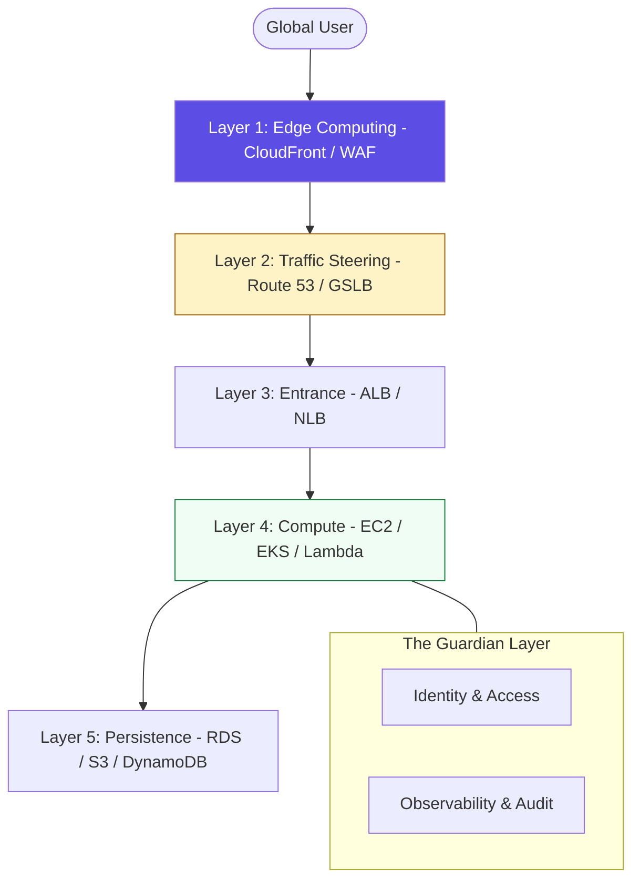

# ☁️ Introduction to Cloud Platform Engineering

> **"A cloud administrator manages resources; a platform engineer builds the systems that manage themselves. If you are solving the same problem twice, you aren't automating; you're just busy."**

Welcome to the **Cloud Platform Engineering** foundations. In this module, we transition from "Resource Operations" to **"Architectural Orchestration."** You will learn to view the cloud not as a collection of isolated servers and buckets, but as a global, high-availability platform that prioritizes **Resilience**, **Security**, and **Developer Velocity.**

---

## 🏗️ The Infrastructure Hierarchy

A professional cloud platform is built in layers. We move from the **Edge** (the user's computer) to the **Core** (the data center).



---

## 🎭 Real-World DevOps Scenarios

### 🛡️ Scenario: The "Zombie" Data Center
**The Incident:** A sub-marine cable was severed off the coast of Australia, causing massive packet loss for a global e-commerce site.
**The Failure:** The site's primary server was located in a single availability zone in Sydney. Users in the US and Europe experienced 10-second page loads or total timeouts.
**The Fix:** Implementation of a **Global Platform Strategy**. The site front-end was moved to **S3 + CloudFront** (Global Edge), and the API was redeployed into a **Multi-Region** active-passive architecture.
**The Result:** During the next cable failure, users were automatically served from the closest surviving region (Singapore or US-West) with negligible latency increases.

---

## 💻 DevOps Logic Snippets: "The Self-Healing Baseline"

A Platform Engineer's work is defined by the **Health Check**.

```yaml
# 🚀 Standard: Health Check logic for a Load Balancer
# If the app doesn't respond '200 OK', it is killed and replaced automatically.
HealthCheck:
  Port: 8080
  Protocol: HTTP
  Path: /healthz
  Interval: 30
  Timeout: 5
  HealthyThreshold: 2
  UnhealthyThreshold: 5 # 🛡️ Guard Clause: Don't kill too early on transient blips
```

---

## 🎙️ Interview Preparation (Foundations)

1.  **"What is the difference between an Availability Zone (AZ) and a Region?"**
    *   *Answer:* A **Region** is a geographic area (e.g., US-East-1) consisting of multiple, isolated **Availability Zones**. An **AZ** is one or more discrete data centers with redundant power, networking, and connectivity. Regions are used for disaster recovery and data sovereignty; AZs are used for high availability within a region.
2.  **"What is 'High Availability' (HA) and how is it measured?"**
    *   *Answer:* HA is the ability of a system to remain operational for a high percentage of time. It is measured in "nines" (e.g., 99.9% or "Three Nines"). Achieving HA requires eliminating "Single Points of Failure" by redundantly deploying resources across multiple failure domains (AZs).
3.  **"What is the 'Global Edge' and why does it matter for latency?"**
    *   *Answer:* The Edge consists of points of presence (PoP) located close to users. By caching static content (images, JS) at the Edge using a CDN like CloudFront, you reduce the physical distance data must travel, significantly lowering latency and reducing load on your origin servers.
4.  **"Explain the 'Shared Responsibility Model' for a Managed Database (RDS)."**
    *   *Answer:* AWS is responsible for patching the underlying OS, the hypervisor, and the database engine software. The **Customer** is responsible for database-level user permissions, encryption of the data, and defining the backup/retention policies.
5.  **"Why is 'Tagging' considered a core governance requirement?"**
    *   *Answer:* Without consistent tagging (e.g., `Owner`, `Environment`, `Project`), it is impossible to track costs, perform automated cleanup of "zombie" resources, or apply security policies across thousands of resources.

---

## 🧠 Knowledge Check

1.  **Which term denotes the geography consisting of multiple data centers?**
    *   [ ] Availability Zone
    *   [x] Region
    *   [ ] Edge Location
2.  **What is the primary benefit of 'Fault Tolerance'?**
    *   [ ] Making the server run faster.
    *   [x] The system continues to operate even if some components fail.
    *   [ ] Reducing the monthly cloud bill.
3.  **True or False: If a region fails, your resources in an Availability Zone within that region stay online.**
    *   [ ] True
    *   [x] False (AZs are part of a region; if the regional control plane fails, the AZs are compromised).
4.  **What is the 'Health Check' used for?**
    *   [x] To identify unhealthy instances so the load balancer can stop sending them traffic and the ASG can replace them.
    *   [ ] To check if the developer is healthy.
    *   [ ] To verify the credit card for billing.
5.  **Which architecture pattern prevents 'Single Points of Failure'?**
    *   [ ] Vertical Scaling
    *   [x] Multi-AZ Deployment
    *   [ ] Single Account Strategy

---

[⬅️ Back to Cloud Platforms Index](../readme.md) | [Next: Compute & Scale](../02-compute-and-scale/readme.md) ➡️
