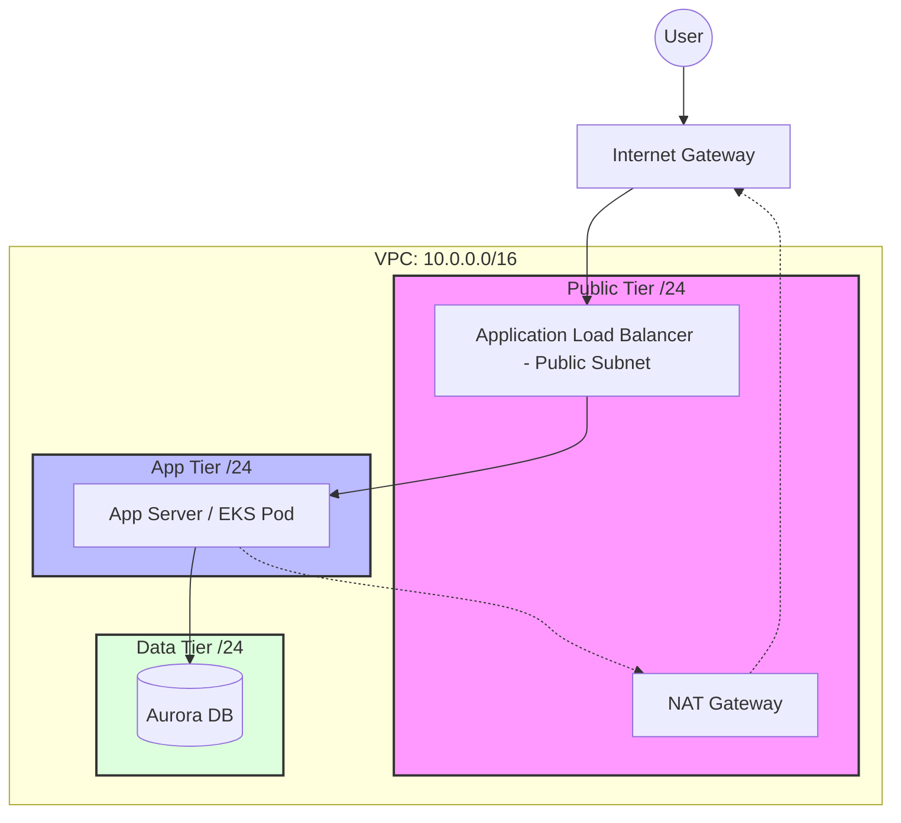

# 🌐 Senior Architect Guide
> **"Networking in the cloud is not about connecting cables; it's about orchestrating logical isolation boundaries."**

## [00] Metadata | Architectural Governance
| Attribute | Production Standard |
| :--- | :--- |
| **Tier** | Intermediate / Staff SRE |
| **Standard** | 3-Tier Multi-AZ Architecture |
| **Security Model** | Zero-Trust (VPC Endpoints + Security Group Chaining) |
| **Connectivity** | Transit Gateway Hub-and-Spoke |
| **Last Technical Audit** | 2026-02-06 |

---
## 🏗️ 1. The "Junior's Master Architecture": The 3-Tier Standard
A professional VPC is not a single bucket of resources. It is a layered defense system.

### 🏢 Subnet Segmentation Strategy
| Subnet Tier | Accessibility | Use Case | Routing Logic |
| :--- | :--- | :--- | :--- |
| **Public** | Internet-Facing | ALBs, NAT Gateways, Bastion (SSM) | `0.0.0.0/0` -> Internet Gateway (IGW) |
| **Private (App)** | Semi-Isolated | EKS Nodes, EC2 Microservices | `0.0.0.0/0` -> NAT Gateway |
| **Data (Isolated)**| Fully-Isolated | RDS, Aurora, ElastiCache | **NO** Route to Internet / Gateway |

> [!CAUTION] 
> Never place a database in a subnet that has a route to a NAT Gateway or IGW. If there is no route out, there is no path for an exfiltration attack to succeed.

### 🗺️ Visual Architecture (Mermaid)


---

## 📦 2. Technical Deep Dive: Traffic Flow Analysis
**"The Packet's Journey: Internet to Private Subnet"**

1.  **Ingress**: Packet hits the **Internet Gateway (IGW)**.
2.  **Layer 3 Evaluation**: The VPC Route Table directs the packet to the **Public Subnet** where the Load Balancer (ALB) lives.
3.  **Layer 4/7 Evaluation**: The ALB terminates SSL/TLS and forwards the request to the **Private Subnet** instance IP.
4.  **Security Filtering**: 
    - **NACLs** check the subnet boundary (Stateless).
    - **Security Groups** check the instance boundary (Stateful).
5.  **Egress**: If the Private instance needs to talk back to an external API, it sends the packet to its local Route Table, which points to the **NAT Gateway** in the Public tier.

---

## 🛰️ 3. Advanced Connectivity: Peering vs. Transit Gateway
When your infrastructure grows beyond a single VPC, you must choose a connectivity pattern.

| Feature | VPC Peering | Transit Gateway (TGW) |
| :--- | :--- | :--- |
| **Structure** | 1:1 Point-to-Point | Hub-and-Spoke |
| **Complexity** | Becomes "Spaghetti" at 5+ VPCs | Centralized and Scalable |
| **Transitive?**| **No**. A->B and B->C != A->C | **Yes**. Central hub handles all routes |
| **Cost** | Free (Data transfer only) | Hourly Fee + Data Processing ($$) |

> **Senior Pro-Tip**: Use **VPC Peering** for simple, low-latency links between two VPCs in the same region. Use **Transit Gateway** for enterprise-scale connectivity, cross-region hubs, and connecting On-Premises via VPN/Direct Connect.

---
## 🛡️ 4. Security Hardening: The SRE Way

### ⛓️ Security Group Chaining
**Stop using CIDR blocks in security groups.**
Instead of allowing `10.0.1.0/24`, allow the **source security group ID**.
```hcl
# DB Security Group Rule
resource "aws_security_group_rule" "allow_app" {
  type                     = "ingress"
  from_port                = 5432
  to_port                  = 5432
  protocol                 = "tcp"
  source_security_group_id = aws_security_group.app_tier.id
  security_group_id        = aws_security_group.db_tier.id
}
```
*Why?* If you scale your App tier or change its CIDR, the DB tier automatically adapts. It's **Identity-based networking**.
### 🔍 VPC Flow Logs: The Auditor's Eye
Enable Flow Logs to monitor every packet.
```bash
# Find rejected traffic (potential intrusion)
aws logs filter-log-events \
  --log-group-name /aws/vpc/flowlogs \
  --filter-pattern "[version, account, eni, source, destination, srcport, destport, protocol, packets, bytes, windowstart, windowend, action=REJECT, flowlogstatus]"
```
### 🔓 SSM vs. Bastion Host
**"Opening Port 22 to the world is a legacy anti-pattern."**
Use **AWS Systems Manager (SSM) Session Manager**.
- **No SSH Keys**: Integrated with IAM.
- **No Public IP**: Works on private instances.
- **Audit Trail**: Every keystroke recorded in S3/CloudWatch.

---
## 🔒 5. Zero-Trust Connectivity: VPC Endpoints
**"Why send traffic over the internet to talk to AWS Services?"**

VPC Endpoints (PrivateLink) allow you to connect your VPC to AWS services as if they were inside your network.

| Endpoint Type | Protocol | Use Case | Cost |
| :--- | :--- | :--- | :--- |
| **Gateway** | Routing Table | S3, DynamoDB | **FREE** |
| **Interface** | Private DNS / ENI | SQS, SNS, Kinesis, EC2 API | ~$7/mo + data |

> **Junior Warning**: Without an S3 Gateway Endpoint, your private EC2s must go through the NAT Gateway to talk to S3, incurring $0.045/GB in processing fees. **Always add a Gateway Endpoint for S3.**

---
## 💳 6. FinOps: Networking Cost Optimization
Networking is often the "hidden" cost in AWS.

1.  **NAT Gateway Consolidation**: In Dev environments, use a **Single NAT Gateway** for all AZ's instead of one per AZ. (Savings: ~$64/mo).
2.  **Avoid NAT for AWS APIs**: Use VPC Endpoints to bypass NAT processing fees.
3.  **Same-AZ Traffic**: Prefer cross-instance communication within the same AZ. Cross-AZ transfer costs $0.01/GB.
4.  **Egress Fees**: Watch out for "Data Transfer Out." Use CloudFront to cache content and reduce egress costs.
---
## 🏗️ 7. From Console to Code: Terraform VPC Module
```hcl
module "vpc" {
  source = "terraform-aws-modules/vpc/aws"
  version = "5.0.0"

  name = "prod-vpc"
  cidr = "10.0.0.0/16"

  azs             = ["us-east-1a", "us-east-1b", "us-east-1c"]
  public_subnets  = ["10.0.1.0/24", "10.0.2.0/24", "10.0.3.0/24"]
  private_subnets = ["10.0.10.0/24", "10.0.11.0/24", "10.0.12.0/24"]
  database_subnets = ["10.0.20.0/24", "10.0.21.0/24", "10.0.22.0/24"]

  enable_nat_gateway = true
  single_nat_gateway = false # High Availability

  # Zero-Trust: S3 Gateway Endpoint
  enable_s3_endpoint = true

  tags = { Environment = "production" }
}
```

---
## 🛠️ 8. Troubleshooting Checklist
**"My EC2 can't reach the internet—what do I check?"**

1.  **Route Table**: Does `0.0.0.0/0` point to an **IGW** (Public) or **NAT Gateway** (Private)?
2.  **Public IP**: If in a public subnet, does the instance have a Public IP assigned?
3.  **Security Group**: Is the **Outbound Rule** allowing `0.0.0.0/0`?
4.  **Network ACL**: Are the **Stateless** rules allowing both port 80/443 AND the **Ephemeral Port Range** (1024-65535)?
5.  **DNS**: Are `enableDnsHostnames` and `enableDnsSupport` set to `true`?

---

## 🧪 9. Hands-On Lab: The Secure 3-Tier Mission
**Objective**: Build a production-grade network that isolates data and optimizes cost.

### Phase 1: The Deployment
1. Use the Terraform module above to deploy a VPC.
2. Verify that instances in the `database_subnets` have **NO** route to the internet.

### Phase 2: The Security Audit
1. Enable **VPC Flow Logs**.
2. Create a Security Group for an App Server and a Database.
3. **Challenge**: Configure the Database SG to only accept traffic from the App Server SG ID.

### Phase 3: The Cost Fix
1. Log into a private EC2. Try to download a file from S3: `aws s3 cp s3://my-bucket/test.txt .`
2. Check the NAT Gateway CloudWatch metrics—you'll see data spike.
3. Deploy an **S3 Gateway Endpoint**.
4. Run the download again. Observe that it no longer routes through the NAT Gateway.

---
*Created by Senior Cloud Architect | Optimized for SRE Operational Reality*
#aws #vpc #networking #security #terraform #finops

---
### 📚 Supplemental Resources
- [🚀 VPC CLI Cheatsheet & Automation Scripts](./cheatsheet.md)
- [🛠️ AWS Troubleshooting Guide](../../../../../readme.md)
