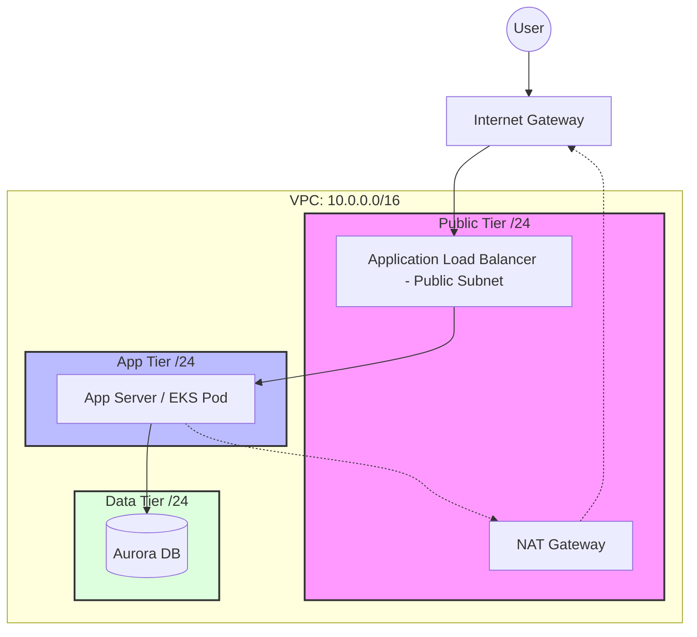

# 🌐 AWS Virtual Private Cloud (VPC) | Senior Architect Guide
> **"Networking in the cloud is not about connecting cables; it's about orchestrating logical isolation boundaries."**

## [00] Metadata | Architectural Governance
| Attribute | Production Standard |
| :--- | :--- |
| **Tier** | Intermediate / Staff SRE |
| **Standard** | 3-Tier Multi-AZ Architecture |
| **Security Model** | Zero-Trust (VPC Endpoints + Security Group Chaining) |
| **Connectivity** | Transit Gateway Hub-and-Spoke |
| **Last Technical Audit** | 2026-02-06 |

---

## 🏗️ 1. The "Junior's Master Architecture": The 3-Tier Standard
A professional VPC is not a single bucket of resources. It is a layered defense system.

### 🏢 Subnet Segmentation Strategy
| Subnet Tier | Accessibility | Use Case | Routing Logic |
| :--- | :--- | :--- | :--- |
| **Public** | Internet-Facing | ALBs, NAT Gateways, Bastion (Legacy) | `0.0.0.0/0` -> Internet Gateway (IGW) |
| **Private (App)** | Semi-Isolated | EKS Nodes, EC2 Microservices | `0.0.0.0/0` -> NAT Gateway |
| **Data (Isolated)**| Fully-Isolated | RDS, Aurora, ElastiCache | **NO** Route to Internet / Gateway |

> [!CAUTION] 
> Never place a database in a subnet that has a route to a NAT Gateway or IGW. If there is no route out, there is no path for an exfiltration attack to succeed.

### 🗺️ Visual Architecture (Mermaid)


---

## 📦 2. Technical Deep Dive: Traffic Flow Analysis
**"The Packet's Journey: Internet to Private Subnet"**

1.  **Ingress**: Packet hits the **Internet Gateway (IGW)**.
2.  **Layer 3 Evaluation**: The VPC Route Table directs the packet to the **Public Subnet** where the Load Balancer (ALB) lives.
3.  **Layer 4/7 Evaluation**: The ALB terminates SSL/TLS and forwards the request to the **Private Subnet** instance IP.
4.  **Security Filtering**: 
    - **NACLs** check the subnet boundary (Stateless).
    - **Security Groups** check the instance boundary (Stateful).
5.  **Egress**: If the Private instance needs to talk back to an external API, it sends the packet to its local Route Table, which points to the **NAT Gateway** in the Public tier.

---

## 🛰️ 3. Advanced Connectivity: Peering vs. Transit Gateway
When your infrastructure grows beyond a single VPC, you must choose a connectivity pattern.

| Feature | VPC Peering | Transit Gateway (TGW) |
| :--- | :--- | :--- |
| **Structure** | 1:1 Point-to-Point | Hub-and-Spoke |
| **Complexity** | Becomes "Spaghetti" at 5+ VPCs | Centralized and Scalable |
| **Transitive?**| **No**. A->B and B->C doesn't mean A->C | **Yes**. Central hub handles all routes |
| **Cost** | Free (Data transfer only) | Hourly Fee + Data Processing ($$) |

> **Senior Pro-Tip**: Always leave room for growth. Don't use a `/28` CIDR if you expect to scale to hundreds of containers. Start with a `/20` or `/16` for the VPC to avoid the "CIDR Exhaustion" nightmare.

---

## 🛡️ 4. The Security Shift: SSM vs. Bastion Host
**"Opening Port 22 to the world is a firing offense."**

*   **The Bastion (Legacy)**: A public EC2 instance that acts as a jump box. It increases attack surface and requires managing SSH keys.
*   **AWS Systems Manager (SSM) Session Manager**:
    - **No Port 22**: Communication happens over the SSM Agent on 443 (Outbound only).
    - **IAM-Based**: Control access via individual AWS users/roles, not SSH keys.
    - **Full Audit**: Every command is logged to S3/CloudWatch.
    - **Private**: Works on instances with **NO** public IP or IGW route.

---

## 🏗️ 5. From Console to Code: Terraform VPC Module
Production-grade VPCs are never built manually.

```hcl
module "vpc" {
  source = "terraform-aws-modules/vpc/aws"
  version = "5.0.0"

  name = "prod-vpc"
  cidr = "10.0.0.0/16"

  azs             = ["us-east-1a", "us-east-1b", "us-east-1c"]
  public_subnets  = ["10.0.1.0/24", "10.0.2.0/24", "10.0.3.0/24"]
  private_subnets = ["10.0.10.0/24", "10.0.11.0/24", "10.0.12.0/24"]
  database_subnets = ["10.0.20.0/24", "10.0.21.0/24", "10.0.22.0/24"]

  enable_nat_gateway = true
  single_nat_gateway = false # HA for Production

  enable_vpn_gateway = false

  tags = {
    Environment = "production"
    ManagedBy   = "Terraform"
  }
}
```

---

## 🛠️ 6. Troubleshooting Checklist
**"My EC2 can't reach the internet—what do I check?"**

1.  **Route Table**: Does `0.0.0.0/0` point to an **IGW** (Public) or **NAT Gateway** (Private)?
2.  **Public IP**: If in a public subnet, does the instance have a Public IP assigned?
3.  **Security Group**: Is the **Outbound Rule** allowing the traffic (usually `0.0.0.0/0`)?
4.  **Network ACL**: Are the **Stateless** rules allowing both port 80/443 AND the **Ephemeral Port Range** (1024-65535) for return traffic?
5.  **NAT Health**: Is the NAT Gateway `Active`? If using a NAT Instance, is `Source/Dest Check` disabled?

---
*Created by Senior Cloud Architect | Optimized for SRE Operational Reality*
#aws #vpc #networking #security #terraform
