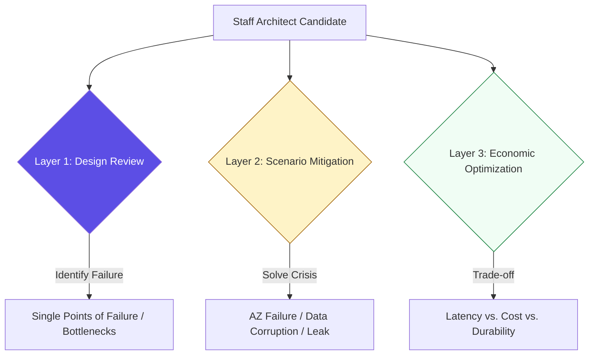

# 🏁 Mastery Assessments: Cloud Platform Architecture

> **"A senior architect is not measured by the systems they build, but by the systems they can save. You haven't mastered the cloud until you've successfully navigated a regional outage, an identity breach, and a cost explosion."**

Welcome to the **Cloud Platform Assessments**. This final module pressure-tests your architectural judgment. We move beyond "What a service does" and focus on **"Which service is the correct choice"** for high-stakes enterprise requirements. These assessments prepare you for senior-level design reviews and the "Architectural Board" interviews at top-tier tech companies.

---

## 🏗️ The Evaluation Architecture

Your platform expertise is verified through three critical testing layers:

---

## 📂 Evaluation Components

### 1. [🎙️ Technical Interview Deep-Dives](./interview-questions/readme.md)
Advanced Q&A covering architectural trade-offs, Zero-Trust identity frameworks, and "Grey Failure" scenarios.

### 2. [🛡️ Real-World Disaster Scenarios](./real-life-scenarios/readme.md)
Practical walkthroughs of production crises. You are given a failure (e.g., "The site is slow in APAC but fast in US") and must architect a global solution.

### 3. [📊 Design & Audit Challenges](./readme.md)
Find the "Single Point of Failure" in complex diagrams and propose a "Well-Architected" remediation.

---

## 🚀 The Staff Architect's Checklist

In every assessment, evaluate your solution against these four architectural pillars:

1.  **Blast Radius**: If this component fails, what else goes down? How do we isolate the failure?
2.  **State Management**: Where is the persistent data? Is it replicated across physically separate zones?
3.  **Governance**: Is this change tracked in CloudTrail? Is the identity gated by an SCP?
4.  **Cost Efficiency**: Are we using the most cost-effective tier (e.g., Spot/Reserved/Intelligent-Tiering) for this workload?

---

[⬅️ Back to Cloud Platforms Index](../readme.md)
