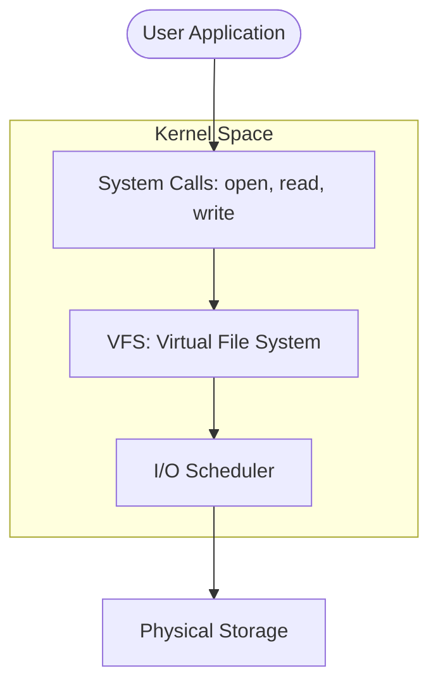

# 🖥️ 01: Introduction to Intermediate System Administration

> **"A computer is a machine. A server is a service."**

---

## 🌟 Overview

Welcome to the Intermediate level of System Administration. In a beginner's course, you likely learned how to move files, change permissions, and create users. At the **Intermediate level**, we shift our focus to **Service Reliability** and **System Architecture**.

We stop treating the server as a "Box with Files" and start treating it as a **Component of a Cloud Platform**. This means every configuration must be secure, documented, and optimized for high performance.

### Key Shifts:
- **From Interactive to Automated**: If you have to SSH into 10 servers to change a setting, you are failing. We use Systemd units and automation to manage states.
- **From Permissions to Hardening**: We move beyond `chmod 777` into Mandatory Access Controls like SELinux.
- **From "Is it UP?" to "How is it performing?"**: We dive into kernel-level metrics to find memory leaks and I/O wait times.

---

## 🏛️ The Operational Stack

Understanding the interaction between the user space and the kernel space is vital for troubleshooting complex issues.

---

## 🚀 The Intermediate Toolbelt

In this module, you will move beyond `ls` and `cd` into the "Power Tools" of a Senior Admin:
1.  **Systemd**: Managing process lifecycles and dependencies.
2.  **LVM**: Treating storage as a fluid pool rather than rigid partitions.
3.  **NFTables**: Implementing systematic firewall rulesets.
4.  **Auditd**: Tracking kernel events to see exactly who changed a file.

---

## ❓ Interview Preparation (Introduction)

1.  **Q: What is the difference between User Space and Kernel Space?**
    *A: User Space is where your applications (Nginx, Python, MySQL) run; it has restricted access to hardware. Kernel Space is the core of the OS; it has full hardware access and manages memory, CPU, and drivers. Applications talk to the kernel via System Calls.*

2.  **Q: Why is 'Systemd' controversial but standard?**
    *A: Traditional SysVinit was simple but slow and handled dependencies poorly. Systemd is complex and "bloated" to some, but it provides parallel startup, improved logging (journald), and unified management of services, mounts, and timers, making it the industry standard.*

---

## 📝 Knowledge Check

1. **What is the standard interface an application uses to request services from the OS kernel?**
- [ ] a) API
- [x] b) System Call (Syscall)
- [ ] c) Shell Command

2. **True or False: Intermediate administration focuses on managing fleets of servers rather than a single machine.**
- [x] True
- [ ] False

---

## 🔗 Next Steps
Proceed to: **[Server Hardening](../02-server-hardening/readme.md)** →
