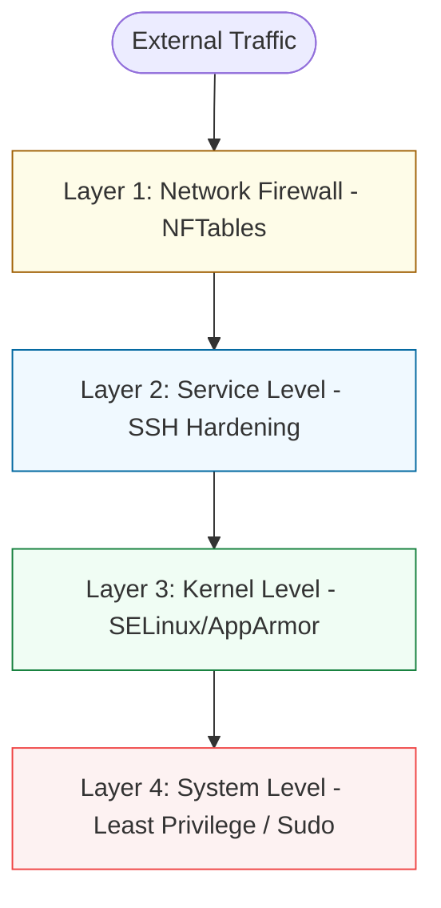

# 🛡️ 02: Server Hardening & Security

> **"A server is only as secure as its weakest configuration."**

---

## 🏛️ The Defense-in-Depth Architecture

Security in System Administration is not a single "Lock." It is a series of layers designed to frustrate an attacker and buy time for the administrator to respond.

### Security Layers

---

## 🌟 Overview

This module covers the "Art of Defense." You will learn how to turn a default Linux installation into a "Hardened" production target. We move beyond basic user permissions into kernel-enforced security policies and network traffic control.

### Key Intermediate Topics:
1.  **Intermediate Firewalls**: Moving from "Block All" to systematic rulesets using `nftables` or `firewalld`.
2.  **Mandatory Access Control (MAC)**: Understanding why `root` isn't actually omnipotent when **SELinux** or **AppArmor** is enabled.
3.  **SSH Hardening**: Implementing Key-only auth, disabling Root login, and setting up `Fail2Ban`.
4.  **Filesystem Hardening**: Utilizing `noexec`, `nosuid`, and `nodev` mount options to prevent malicious script execution.

---

## 🏗️ Professional Patterns

### 1. The Principle of Least Privilege (PoLP)
Ensuring that services (like Nginx) run under their own dedicated users with no shell access (`/sbin/nologin`), limiting the "Blast Radius" of a web-service exploit.

### 2. SELinux Enforcement
Learning to interpret "Audit Denials" and correctly setting booleans instead of simply running `setenforce 0`, which is the mark of an amateur.

---

## 🏆 Real-World Scenario: The Brute Force Thwart

**The Crisis**: A public-facing jump host is receiving 100,000 SSH login attempts per hour from a botnet.
**The Solution**: A multi-layered defense:
1.  **SSH Config**: Changed port from 22 to a random high port (Security by obscurity as a first hurdle).
2.  **Fail2Ban**: Automatically identified IPs with 3+ failures and added them to a temporary drop list in the firewall.
3.  **Public Key Auth**: Completely disabled passwords, making the brute-force attempts mathematically impossible.
**Result**: CPU load dropped from 80% to 2%, and the server remained 100% secure.

---

## ❓ Interview Preparation (Hardening)

1.  **Q: What is the difference between DAC and MAC?**
    *A: **DAC (Discretionary Access Control)** is standard Linux permissions (rwxrwxrwx) where the owner of a file can change its permissions. **MAC (Mandatory Access Control)** like SELinux is a central policy enforced by the kernel. Even if a user has 'root' permission to a file, the MAC policy can block access if the context (e.g., 'httpd_t') doesn't allow it.*

2.  **Q: Why should you mount /tmp with the 'noexec' option?**
    *A: /tmp is often world-writable. Many exploits involve downloading a malicious script to /tmp and running it. 'noexec' prevents any binaries or scripts from executing from that partition, significantly reducing the attack surface.*

---

## 📝 Knowledge Check

1. **Which command is used to check the current status of SELinux?**
- [ ] a) `selinux status`
- [x] b) `sestatus`
- [ ] c) `getenforce --all`

2. **True or False: Disabling Root login over SSH is a recommended security best practice.**
- [x] True
- [ ] False

---

## 🔗 Next Steps
Proceed to: **[Performance Tuning](../03-performance-tuning/readme.md)** →
