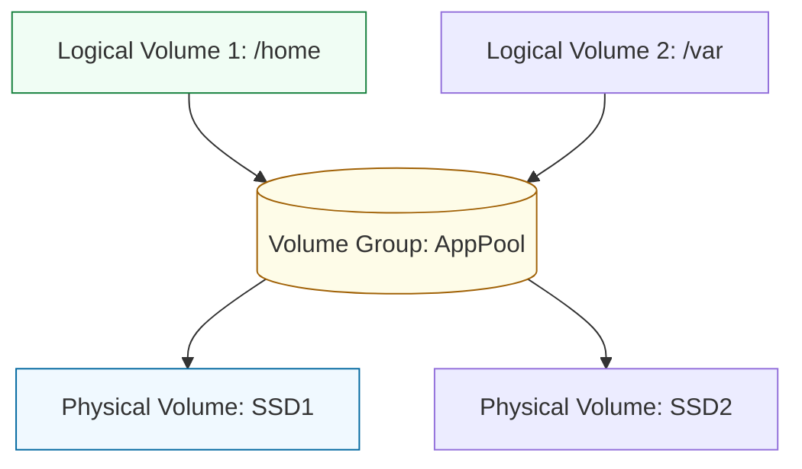

# 💾 06: Advanced Storage & LVM

> **"Data is the most valuable asset. The storage layer must be flexible, redundant, and expandable."**

---

## 🏛️ The LVM Hierarchy

In modern administration, we don't use rigid physical partitions. We use **Logical Volume Management (LVM)** to create a "Fluid Pool" of storage.

### The Storage Abstraction Layer

---

## 🌟 Overview

This module covers **Storage Engineering**. You will learn to manage disk space in a dynamic environment where systems must grow without reformatting or downtime.

### Key Intermediate Topics:
1.  **The LVM Stack**: Physical Volumes (PV) → Volume Groups (VG) → Logical Volumes (LV).
2.  **Online Resizing**: Expanding a filesystem (ext4/xfs) while it is mounted and in-use.
3.  **RAID levels (0, 1, 5, 10)**: Understanding the trade-offs between Speed, Redundancy, and Cost.
4.  **Swap Management**: Creating and managing swap files and partitions for memory overflow.

---

## 🏗️ Professional Patterns

### 1. The "Thin Provisioning" Pattern
Allocating a "Virtual" 1TB of space to a service while only using 100GB of physical disk, allowing for efficient over-subscription of storage.

### 2. Snapshots for Backup
Creating an "LVM Snapshot" of a database volume before a major migration, providing a 1-second "Undo" button if things go wrong.

---

## 🏆 Real-World Scenario: The "Disk Full" Production Emergency

**The Crisis**: An application has stopped working because the `/var/lib/mysql` partition is 100% full. You cannot shut down the server.
**The Solution**: An intermediate LVM expansion.
1.  **Add Physical Space**: Attached a new 100GB EBS volume (or physical disk) to the server.
2.  **Initialize PV**: `pvcreate /dev/sdb`.
3.  **Extend VG**: `vgextend AppPool /dev/sdb`.
4.  **Extend LV & Filesystem**: `lvextend -r -L +90G /dev/AppPool/mysql`.
**Result**: The partition grew from 10GB to 100GB instantly. The database resumed working without a single second of downtime.

---

## ❓ Interview Preparation (Storage)

1.  **Q: What is the main advantage of LVM over standard partitioning (GPT/MBR)?**
    *A: Standard partitions are fixed in size and location on the disk. LVM allows you to span multiple physical disks as a single pool, resize volumes on the fly, and create snapshots. It treats storage as software rather than hardware.*

2.  **Q: Explain RAID 1 vs. RAID 5.**
    *A: RAID 1 is **Mirroring** (2 disks); it has 100% redundancy but you lose 50% of your total capacity. RAID 5 is **Parity** (3+ disks); it has redundancy for a single disk failure and higher capacity efficiency, but has a "Parity Penalty" during write operations.*

---

## 📝 Knowledge Check

1. **Which command is used to add a new Physical Volume to an existing Volume Group?**
- [ ] a) `pvadd`
- [x] b) `vgextend`
- [ ] c) `lvextend`

2. **True or False: Using the -r flag with lvextend will automatically resize the underlying filesystem.**
- [x] True
- [ ] False

---

## 🔗 Next Steps
Proceed to: **[Assessments](../07-assessments/readme.md)** →
