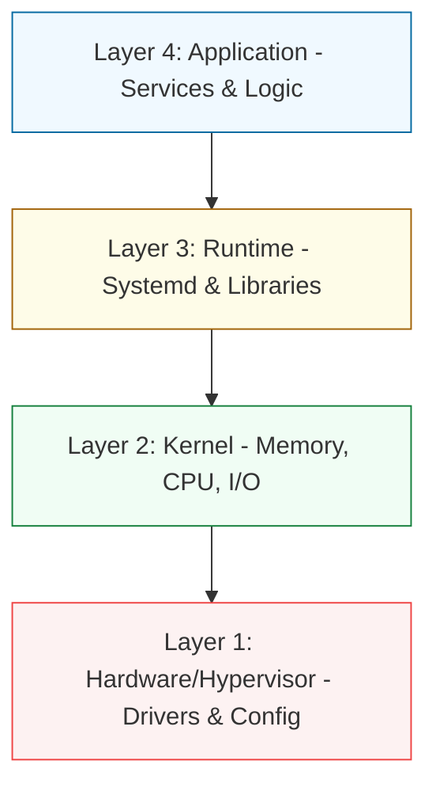

# 🖥️ System Administration (Intermediate)

> **"A junior admin fix issues. An intermediate admin builds systems that don't break. A senior admin builds systems that fix themselves."**

---

## 🏛️ The System Layers

Intermediate system administration focuses on the transition from "Managing a Computer" to "Engineering a Server Platform."

## 📚 Overview

This module covers the deeper internals of Linux and Windows systems. We focus on **Security Hardening**, **Performance Optimization**, and **Lifecycle Management**. You will learn how the kernel manages resources and how to audit every action on a system for compliance and troubleshooting.

---

## 🎯 Junior's Mission: The Kernel Lockup
**Scenario**: A database server is running at 100% CPU, but the `top` command shows the application is only using 10%. The system is sluggish, and users are complaining about timeouts.
**Your Goal**: Identify if the CPU is being eaten by **I/O Wait** (disk bottleneck), **Hardware Interrupts** (network card issues), or a **Kernel Panic** in progress and resolve the bottleneck before the server reboots.

---

## 🏗️ Operational Reality: Production Hazards
Intermediate System Administration is where "Theoretical Knowledge" meets "Explosive Reality."
1.  **The SELinux Wall**: You spend 3 hours debugging why Nginx can't read a file even though the permissions are `777`. It turns out **SELinux** blocked the access because the "Security Context" of the file was wrong.
2.  **OOM Reaper**: You add more RAM to a server, but it keeps crashing. You realize you didn't tune the `overcommit_memory` kernel setting, so Linux keeps killing your database to protect the kernel.
3.  **LVM Resize Gone Wrong**: You try to increase a disk partition size while the system is under heavy load. You miss a command, and the filesystem metadata becomes corrupted, leading to a "Kernel Panic" on the next reboot.
4.  **Log Rotation Disk Crash**: You stop "Rotating" your logs to save CPU. Three weeks later, the `/var/log` partition fills up, and the server stops accepting any new connections, including SSH.

---

## 🛠️ The System Admin's Toolbelt (Deep Diagnostics)
| Tool/Command | Why it matters |
| :--- | :--- |
| `iostat -xz 1` | "X-Ray" vision for your disks. Is the hardware failing to keep up with the data? |
| `getenforce` / `sestatus` | Checking if the "Invisible Security Guard" (SELinux) is active. |
| `lsns` | Listing namespaces. The secret command for debugging Docker/Container networking at the OS level. |
| `journalctl -xe` | The "Emergency Room" notes. See the last thing the kernel said before a crash. |
| `lsof -i :80` | "Who is on Port 80?" Mapping network ports to specific process IDs. |

---

## 🎓 Learning Objectives
By the end of this module, you will be able to:
1.  **Harden Systems**: Implement enterprise-grade security using Firewalls (NFTables/Firewalld) and Mandatory Access Control (SELinux/AppArmor).
2.  **Optimize Performance**: Use advanced tools like `sar`, `vmstat`, and `perf` to identify bottlenecks in CPU, Memory, and I/O.
3.  **Manage Logs & Auditing**: Set up centralized logging and system auditing to track "Who did What" and "When."
4.  **Master Storage**: Use LVM (Logical Volume Management) to resize disks without downtime and implement RAID for data redundancy.
5.  **Understand Boot & Init**: Master the `systemd` ecosystem and the Linux boot sequence (BIOS/UEFI → GRUB → Kernel → Init).

---

---

## 🏗️ Module Roadmap

| Phase | Topic | Focus |
| :--- | :--- | :--- |
| **01** | [**Introduction**](./01-introduction/readme.md) | Platform Engineering vs. Traditional SysAdmin. |
| **02** | [**Server Hardening**](./02-server-hardening/readme.md) | Firewalls, SSH Security, and MAC (SELinux). |
| **03** | [**Performance Tuning**](./03-performance-tuning/readme.md) | Resource Monitoring and Kernel Parameters. |
| **04** | [**Log Management & Auditing**](./04-log-management-and-auditing/readme.md) | Journald, Auditd, and Log Rotation. |
| **05** | [**Kernel & Boot Systems**](./05-kernel-and-boot-systems/readme.md) | Systemd Units and the Boot Lifecycle. |
| **06** | [**Advanced Storage (LVM)**](./06-advanced-storage-lvm/readme.md) | Dynamic Storage and Redundancy. |
| **07** | [**Assessments**](./07-assessments/readme.md) | Interview Prep, Quizzes, and Solutions. |

---

## 🚀 The Reliability Standard

All administration practices in this module follow the **SRE (Site Reliability Engineering)** mindset:
- **Observability**: If it isn't monitored, it doesn't exist.
- **Security by Design**: Least privilege applied at the kernel level.
- **Immutability**: Prefer reproducible configurations over manual one-off fixes.

---

[⬅️ Back to Infrastructure Automation](../readme.md)
