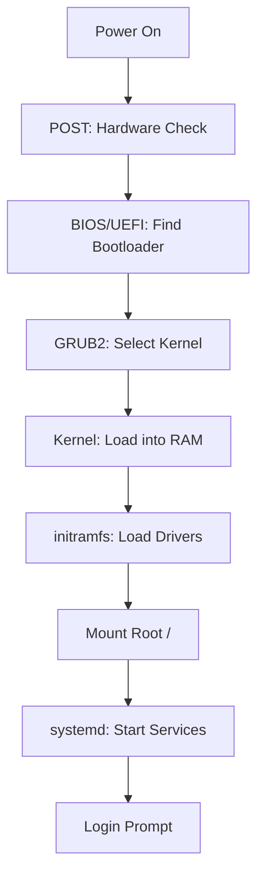

# Linux Boot Sequence: Architectural Reference

**Doc Version:** 1.0.0
**Role:** Systems Engineer
**Scope:** BIOS/UEFI, GRUB, Kernel, and Init System

---

## 1. The 5 Stages of Boot

Understanding the boot sequence is critical for troubleshooting "Server won't boot" incidents.

### 1. BIOS / UEFI (Hardware Level)
- **BIOS (Legacy)**: Performs POST (Power-On Self-Test). Looks for the MBR (Master Boot Record) on the primary disk.
- **UEFI (Modern)**: Replacement for BIOS. Uses an EFI System Partition (ESP) to find the bootloader. Supports Secure Boot.

### 2. Bootloader: GRUB2
- **Grand Unified Bootloader**: Loads the Linux Kernel into memory.
- **Config**: `/boot/grub/grub.cfg` (generated from `/etc/default/grub`).
- **Interactive**: Allows editing boot parameters (e.g., adding `init=/bin/bash` to reset a root password).

### 3. Kernel Initialization
- The kernel (`vmlinuz`) mounts the **initramfs** (Initial RAM Filesystem).
- **initramfs**: A temporary filesystem containing drivers (e.g., RAID, LVM, Disk Encryption) needed to mount the *real* root filesystem (`/`).

### 4. Mounting the Root Filesystem
- The kernel mounts the physical disk to `/`.
- It starts the first process: **init** (PID 1).

### 5. systemd (The Init System)
- `systemd` is the modern init system for almost all Linux distros.
- Identifies the **Default Target** (e.g., `multi-user.target` or `graphical.target`).
- Boots services in parallel based on unit dependencies.

---

## 2. Common Boot Issues & Fixes

| Symptom | Probable Cause | Fix |
| :--- | :--- | :--- |
| "No Bootable Device" | MBR/EFI partition corrupted. | Reinstall GRUB using a Live CD. |
| "Kernel Panic" | Missing driver or corrupted `initrd`. | Rebuild initramfs: `update-initramfs -u`. |
| Hangs at Service Start | Misconfigured `systemd` unit. | Boot into "Single User Mode" or "Emergency Target." |
| "Root FS not found" | UUID in `/etc/fstab` is wrong. | Boot Live CD, check `blkid`, update `fstab`. |

---

## 3. Visualizing the Sequence

---

## 4. systemd Units and Targets

- **Units**: Files describing services (`.service`), mounts (`.mount`), and sockets (`.socket`).
- **Targets**: Groupings of units (similar to "Runlevels" in old SysVinit).
    - `rescue.target`: Single-user mode (root shell).
    - `multi-user.target`: Standard server mode (networking, SSH).

---

## 5. Security Guardrails

- **Secure Boot**: Prevents unauthorized kernels from booting.
- **GRUB Password**: Prevents unauthorized editing of boot parameters.
- **Disk Encryption (LUKS)**: Protects data at rest, requires a passphrase (or TPM key) during the Kernel Initialization stage.

> **Enterprise Pattern**: Implement **Remote Disk Unlocking**. Use tools like `Clevis` and `Tang` to automatically decrypt disks in the data center while still requiring manual intervention if the server is physically removed.
