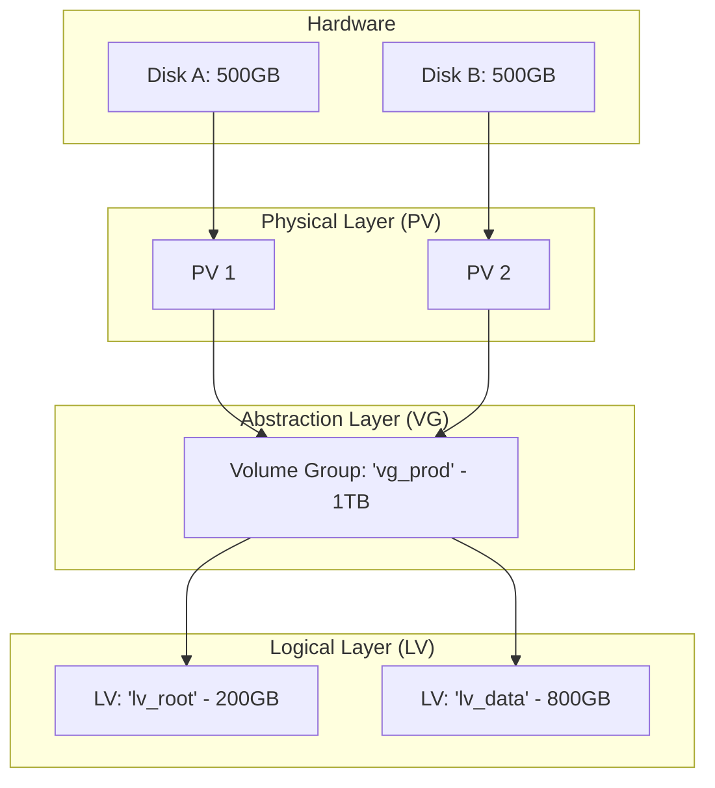

# LVM (Logical Volume Management): Reference Architecture

**Doc Version:** 1.0.0
**Role:** Storage Engineer
**Scope:** Physical Volumes, Volume Groups, and Resizing

---

## 1. Why use LVM?

Traditional partitioning is static. If your `/var` partition is full, you are in trouble. LVM provides **Abstraction** and **Flexibility**.

- **Dynamic Resizing**: Increase a disk size while the system is running.
- **Spanning**: Combine multiple physical disks (HDDs/SSDs) into a single large logical volume.
- **Snapshots**: Capture the state of a volume at a specific point in time (handy for backups).

---

## 2. The LVM Hierarchy



---

## 3. Standard Operations (The Workflow)

### 1. Initialize Physical Volumes
```bash
pvcreate /dev/sdb
```

### 2. Create Volume Group
```bash
vgcreate vg_data /dev/sdb
```

### 3. Create Logical Volume
```bash
lvcreate -L 50G -n lv_app vg_data
```

### 4. Create Filesystem
```bash
mkfs.ext4 /dev/vg_data/lv_app
```

---

## 4. Resizing (Zero Downtime)

### Step 1: Add/Extend Physical Disk
(In VMware/AWS/Cloud console, increase the disk size).

### Step 2: Inform Kernel
```bash
rescan-scsi-bus.sh # or equivalent
```

### Step 3: Extend everything
```bash
# 1. Extend Physical Volume
pvresize /dev/sdb

# 2. Extend Logical Volume and Filesystem in one go
lvextend -L +10G /dev/vg_data/lv_app -r
```
*Note: The `-r` flag automatically resizes the underlying filesystem (works for ext4 and XFS).*

---

## 5. LVM Snapshots

- **How it works**: Uses "Copy-on-Write." It only stores the data that has changed since the snapshot was taken.
- **Usage**:
```bash
lvcreate -L 5G -s -n snappy /dev/vg_data/lv_app
```
- **Warning**: Snapshots are NOT backups. They reside on the same physical disks. Use them as a temporary state before a high-risk operation.

> **Enterprise Pattern**: Implement **Thin Provisioning**. Allocate a 10TB logical volume but only consume physical space as data is actually written. This avoids wasting expensive SSD space.
