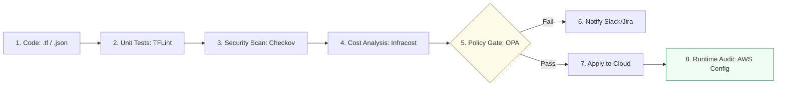

# Infrastructure Compliance & Governance Reference

**Doc Version:** 1.1.0
**Role:** DevSecOps Engineer / Compliance Officer
**Scope:** Scanning, Drift, Policy Enforcement, and Cost Governance

---

## 1. Compliance "Shift-Left"

In modern DevOps, security and compliance are not "checklists" at the end of a project; they are integrated into the **CI/CD Pipeline**.

### The Three Pillars of Compliant IaC:
1.  **Identity**: Every automation run must use a scoped Service Account with **Least Privilege** (no `AdminAccess` for your CI pipeline).
2.  **Standards**: Resources must adhere to pre-defined security groups, encryption standards, and naming conventions.
3.  **Governance**: Enforcing tags for cost-tracking (e.g., `Owner`, `Environment`, `ProjectID`).

---

## 2. Policy as Code: Enforcing the Rules

Static analysis is no longer enough. We use **Policy Engines** to enforce logic.

### 🛡️ Open Policy Agent (OPA) & Rego
OPA is the industry standard for general-purpose policy enforcement.
*   **Example Rule**: "Any S3 bucket created in Production must have Server-Side Encryption enabled."
*   **Workflow**: Convert Terraform Plan to JSON -> Run OPA check against Rego policy -> Fail build if non-compliant.

### 🛡️ HashiCorp Sentinel
Embedded into Terraform Cloud/Enterprise.
*   **Hard-mandatory**: Blocks the run.
*   **Soft-mandatory**: Allows run if an authorized person overrides it.
*   **Advisory**: Warns only.

---

## 3. The Automation Toolkit (SAST-IaC)

These tools should run on every Pull Request containing infrastructure changes.

| Tool | Focus | Operational Why |
| :--- | :--- | :--- |
| **Checkov** | Compliance Scanning | Scans HCL, K8s, and CloudFormation for 1000+ security best practices. |
| **Infracost** | Cost Governance | Estimates the $$$ impact of a code change *before* it's applied. |
| **TFLint** | Logic & Provider Linting | Catches errors like "Invalid instance type for this region" before the API call. |
| **Terrascan** | Cloud Native Security | Deep integration with Kubernetes and ArgoCD workflows. |

---

## 4. Immutable Infrastructure & The "Golden Image"

Compliance is easier when the target doesn't change.

### 🏗️ The Packer Pattern
1.  **Code**: Define a JSON/HCL template for a server image.
2.  **Bake**: Packer launches a VM, installs patches, configures security, and saves it as a "Golden Image" (AMI/VHD).
3.  **Deploy**: Terraform launches servers using the specific Image ID.
4.  **Recycle**: To update, you "re-bake" and "re-deploy." You **never** SSH into a live server to fix a security patch.

> **Staff Principle**: If a server is over 30 days old, it is "Stale." Automatically recycle instances using Auto-Scaling Group (ASG) instance refresh to force compliance with latest patches.

---

## 5. Cloud-Native Guardrails: The Perimeter

Compliance isn't just in the code; it's also in the Cloud Account configuration.

*   **Service Control Policies (SCPs)** (AWS): Deny the ability to disable CloudTrail or delete S3 backups, even for the Root user.
*   **Resource Quotas** (GCP/Azure): Prevent "Spiking" costs by limiting the maximum number of GPUs or High-Memory instances in a project.
*   **Automated Remediation**: A Lambda/Cloud Function triggered by a CloudWatch Event that automatically shuts down any resource missing a mandatory `CostCenter` tag.

---

## 6. Visualizing the Compliance Pipeline

---

## 7. Operational Discipline: Secret Management

Compliance fails if your secrets are in your logs or state.
*   **Rule 1**: Never hardcode secrets. Use `sensitive = true` in Terraform.
*   **Rule 2**: Use Dynamic Credentials (e.g., Vault AWS Secret Engine) that expire after 1 hour.
*   **Rule 3**: Inject secrets into the runtime via Environment Variables or a dedicated Secret Manager (AWS Secrets Manager, Azure Key Vault).

> **Staff Pattern**: Implement **Secret Rotation**. Use automation to rotatate database passwords every 30 days and update the corresponding application configurations automatically.
