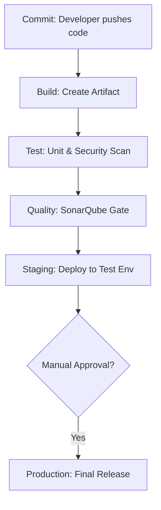

# CI/CD Fundamentals

CI/CD is the backbone of modern software delivery. It automates the transition from code commit to production deployment, ensuring speed, reliability, and consistency.

## 📚 Module Structure

- **[Boilerplates](readme.md)**: `ci_cd_skeleton.sh` (Logical flow of a pipeline).
- **[CHALLENGES](./challenges.md)**: Designing workflows and understanding failure.

---

## 🏗️ Core Concepts

| Concept | Description |
| :--- | :--- |
| **Continuous Integration (CI)** | Merging code many times a day. Automated builds/tests detect bugs instantly. |
| **Continuous Delivery (CD)** | The code is *always* ready to be deployed. Final push is manual. |
| **Continuous Deployment (CD)** | Fully automated. Every commit that passes tests goes straight to Production. |

---

## 🏗️ The Pipeline Lifecycle

---

## 🛡️ Best Practices

1. **Build Once**: The same binary/image must be tested in Staging and deployed to Prod.
2. **Parity**: Dev should match Prod as closely as possible (use Docker).
3. **Clean State**: Every build should happen in a clean, ephemeral environment.

---

## 📖 Real-World Story: The "Silent Failure"

**Scenario**: A company was deploying manually. A developer forgot to run the `migration` script.
**Crisis**: The new code launched, but the database schema didn't match. The site crashed for 4 hours.
**Solution**: They automated the deployment using a CI/CD pipeline that runs database migrations as a mandatory stage.
**Result**: Deployment errors dropped to zero.

---

## ❓ Interview Questions

1. **What is the main difference between Continuous Delivery and Continuous Deployment?**
   - *Answer*: Both automate building and testing, but Continuous *Delivery* has a manual approval step before production, while Continuous *Deployment* is fully automatic.
2. **What does 'Shift-Left' mean?**
   - *Answer*: Moving tasks like testing and security scanning earlier in the development lifecycle (to the "left" on a timeline) to catch issues sooner.
3. **What is an 'Artifact'?**
   - *Answer*: The compiled, deployable output of a build (e.g., a `.deb` file, a Docker image, or a `.zip` file).

---

[Next: Jenkins Mastery](readme.md)
