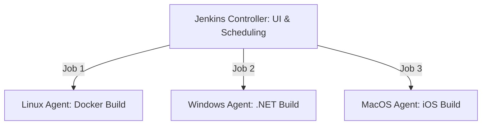

# Jenkins: Enterprise CI/CD Excellence

Jenkins is the world's most popular open-source automation server. It acts as the "Orchestrator" of the DevOps ecosystem, coordinating everything from code commits to production deployments.

## 🏗️ Module Roadmap

| Stage | Topic | Focus |
| :--- | :--- | :--- |
| **01** | **[Architecture & Setup](./01-architecture-and-setup/readme.md)** | Controllers, Agents, and Docker Integration. |
| **02** | **[Pipelines as Code](../../../../readme.md)** | Jenkinsfile syntax, Stages, and Post-build logic. |
| **03** | **[Security & Admin](../../../../readme.md)** | RBAC, Backups, and Plugin management. |

---

## 🏗️ Distributed Architecture

Jenkins scales by offloading work from the **Controller** to **Agents**.

---

## 🔑 Key Concepts

| Concept | Description |
| :--- | :--- |
| **Jenkinsfile** | A text file that contains the definition of a Jenkins Pipeline. |
| **Stage** | A distinct segment of the pipeline (e.g., "Build", "Test"). |
| **Step** | A single task that tells Jenkins what to do (e.g., `sh 'npm install'`). |
| **Workspace** | A temporary directory on the agent where the build happens. |
| **Post** | Logic that runs at the end of a stage or pipeline based on status. |

---

## 🛡️ Best Practices
1.  **Declarative > Scripted**: Always prefer Declarative pipelines for readability.
2.  **No Secrets in Git**: Use Jenkins `credentials()` to inject secrets securely.
3.  **Ephemeral Agents**: Use Docker-based agents so every build starts with a clean slate.

---

## 📖 Real-World Story: The "Plugin Purgatory"
**Scenario**: An admin installed 200 plugins "just in case." 
**Crisis**: Jenkins took 15 minutes to restart, and multiple plugins conflicted, crashing the UI.
**Solution**: They refactored to a **Minimalist Plugin Policy**, moving complex logic out of plugins and into **Shared Libraries**.
**Result**: Restart time dropped to 2 minutes, and stability increased by 90%.

---

## ❓ Interview Questions

1. **What is the difference between a Controller and an Agent?**
   - *Answer*: The Controller manages the UI, logs, and configuration. The Agent is where the actual code compilation and testing occur.
2. **Explain the `post` block in a Jenkinsfile.**
   - *Answer*: It allows you to run specific code based on the outcome of the build (e.g., `success`, `failure`, `always`).
3. **What is a 'Shared Library'?**
   - *Answer*: A separate Git repository containing Groovy scripts that can be reused across multiple Jenkins pipelines to avoid duplication.

---

[Next: Secret Scanning](readme.md)

---
## 🧭 Additional Modules
- [Backup Recovery](backup-recovery/readme.md)
- [Best Practices](best-practices/readme.md)
- [Installation](installation/readme.md)
- [Integration](integration/readme.md)
- [Monitoring](monitoring/readme.md)
- [Pipelines](pipelines/readme.md)
- [Plugins](plugins/readme.md)
- [Scaling](scaling/readme.md)
- [Security](security/readme.md)
