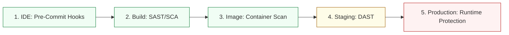

# Pipeline-as-Code & Shift-Left Architecture Reference

**Doc Version:** 1.0.0
**Role:** CI/CD Architect / DevOps Lead
**Scope:** Pipeline design, DSLs, and Shift-Left integration patterns

---

## 1. The Pipeline-as-Code (PaC) Paradigm

Pipeline-as-Code is the practice of defining your deployment pipelines using a version-controlled domain-specific language (DSL) or standard configuration format (YAML).

### Why PaC?
- **Version Control**: Pipelines are versioned alongside the application code.
- **Repeatability**: Environments can be recreated from scratch with consistent deployment logic.
- **Auditability**: Every change to the deployment process is tracked via Git history.
- **Efficiency**: Use of templates, shared libraries, and inheritance to reduce duplication.

---

## 2. DSL vs. YAML based Pipelines

| Feature | DSL (e.g., Jenkins Groovy) | YAML (e.g., GitHub Actions, GitLab CI) |
| :--- | :--- | :--- |
| **Flexibility** | High. Can use full programming logic (loops, conditionals). | Medium. Restricted to predefined keywords and expressions. |
| **Complexity** | Higher. Requires learning a specific language. | Lower. Declarative and easy to read. |
| **Reusability** | Extensive (Shared Libraries). | Good (Reusable Workflows, Actions). |
| **Portability** | Low. Often vendor-specific. | Medium. Easier to migrate between YAML-based providers. |

---

## 3. The "Shift-Left" Security Integration

Shift-Left security aims to find and fix vulnerabilities as early as possible in the software development lifecycle (SDLC).

### The Security Pipeline Chain

1.  **Stage 1: IDE/Local (Pre-Commit)**
    - **TruffleHog / GitLeaks**: Detect hardcoded secrets before they are committed.
    - **Snyk / OSV-Scanner**: Check for vulnerable open-source dependencies in the developer's environment.

2.  **Stage 2: Build Time (Static Analysis)**
    - **SAST (Static Application Security Testing)**: Analyze source code for vulnerabilities (e.g., SonarQube, CodeQL).
    - **SCA (Software Composition Analysis)**: Build an inventory of all third-party libraries and check for known CVEs.

3.  **Stage 3: Containerization (Image Scanning)**
    - **Trivy / Grype**: Scan the built Docker image for vulnerabilities in OS packages and language-specific libs.

4.  **Stage 4: Dynamic Analysis (DAST)**
    - **OWASP ZAP**: Scan the running application in a staging environment for runtime vulnerabilities (e.g., SQL injection, XSS).

---

## 4. Visualizing the Shift-Left Flow

---

## 5. The "Quality Gate" Concept

A Quality Gate is a policy enforcement point that stops the pipeline if certain criteria are not met.

### Common Quality Gate Metrics (SonarQube)
- **Security Rating**: "A" (no open vulnerabilities).
- **Maintainability**: Technical debt ratio < 5%.
- **Reliability**: No new bugs introduced in the current branch.
- **Coverage**: Unit test coverage > 80%.
- **Duplication**: Less than 3% duplicated code.

---

## 6. Pipeline Resilience Patterns

- **Retry Strategy**: Automatically retry transient failures (e.g., network timeout during artifact push).
- **Timeouts**: Ensure no single step can hang indefinitely, blocking the entire runner fleet.
- **Parallelization**: Run non-dependent tasks (e.g., Linting, Testing, Security Scanning) in parallel to reduce cycle time.
- **Post-Action Hooks**: Always send notifications (Slack, Teams) or clean up resources on failure/success.

> **Enterprise Pattern**: Use **Shared Libraries** in Jenkins to standardize pipeline logic across 100+ projects. This ensures that every team gets the same security scanning and deployment rigor without having to write it themselves.
