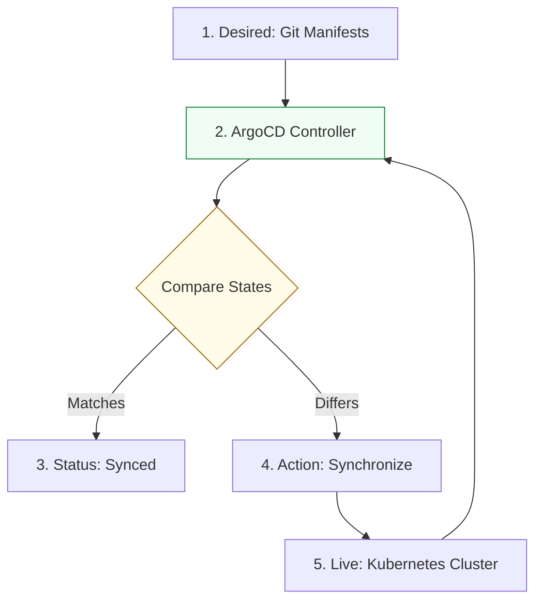

# ArgoCD & GitOps Architecture Reference

**Doc Version:** 1.0.0
**Role:** Kubernetes SRE / GitOps Engineer
**Scope:** ArgoCD internals, Sync strategies, and Enterprise patterns

---

## 1. The GitOps Controller Pattern

ArgoCD operates as a **Kubernetes Controller**. Its primary job is to continuously monitor the state of the cluster and ensure it matches the state defined in Git.

### The Three States
1.  **Desired State**: The Kubernetes manifests (YAML/Helm/Kustomize) stored in a Git repository.
2.  **Live State**: The actual resources running in the Kubernetes cluster.
3.  **OutOfSync State**: When the Live State does not match the Desired State (also known as **Config Drift**).

---

## 2. ArgoCD Internal Components

ArgoCD consists of several key services:

-   **API Server**: Exposes the UI/CLI and handles authentication/authorization.
-   **Repository Server**: Clones Git repositories and generates manifests (executes Helm, Kustomize, etc.).
-   **Application Controller**: The "brain" that compares Live vs. Desired state and initiates synchronization.
-   **Redis**: Caching layer for Git contents and manifest generation.
-   **Dex**: OIDC identity provider for SSO.

---

## 3. Sync Policies & Safety Gates

ArgoCD provides multiple ways to manage synchronization to ensure safety in production.

### A. Manual Sync (The "Human Gate")
- **Behavior**: ArgoCD detects drift but takes no action.
- **Usage**: Critical production environments where a human must review the diff before applying.

### B. Automatic Sync (The "Cruise Control")
- **Behavior**: ArgoCD immediately applies changes once detected in Git.
- **Safety Features**:
    - **Self-Heal**: Automatically overwrites manual changes made directly to the cluster (reversing ad-hoc `kubectl` edits).
    - **Prune**: Automatically deletes resources in the cluster that are no longer in the Git repository.

---

## 4. Enterprise Patterns: App-of-Apps and ApplicationSets

Managing 100+ microservices manually in ArgoCD is impossible. We use advanced patterns to scale.

### A. The App-of-Apps Pattern
- **Definition**: A parent ArgoCD application whose children are other ArgoCD applications.
- **Use Case**: Bootstrapping an entire cluster with monitoring, logging, and security tools.

### B. ApplicationSet Controller (Automation)
- **Definition**: A controller that automatically generates ArgoCD applications based on templates.
- **Generators**: 
    - **List**: Create an app for every item in a list.
    - **Git**: Create an app for every directory in a Git repo.
    - **Cluster**: Create an app for every cluster connected to ArgoCD.

---

## 5. Visualizing the Reconciliation Loop

---

## 6. Security Governance

- **RBAC**: Enforce granular permissions for different teams (e.g., Team A can only sync to Namespace A).
- **SSO**: Integrate with Okta, Azure AD, or GitHub for unified identity.
- **Projects**: Group applications into "Projects" to enforce security boundaries and source repository limits.
- **Webhooks**: Use Git webhooks to trigger immediate synchronization instead of waiting for the 3-minute polling interval.

> **Enterprise Pattern**: Use **Self-Heal** in all environments. This ensures that the only way to change the cluster is via a Git PR, creating a perfect audit trail and preventing "cowboy" engineering changes.
