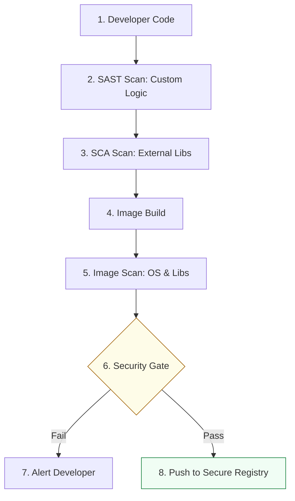

# Vulnerability Management & Security Automation Reference

**Doc Version:** 1.0.0
**Role:** DevSecOps Engineer / Security Architect
**Scope:** Vulnerability lifecycle, scanning patterns, and remediation strategies

---

## 1. The Vulnerability Lifecycle

Security automation is not just about finding bugs; it's about managing their resolution.

1.  **Detection**: Automated scanners (Trivy, Snyk, Grype) identify CVEs in code or images.
2.  **Triaging**: Categorizing vulnerabilities based on **Severity (CVSS Score)** and **Exploitability**.
3.  **Remediation**:
    - **Update**: Bumping the version of a library or base image.
    - **Remove**: Deleting unused packages to reduce the attack surface.
    - **Mitigate**: Implementing a firewall rule or configuration change if an update is not possible.
4.  **Verification**: Re-scanning to ensure the fix is effective.

---

## 2. Scanning Patterns (SAST vs. SCA vs. Image Scan)

### A. SAST (Static Application Security Testing)
- **Objective**: Analyze the "Custom Code" written by developers.
- **Focus**: SQL injection, XSS, insecure cryptography.
- **Tool**: SonarQube, Snyk Code.

### B. SCA (Software Composition Analysis)
- **Objective**: Analyze the "Open Source Dependencies" (e.g., `npm`, `pip`, `go` modules).
- **Focus**: Known CVEs in third-party libraries.
- **Tool**: Snyk, OWASP Dependency-Check.

### C. Image Scanning
- **Objective**: Analyze the "Final Artifact" (Docker image).
- **Focus**: Vulnerabilities in the OS (Alpine/Debian) and the installed packages.
- **Tool**: Trivy, Grype.

---

## 3. The "Shift-Left" Deployment Guardrail

Integrating security into the CI pipeline ensures that no critical vulnerability reaches a production registry.

### Threshold Enforcement
In production-grade pipelines, we configure scanners to **fail the build** based on severity:
```bash
# Fail only if CRITICAL vulnerabilities are found
trivy image --exit-code 1 --severity CRITICAL my-app:latest
```

---

## 4. Visualizing the Security Feedback Loop



---

## 5. Enterprise Best Practices

- **Base Image Selection**: Use "Distroless" or "Slim" images (e.g., `python:3.9-slim`) to minimize the number of installed packages and thus the attack surface.
- **Vulnerability Ignore Lists (.trivyignore)**: Documented and approved exceptions for false positives or vulnerabilities with no known fix.
- **Continuous Monitoring**: Re-scanning existing images in the registry every 24 hours (not just at build time) to detect "Zero-Day" vulnerabilities.
- **SBOM (Software Bill of Materials)**: Generating a machine-readable list of all components (using `trivy sbom`) for compliance and transparency.

> **Enterprise Pattern**: Implement a **Golden Image Pipeline**. A centralized team builds and scans "Base Images" for the entire company. Application teams *must* use these pre-approved, pre-scanned images as their `FROM` instruction in Dockerfiles.
