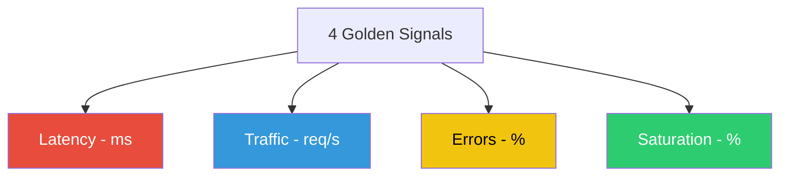

# 🟡 Monitoring & Alerting (Intermediate)

## 📚 Overview

Monitoring is the practice of observing the state of your infrastructure using tools like **Prometheus** and **Grafana**. In this module, we transition from manual checks to automated data collection and sophisticated alerting.

## Core Concept: The Three Pillars
**[REFERENCE: Observability Architecture](./reference/observability-architecture-ref.md)**

A complete view of system health requires three distinct data types:
- **Metrics**: High-level numeric data (CPU, Latency) for alerting and dashboards.
- **Logs**: Detailed text events for deep-dive root cause analysis.
- **Traces**: End-to-end maps of a request's journey through microservices.
- **The 4 Golden Signals**: Standardizing monitoring around Latency, Traffic, Errors, and Saturation.

## Enterprise Governance: High-Signal Alerting
**[REFERENCE: Observability Architecture](./reference/observability-architecture-ref.md)**

Escalating issues effectively without causing alert fatigue:
- **Symptom-Based Alerting**: Only waking up engineers for issues that actually impact the customer (e.g., Error Rates, not CPU spikes).
- **Service Level Objectives (SLOs)**: Defining acceptable performance targets (e.g., 99.9% uptime) and alerting on "Error Budget" consumption.
- **Dashboards-as-Code**: Managing Grafana dashboards in Git to ensure consistency and disaster recovery.
- **OpenTelemetry Standard**: Utilizing vendor-neutral collection to prevent vendor lock-in and simplify instrumentation.

## 🎯 Learning Objectives

- ✅ Deploy the **Prometheus + Grafana** stack using Helm.
- ✅ Implement monitoring for **The 4 Golden Signals**.
- ✅ Create custom Grafana dashboards for application health.
- ✅ Configure **Alertmanager** for Slack/Email notifications.

---

## 🏗️ Professional Pattern: The 4 Golden Signals
If you can only monitor four metrics, these are the ones:

1.  **Latency**: The time it takes to service a request.
2.  **Traffic**: A measure of how much demand is being placed on your system (e.g., HTTP req/sec).
3.  **Errors**: The rate of requests that fail, either explicitly (e.g., HTTP 500s) or implicitly.
4.  **Saturation**: How "full" your service is (e.g., memory usage, thread pool utilization).



---

## 🛠️ Tooling: Prometheus recording_rules.yml
In production, we use **Recording Rules** to pre-calculate frequently needed or computationally expensive expressions.

**Boilerplate:** `prometheus_rules.yml`
```yaml
groups:
  - name: example_rules
    rules:
      - record: job:http_inprogress_requests:sum
        expr: sum by (job) (http_inprogress_requests)
      - alert: HighRequestLatency
        expr: job:request_latency_seconds:mean5m{job="my-app"} > 0.5
        for: 10m
        labels:
          severity: warning
        annotations:
          summary: "High request latency on {{ $labels.instance }}"
```

---
**Next Step**: [Prometheus & Grafana via Helm](readme.md) 🚀
